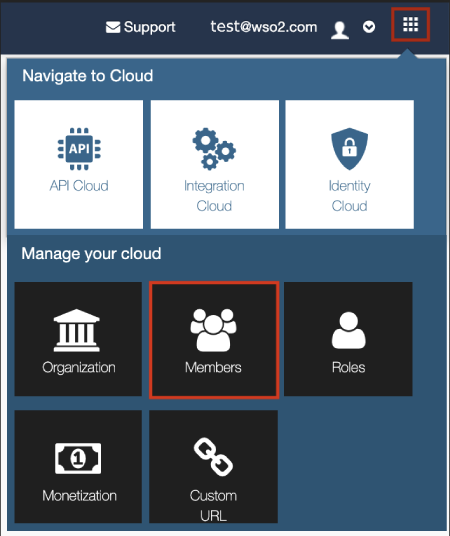
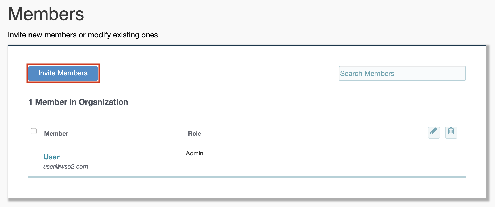

# Register and Invite Members

WSO2 offers different public, private, and hybrid cloud solutions and all
of them are collectively known as [WSO2 Cloud](http://cloud.wso2.com). You can **register** to all of the public cloud offerings using a valid e-mail address. 

Follow the steps below to register your organization in the Cloud and
invite members to it:

##Let's get started.

1.  Go to [http://cloud.wso2.com](http://cloud.wso2.com/) and sign up to
    any one of the public clouds. The UI guides you through the signup
    process.
2.  Log in to the organization that you created. You have admin rights
    to it.
3.  Click the settings icon on the top right-hand corner of the screen
    and then click the
    **[Members](https://cloudmgt.cloud.wso2.com/cloudmgt/site/pages/user.jag)**
    menu.  
    

    !!! tip
    
        **Tip** : You can create multiple different organizations under the
        same login using the
        **[Organization](https://cloudmgt.cloud.wso2.com/cloudmgt/site/pages/organization.jag)**
        menu, which is next to the **Members** menu.
    

4.  Click **Invite Members** .  
    

5.  Give valid e-mail addresses of the members, specify the role and
    invite. (API Cloud specific roles will be listed under API Cloud
    category)  
    

    !!! tip
    
        You can customize the invitation emails by applying your own logo
        and changing the content. For information on how to do this, see
        [Customize invitation emails](_Customize_Invitation_Emails_) .
    
    !!! note
    
        Admin Role

        WSO2 API Cloud comes with a common Admin role. Any user with Admin role
        privileges can create new users and roles, and configure
        permissions for the roles.

6.  Note that the member is sent an invitation e-mail, which has to be
    accepted by them in order to be added to the Cloud as a registered
    member.
