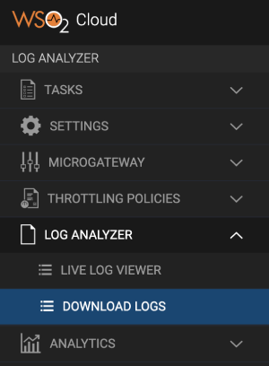
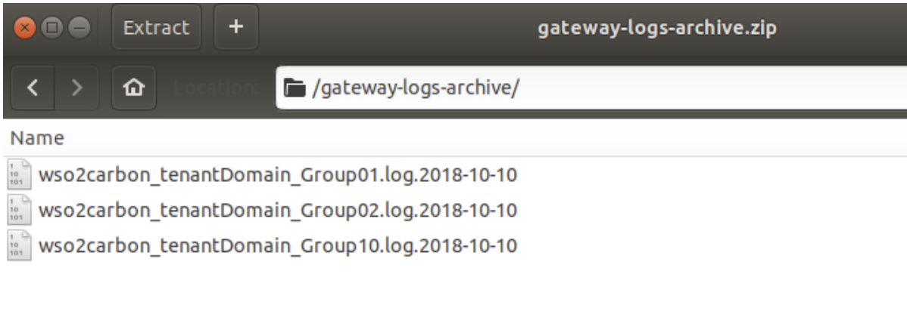

# View and Download Logs

WSO2 API Cloud provides separate tenants for each organization and all
tenant activities are saved as logs. Each tenant has access to 
logs for a specified time period for their organization(tenant) to view,
download or submit to an on-premise monitoring service.

### View Logs

Follow the steps below to view API Gateway logs via the live log viewer.

1.  Access the WSO2 API Cloud Admin portal via
    `https://api.cloud.wso2.com/admin`, and sign in with your credentials.
2.  On the left navigator, click **LOG ANALYZER**. This expands the **LOG ANALYZER** section. 
3.  Click **LIVE LOG VIEWER**   
     

    This displays the live log viewer with all your recent logs: 
     

    The live log viewer displays the latest 600 API Gateway logs related to your       organization, and it works across all regional gateways around the globe. The logs are displayed in the same order in which they are generated during initial page load. The log entries on this page are refreshed every 15 seconds and the latest log entry is displayed at the bottom.

    The live log viewer displays the following types of real-time API Gateway logs, which can be useful when you want to troubleshoot issues:

    -   INFO — Indicated by a blue tag
    -   ERROR — Indicated by a red tag
    -   WARN — Indicated by a brown tag
    -   DEBUG — Indicated by a green tag

### Download Logs

WSO2 API Cloud allows you to download load balancer logs as well as Gateway logs. Follow the steps below to download a required log type for a specified date.

!!! warning
    
    You need to have a paid plan to download logs. If you are on a trial account, first you should upgrade to a [preferred pricing plan](https://wso2.com/api-management/cloud/#pricing).
    

1.  Access the WSO2 API Cloud Admin portal via
    `https://api.cloud.wso2.com/admin`, and sign in with your credentials.
2.  On the left navigator, click **LOG ANALYZER**. This expands the **LOG ANALYZER** section.
3.  Click **DOWNLOAD LOGS**.
 
    
 
    This displays the **Download logs** page.

    

4.  Select the required log **Type** and the **Date** for which you want to download the logs. This displays a download link to download the log files.

    !!! tip
    
        If necessary it is possible to retrieve the logs for the current day. However, these log files are updated every 30 minutes.
    

    

5.  Click the download link that appears. This downloads a ZIP file.

    !!! Note
    
        The download link that is displayed expires in 5 minutes. A timer indicates how much time is left for the download link to expire. If you were not able to download the log file before the link expired, you can select the same log type and date to re-generate the download link.

6.  Extract the ZIP file to view the log files.
    
