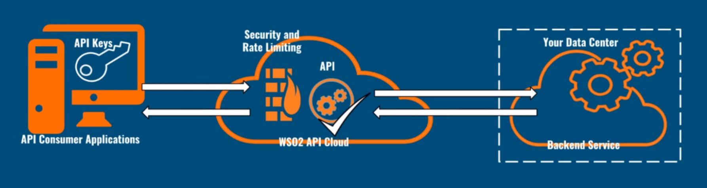
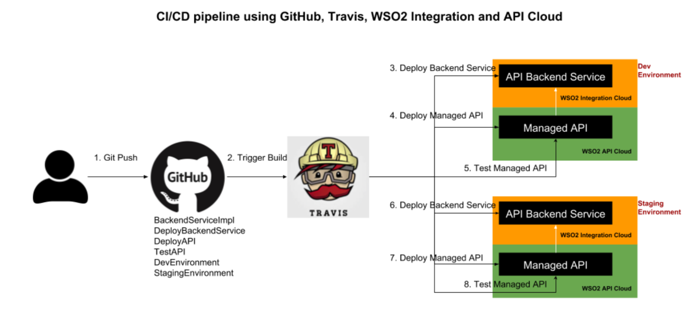

# Continuous Integration and Deployment for WSO2 API Cloud

APIs are used to connect data, services, and applications for the purpose of building
business solutions to satisfy consumer requirements. 

Continuous integration(CI) is the developer practice of merging the source code
into a shared repository frequently and the verification process to detect
And fix errors quickly. The changes are validated using an automated
build and test suites upon receiving commits to the master branch.

Continuous delivery(CD) is the process of deploying and delivering new changes to the customers in a sustainable way. This is achieved by
the automated deployment of the changes into multiple runtimes such as
staging and pre-prod. If your release pipeline is automated up to
production environment without human interactions, that is
continuous deployment. 

Having a continuous deployment pipeline increases
the confidence of customers, accelerates the feedback loop, and is the ultimate customer success. Building continuous integration and
delivery(CI/CD) into your API program helps to deliver the digital
transformation your organization and consumers expect.



The API definition is tightly coupled with your backend service
implementation. Therefore, implementing CI/CD processes for API
Management solutions spans from the development of backend services to
API lifecycle management. In some scenarios you might have to combine
multiple backend services and expose a single interface to the
customers. When exposing disconnected services to your users, it is
advised to follow [API Façade
patterns](https://wso2.com/library/blog-post/2015/10/article-a-pragmatic-approach-to-the-api-facade-pattern/). 
The backend service can be based on either REST or SOAP. The source
code on the version control system can be structured considering the
different aspects of the CI/CD pipeline. Following is an example:

``` java
BackendServiceImplimentation
   src
BackendServiceDeployment
   scripts
       deploy.sh
APIDeployment
   scripts
       postman collections
   resources
       definition
           swagger
           WSDL
       mediation policies
           JSON to XML transform
           SOAP to REST transform
       documents
           getting started guide
APITesting
   scripts
       postman collections
DevEnvironment
    backendService.properties
    development.postman_environment.json
StagingEnvironment
    backendService.properties
    staging.postman_environment.json
ProductionEnvironment
    backendService.properties
    production.postman_environment.json
```

The sensitive data is configured on the CI server using its own
encryption mechanisms such as encrypted values in
[Travis](https://docs.travis-ci.com/user/encryption-keys/) . The
deployment of backend services and APIs can leverage the management
APIs provided by the API management solution. [WSO2 API
Cloud](https://wso2.com/api-management/cloud/) gives you the ability to
deploy APIs, update API documents (Swagger, WSDL, how to guides), create
new versions, promote, demote, retire APIs, etc., using REST APIs is a
key to getting your CI/CD story implemented with flexibility. The
ability to configure API testing tools such as
[Newman](https://www.getpostman.com/docs/v6/postman/collection_runs/command_line_integration_with_newman)
with your CI server is key to the success of your CI/CD solution. The
quality of testing scripts determines the quality of your APIs.

## CI/CD for API Management



In this example, a microservice is exposed as a managed API in WSO2
API Cloud.

-   The developer keeps updating the source code of the microservice
    implementation, the Swagger definition, Postman scripts, deployment
    scripts, etc.
-   Every time the developer pushes the changes to GitHub, the Travis CI
    starts building the microservice implementation.
-   CI deploys the microservice into the WSO2 Integration Cloud and
    exposes that endpoint as a managed API in the WSO2 API Cloud.
-   In this particular example, CI does not deploy new versions. It
    updates the same version. However, you can configure scripts to
    deploy new versions upon changes and deprecate previous API
    versions, etc., that are consuming the managed REST APIs.
-   CI runs the Postman scripts using Newman.
-   If all integration tests are successful in the development
    environment, the CI continues to deploy the microservice to staging
    runtime, perform testing, etc.
-   Click
    [here](https://github.com/manjulaRathnayaka/API-Management-CI-CD-Example)
    to try this example.
-   Though this example makes use of GitHub and Travis. You can modify
    it or use a similar approach with your preferred CI server.
