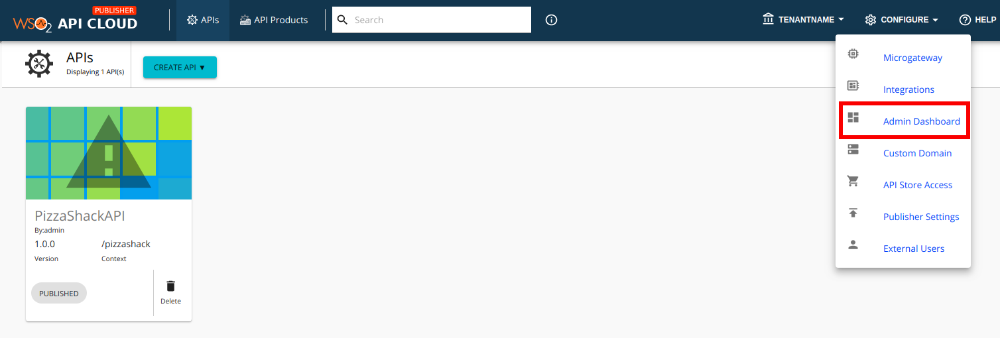
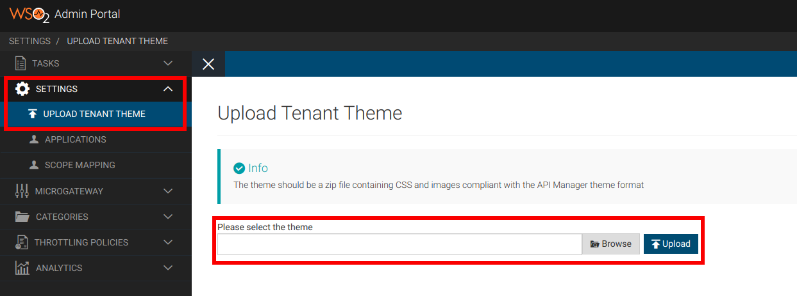

# Apply Customizations

Once you are done with all the changes related to DevPortal, sign in
page, and analytics dashboarad based on the customizations you need to
have, you are ready to upload and apply the customizations.

Follow the steps below to upload and apply your customizations:

1.  Go to the `<THEME_HOME>` folder, select all the
    files/folders inside it, then (Ctrl+A) and right click to archive
    all the selected files and folders together.
2.  Sign in to WSO2 API Cloud. This takes you to the API Publisher web
    application.
3.  Click **Admin Dashboard** under **CONFIGURE** . This opens the Admin
    Dashboard.  
    
4.  On the Admin Dashboard, click **SETTINGS** and then click **UPLOAD
    TENANT THEME** .
5.  Upload your zip file.  
    

Once uploaded you can open the DevPortal to take a look at the customizations that you applied.
