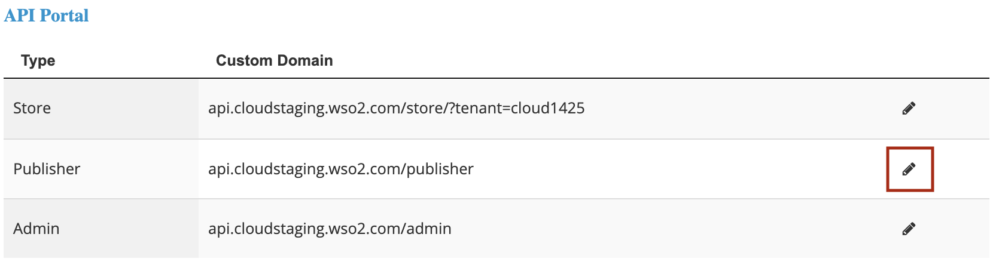
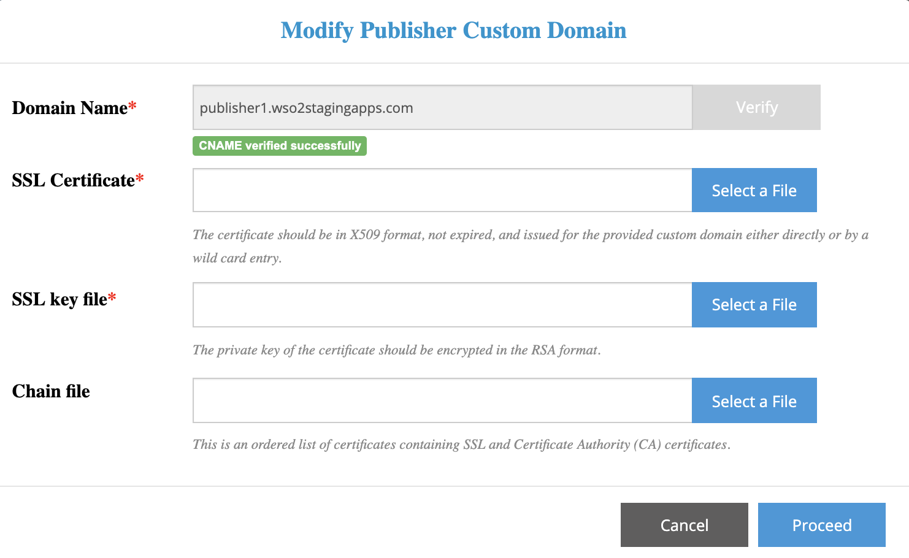

# Customize the API Publisher Domain

The steps to customize the API Publisher domain is similar to how you
customize the API Store domain.

Follow the steps below to customize the API Publisher domain:

1.  Sign in to WSO2 API Cloud (
    [https://api.cloud.wso2.com](https://api.cloud.wso2.com/) ) as an
    admin user.

2.  On the API Publisher, click **Configure** and then select **Custom
    URL** from the drop-down menu.
      
    This displays the **Manage Custom Domains** page.  
    

3.  Under **API Portal** , click the pencil icon to edit the existing
    **Custom Domain** of the **Publisher** .  
      
    This displays the **Modify Publisher Custom Domain** dialog box
    where you can specify a custom **Domain Name** for the Publisher.

4.  Specify a valid **Domain Name** and click **Verify** . This checks
    whether the CNAME record exists for the specified URL.    
    If the CNAME verification is successful, you will see the following
    screen.  
    

5.  For each field, upload a valid file that satisfies the specified
    requirements.

    <table>
    <thead>
    <tr class="header">
    <th>Field</th>
    <th>Requirements</th>
    </tr>
    </thead>
    <tbody>
    <tr class="odd">
    <td><strong>SSL Certificate</strong></td>
    <td>This certificate file must satisfy the following requirements:
    <ul>
    <li>
Should be in X509 format.
</li>
    <li>
Should not be expired.
</li>
    <li>
Should be issued directly or by a wild card entry for a provided custom URL. For example,

    <ul>
    <li>
In the direct method, if the CNAME is `publisher.wso2.com`, the issued SSL file must contain `publisher.wso2.com`.
</li>
    <li>
In the wildcard method, if the CNAME is `publisher.wso2.com`, the issued SSL file should be `*.wso2.com`.
</li>
    </ul></li>
    </ul></td>
    </tr>
    <tr class="even">
    <td><strong>SSL Key File</strong></td>
    <td>The private key of the certificate, which should be encrypted in the RSA format.</td>
    </tr>
    <tr class="odd">
    <td><strong>Chain File</strong></td>
    <td>The chain file to be used if the SSL connection to your custom URL fails with the <strong>SSL Certificate</strong> and <strong>SSL Key File</strong> .</td>
    </tr>
    </tbody>
    </table>

6.  Click **Proceed** . If the certificate files upload successfully,
    you will see a notification similar to the following:  
       
    This confirms that you have successfully changed the API Publisher
    domain name.

    !!! tip
    
        It takes approximately 10 minutes for the changes to apply. Adding
        the configurations and restarting the load balancers can take some
        time.
    

7.  Access the API Publisher using the new domain. In this example, the
    new API Publisher domain is `https://publisher1.wso2stagingapps.com`.

