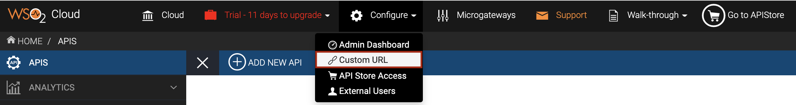
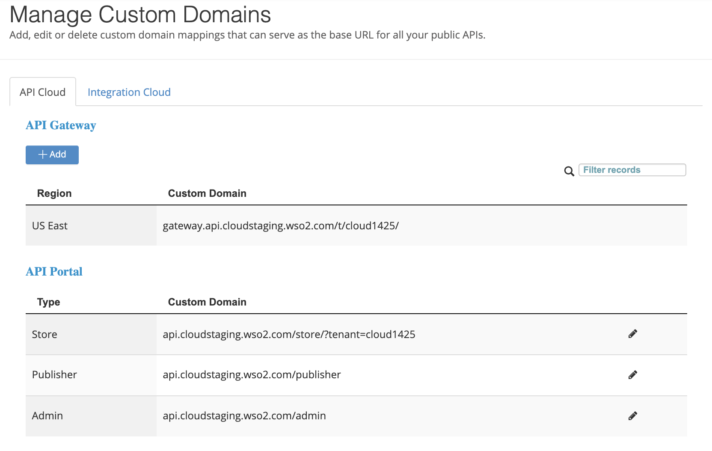
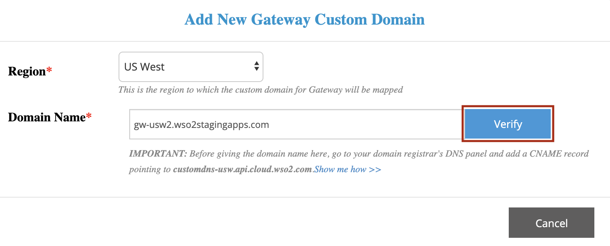
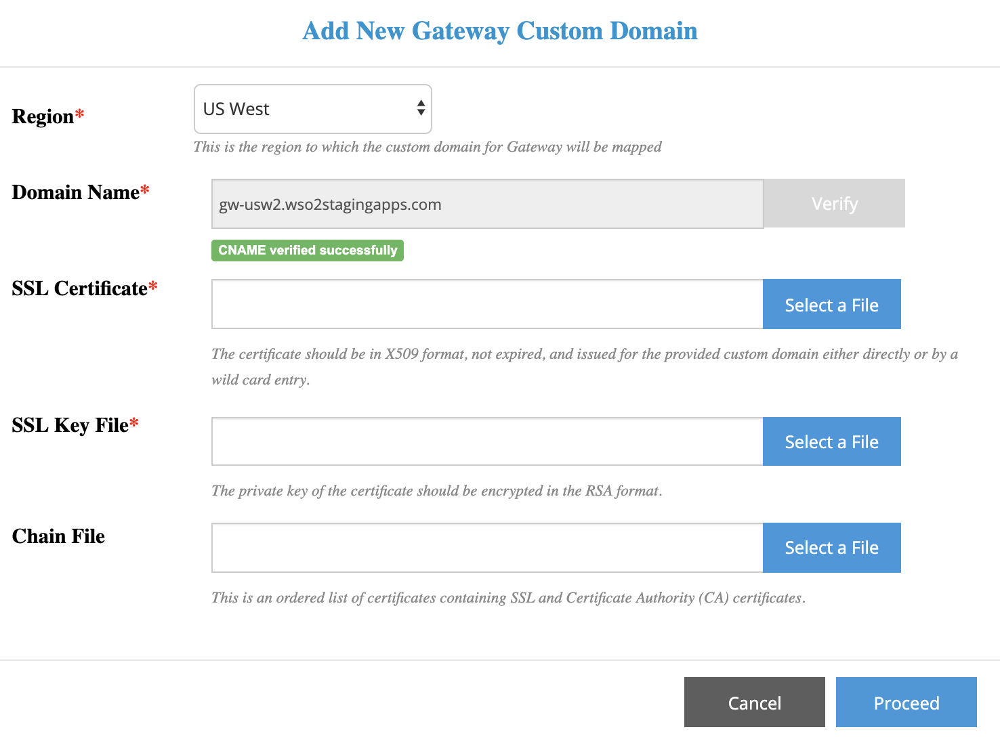
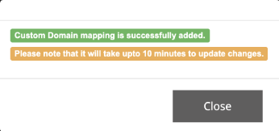
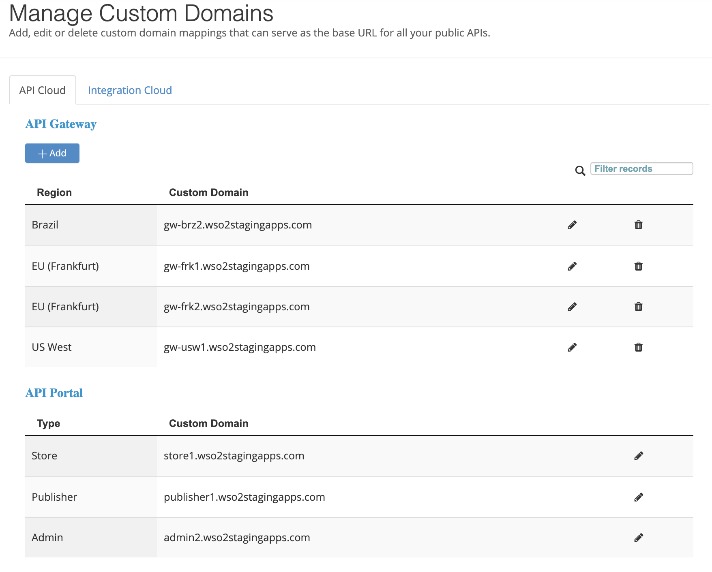
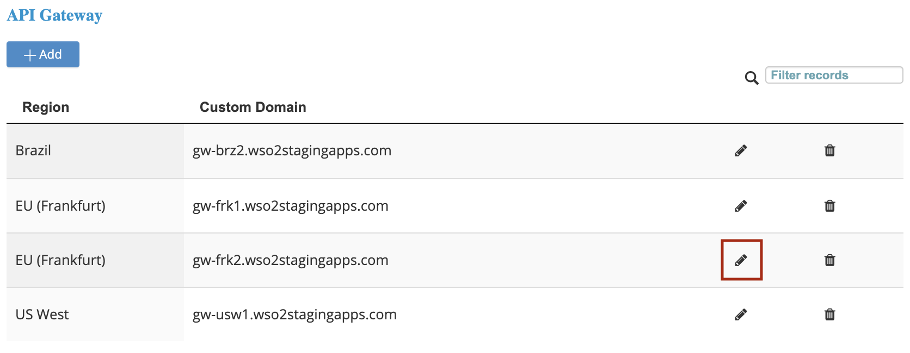
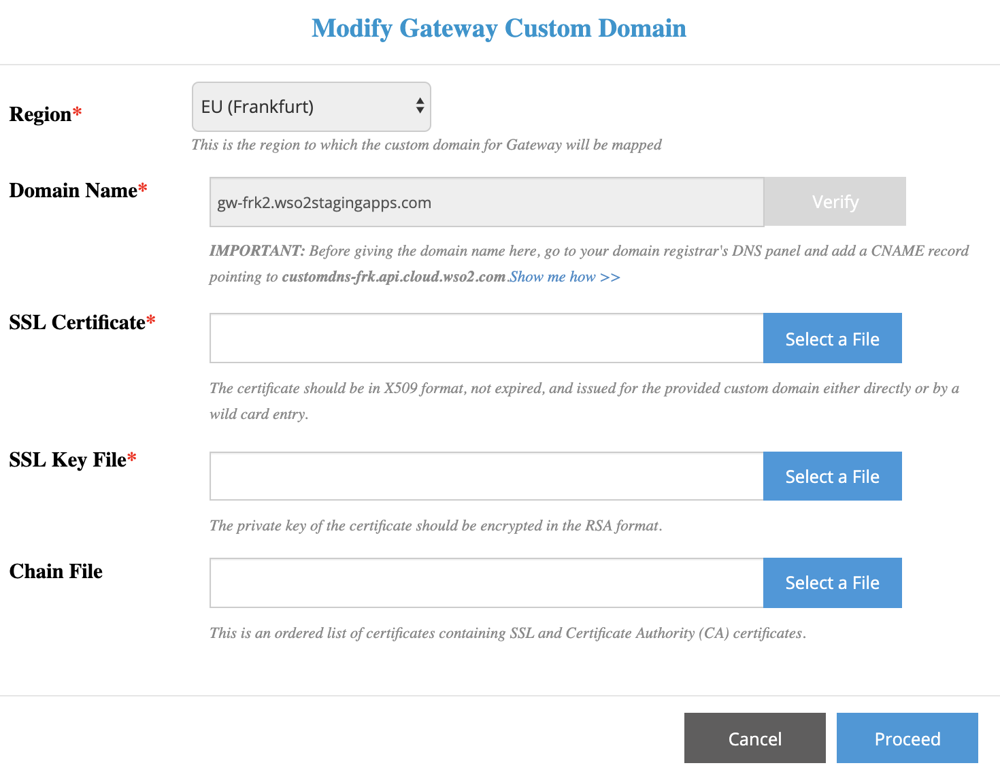
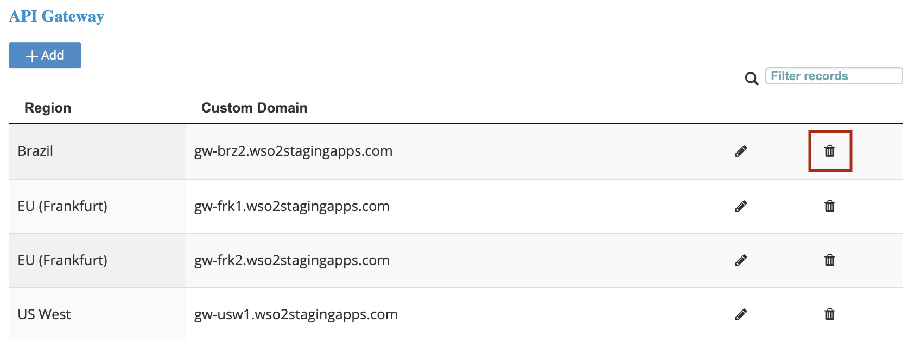
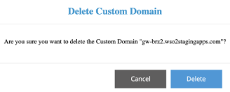

# Customize the API Gateway Domain

By default, WSO2 API Cloud provides
`         gateway.api.cloud.wso2.com/t/<your organization id>/        `
as the Gateway domain. The region of the default Gateway domain is US
East. If necessary, you can customize the Gateway domain to be more
representative of your company or personal branding, and you can also
have multiple gateway custom domains per region. Customizing the Gateway
allows you to route your traffic to a different AWS region.

You can perform any of the following actions to customize the API
Gateway domain depending on your requirement:

-   [Create a new Gateway custom
    domain](#CustomizingtheAPIGatewayDomain-CreateanewGatewaycustomdomain)
-   [Update certificates of an existing Gateway custom
    domain](#CustomizingtheAPIGatewayDomain-UpdatecertificatesofanexistingGatewaycustomdomain)
-   [Delete a Gateway
    domain](#CustomizingtheAPIGatewayDomain-DeleteaGatewaydomain)

### Create a new Gateway custom domain

WSO2 API Cloud currently has regional gateways in US East, US West,
Brazil (São Paulo), EU (Ireland), EU (Frankfurt), Singapore, and Sydney.

!!! tip
    
    You can contact us at <cloud@wso2.com> to request for additional
    regions.
    

Follow the steps below to create a new API Gateway domain in a preferred
region.

1.  Sign in to WSO2 API Cloud [https://api.cloud.wso2.com](https://api.cloud.wso2.com/) as an admin user.

2.  On the API Publisher, click **Configure** and then select **Custom
    URL** from the drop-down menu.
      
    This displays the **Manage Custom Domains** page.  
    

3.  Under **API Gateway**, click **Add**. This displays the **Add New
    Gateway Custom Domain** dialog box.

4.  Select a required **Region** for the Gateway custom domain, then
    specify a **Domain Name** for the Gateway, and then click **Verify**. This checks whether the CNAME record exists for the specified URL.  
      
    If the CNAME verification is successful, you will see the following
    dialog box:  
    

5.  For each field, upload a valid file that meets the specified
    requirements.

    <table>
    <thead>
    <tr class="header">
    <th>Field</th>
    <th>Requirements</th>
    </tr>
    </thead>
    <tbody>
    <tr class="odd">
    <td><strong>SSL Certificate</strong></td>
    <td>This certificate file must satisfy the following requirements:
    <ul>
    <li>
Should be in X509 format.
</li>
    <li>
Should not be expired.
</li>
    <li>
Should be issued directly or by a wild card entry for a provided custom URL. For example,

    <ul>
    <li>
In the direct method, if the CNAME is `gateway.wso2.com`, the issued SSL file must contain `gateway.wso2.com`.
</li>
    <li>
In the wildcard method, if the CNAME is `gateway.wso2.com`, the issued SSL file should be `*.wso2.com`.
</li>
    </ul></li>
    </ul></td>
    </tr>
    <tr class="even">
    <td><strong>SSL Key File</strong></td>
    <td>The private key of the certificate, which should be encrypted in the RSA format.</td>
    </tr>
    <tr class="odd">
    <td><strong>Chain File</strong></td>
    <td>The chain file to be used if the SSL connection to your custom URL fails with the <strong>SSL Certificate</strong> and <strong>SSL Key File</strong> .</td>
    </tr>
    </tbody>
    </table>

6.  Click **Proceed** . If the certificate files upload successfully,
    you will see a notification similar to the following:  
      
    This confirms that you have successfully changed the Gateway domain
    name.

    !!! tip
    
        It takes approximately 10 minutes for the changes to apply. This is
        because adding the configurations and restarting the load balancers
        can take some time.
    

7.  Go to the API Store, select an API and note the new API URLs on the
    API Overview page. You will see the new API Gateway URL.

### Update certificates of an existing Gateway custom domain

WSO2 API Cloud allows you to update certificates of an existing Gateway
custom domain by uploading the latest **SSL Certificate**, **SSL Key
File**, and **Chain File**.

<html>
         

         
Note

         
You cannot use the **Modify Gateway Custom Domain** dialog box to update
the name of an existing Gateway custom domain.

         
If you want to update the name of an existing Gateway custom domain, you
have to delete the existing Gateway custom domain and create a new
Gateway custom domain with a required **Domain Name**.

         

</html>

Follow the steps below to upload new certificate files to an existing
Gateway custom domain :

1.  Sign in to WSO2 API Cloud [https://api.cloud.wso2.com](https://api.cloud.wso2.com/) as an admin user.

2.  On the API Publisher, click **Configure** and then select **Custom
    URL** from the drop-down menu.
      
    This displays the **Manage Custom Domains** page.  
      
    Here, under the **API Gateway** section, you will see all the
    Gateway custom domains that you have created.

3.  Click the pencil icon corresponding to the Gateway custom domain for
    which you want to upload new certificate files.  
      
    This displays the **Modify Gateway Custom Domain** dialog box where
    you can upload new certificate files.  
    

4.  For each field, upload a valid file that meets the specified
    requirements.

    <table>
    <thead>
    <tr class="header">
    <th>Field</th>
    <th>Requirements</th>
    </tr>
    </thead>
    <tbody>
    <tr class="odd">
    <td><strong>SSL Certificate</strong></td>
    <td>This certificate file must satisfy the following requirements:
    <ul>
    <li>
Should be in X509 format.
</li>
    <li>
Should not be expired.
</li>
    <li>
Should be issued directly or by a wild card entry for a provided custom URL. For example,

    <ul>
    <li>
In the direct method, if the CNAME is `gateway.wso2.com`, the issued SSL file must contain `gateway.wso2.com`.
</li>
    <li>
In the wildcard method, if the CNAME is `gateway.wso2.com`, the issued SSL file should be `*.wso2.com`.
</li>
    </ul></li>
    </ul></td>
    </tr>
    <tr class="even">
    <td><strong>SSL Key File</strong></td>
    <td>The private key of the certificate, which should be encrypted in the RSA format.</td>
    </tr>
    <tr class="odd">
    <td><strong>Chain File</strong></td>
    <td>The chain file to be used if the SSL connection to your custom URL fails with the <strong>SSL Certificate</strong> and <strong>SSL Key File</strong> .</td>
    </tr>
    </tbody>
    </table>

5.  Click **Proceed** . If the certificate files upload successfully,
    you will see a notification similar to the following:  
      
    This confirms that you have successfully uploaded new certificate
    files for the Gateway custom domain.

### Delete a Gateway domain

Follow the steps below if you need to delete a Gateway custom domain
that you have created:

1.  Sign in to WSO2 API Cloud [https://api.cloud.wso2.com](https://api.cloud.wso2.com/) as an admin user.

2.  On the API Publisher, click **Configure** and then select **Custom
    URL** from the drop-down menu.
      
    This displays the **Manage Custom Domains** page.  
      
    Here, under the **API Gateway** section, you will see all the
    Gateway custom domains that you have created.

3.  Click the trash icon corresponding to the Gateway custom domain you
    want to delete.  
      
    This displays a confirmation message as follows:  
    
4.  Click **Delete** . This deletes the relevant Gateway custom domain.

