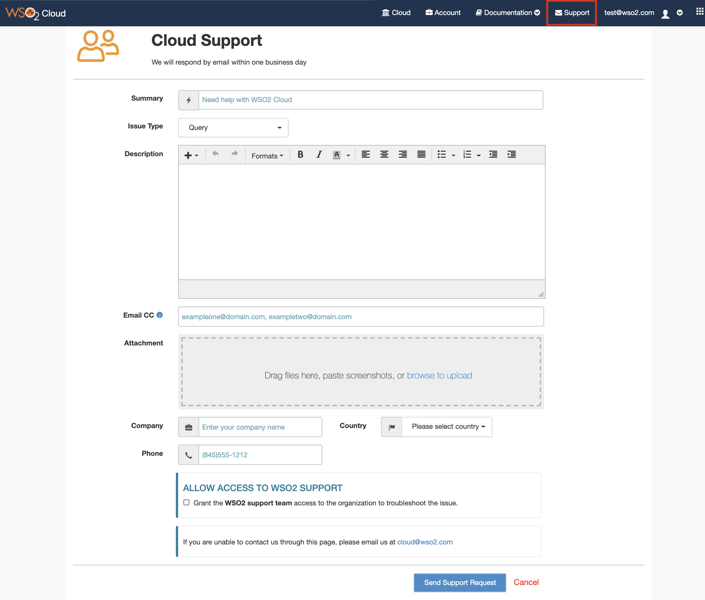
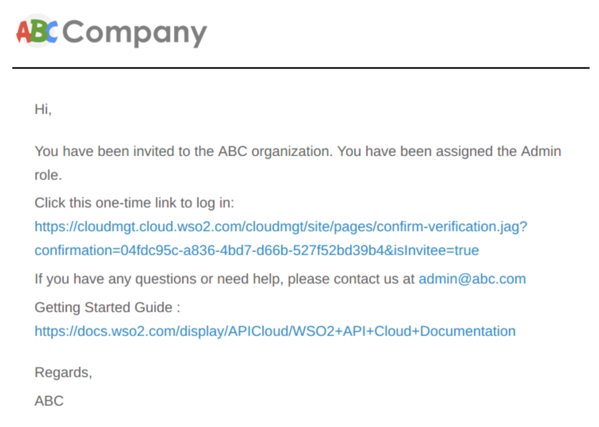

# Customize Invitation Emails

WSO2 Cloud enables you to customize the emails sent to users.

You can customize the emails sent to the invited users by adding your
own logo and changing the content in the emails.

If you want to make your own customizations as demonstrated below,
contact WSO2 Cloud Support via a support request or chat.

  
The default invitation email, with the WSO2 logo and graphics, sent to
the users with Admin role is in the following format:

WSO2 Cloud provides you a one-time link, which will be sent with the
invitation. You can customize the content of the email and choose where
the one-time link should be included. The fields for the roles will be
replaced according to your selection. You can also include your own logo
and graphics to customize the email further.

An example of a customized email is shown below:

!!! tip
    
    **Note:** These invitation emails will have the subject " WSO2 Cloud
    Services ". If you need to customize the email subject, please mention
    it in your request as well.
    

