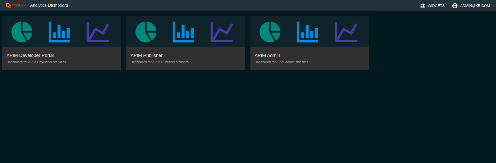

# Customize the Analytics Dashboard

The Analytics Dashboard allows you to customize the favicon and the logo icon to reflect your brand identity. To customize the favicon and logo, you need to upload your files to the following paths.

   <html>
     

     
Note

     
When you upload files, be sure to use the exact file name and file type
        as follows:<ul>
     <li>**Favicon** - <THEME_HOME>/analytics/images/favicon.ico</li>
     <li>**Logo path** - <THEME_HOME>/analytics/images/custom-logo.svg</li>
     </ul>

     

     </html>
        
    
Once you upload the files, follow the steps in the [Apply Customizations](/customize/apply-customizations/) page to apply your changes to the Analytics Dashboard.
    
The Analytics Dashboard will look similar to the following depending on the favicon and logo you uploaded.

    

