# Customize the Devportal

WSO2 Devportal (previously known as API Store) comes with a default
theme that defines the basic look and feel of the Devportal. Since the
capability to customize an API portal with your own corporate logos and
styles is an important requirement when it comes to APIs, WSO2 API Cloud
allows you to customize the look and feel of the Devportal depending on
your preference.

Since the default theme already has most of the UIs and JSON logic
defined, in a typical scenario, you do not have to implement the theme
from scratch. You can customize the default theme by bundling together
the necessary changes (e.g., CSS code, images) as a
`.zip` file, and then upload it through the Admin
Dashboard web application. Once uploaded, the files in the
`.zip` override the corresponding files in the default
theme. The rest is inherited from the default theme.


   <html>
     <div class="admonition note">
     <p class="admonition-title">Note</p>
     <p><ul>
     <li>To override the default theme, ensure that you upload UI changes,
        fonts, and images as follows:</li>
           <ul>
                <li>UI changes as CSS code.</li>
                <li>Fonts in TTF, EOT, WOFF, WOFF2 or OTF format.</li>
                <li>Images in JPG, PNG, SVG, or GIF format.</li>
           </ul>  
     <li>Javascript files are not allowed in the custom theme due to security
        reasons. If you include any Javascript files, such files will be
        discarded and your theme will not work properly.</li>
     </ul></p>
     </div>
     </html>
        

## Before you begin

- Download the `sampleTheme.zip` file.</br>The `sampleTheme.zip` file contains the following
  folder structure. Let's call this folder `<THEME_HOME>` throughout this section.</br>
  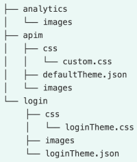 
       
  - The `<THEME_HOME>/apim/defaultTheme.json` file has all
the parameters that define the look and feel of the Devportal.
Therefore, you do not need to have React, CSS, or HTML knowledge to
customize the UI.

## Let's get started

The following topics describe how you can
alter the parameters defined in the `defaultTheme.json        `
file to customize the look and feel of the Devportal UIs depending on your requirement.


!!! tip
    
    <ul>
      <li>Once you alter the appropriate values in the
    `defaultTheme.json` file to achieve the look and feel
    that you want, you can follow the steps in the [Apply Customizations](/customize/apply-customizations/) page to upload and apply your customizations.</li>
      <li>After you make all the necessary changes in the JSON file, ensure that
        the JSON file name is specified as `defaultTheme.json.</li>
    </ul>
    

### Add a landing page

When the developer portal is required to present corporate branding, it is
a common requirement to have a landing page. The default landing page is
the API listing page. But when we enable the home page, there will be an
additional landing page.The landing page provides a head start for
developers who want to rebrand the Devportal to cater to their specific design requirements.   

The home page has four sections.

1.  carousel.
2.  First Description and the listing of APIs filtered by a given tag (provided via the theme file).
3.  Second description and the listing of APIs filtered by a given tag (provided via the theme file).
4.  Contact us section.


The following JSON defines the look and feel and behavior of the landing
page.

``` java
{
 "landingPage": {
   "active": true,
   "carousel": {
     "active": true,
     "slides": [
       {
         "src": "/site/public/images/landing/01.jpg",
         "title": "Lorem <span>ipsum</span> dolor sit amet",
         "content": "Lorem ipsum dolor sit amet, consectetur adipiscing elit. Integer felis lacus, placerat vel condimentum in, porta a urna. Suspendisse dolor diam, vestibulum at molestie dapibus, semper eget ex. Morbi sit amet euismod tortor."
       },
       {
         "src": "/site/public/images/landing/02.jpg",
         "title": "Curabitur <span>malesuada</span> arcu sapien",
         "content": "Curabitur malesuada arcu sapien, suscipit egestas purus efficitur vitae. Etiam vulputate hendrerit venenatis. "
       },
       {
         "src": "/site/public/images/landing/03.jpg",
         "title": "Nam vel ex <span>feugiat</span> nunc laoreet",
         "content": "Nam vel ex feugiat nunc laoreet elementum. Duis sed nibh condimentum, posuere risus a, mollis diam. Vivamus ultricies, augue id pulvinar semper, mauris lorem bibendum urna, eget tincidunt quam ex ut diam."
       }
     ]
   },
   "listByTag": {
     "active": true,
     "content": [
       {
         "tag": "finance",
         "title": "Checkout our Finance APIs",
         "description": "We offers online payment solutions and have more than 123 million customers worldwide. The WSO2 Finance API makes powerful functionality available by exposing various features of our platform. Functionality includes but is not limited to invoice management, transaction processing, and account management.",
         "maxCount": 5
       },
       {
         "tag": "weather",
         "title": "Checkout our Weather APIs",
         "description": "We provide accurate and reliable weather forecast. The Weather API returns weather elements such as temperature, rainfall, weather description, and wind speed.",
         "maxCount": 5
       }
     ]
   },
   "parallax": {
     "active": true,
     "content": [
       {
         "src": "/site/public/images/landing/parallax1.jpg",
         "title": "Lorem <span>ipsum</span> dolor sit amet",
         "content": "Lorem ipsum dolor sit amet, consectetur adipiscing elit. Integer felis lacus, placerat vel condimentum in, porta a urna. Suspendisse dolor diam, vestibulum at molestie dapibus, semper eget ex. Morbi sit amet euismod tortor."
       },
       {
         "src": "/site/public/images/landing/parallax2.jpg",
         "title": "Nam vel ex <span>feugiat</span> nunc laoreet",
         "content": "Nam vel ex feugiat nunc laoreet elementum. Duis sed nibh condimentum, posuere risus a, mollis diam. Vivamus ultricies, augue id pulvinar semper, mauris lorem bibendum urna, eget tincidunt quam ex ut diam."
       }
     ]
   }
 }
}
```

Following are the attributes you can change to customize the landing page:

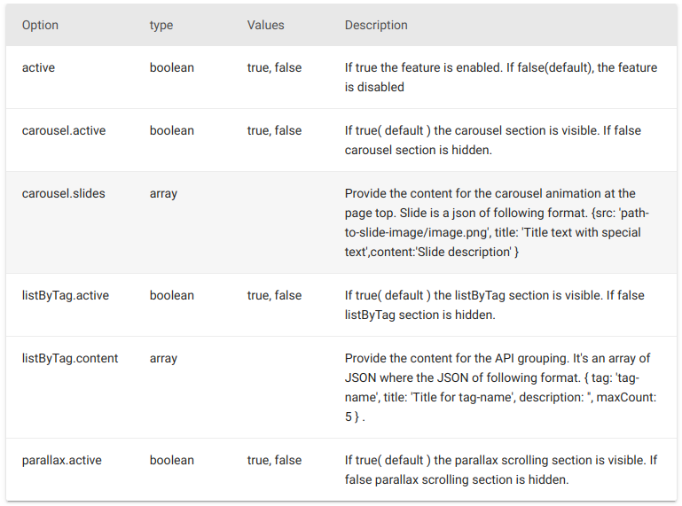

  

------------------------------------------------------------------------

### Change the logo and header styles

The header section can be customized to satisfy various design needs.
Following is the default header and the configuration of it.

  

``` java
"appBar": {
   "logo": "/site/public/images/logo.svg",
   "logoHeight": "19",
   "logoWidth": "208",
   "background": "#0fa2db",
   "activeBackground": "#1c6584",
   "showSearch": true,
   "drawerWidth": "200"
 }
```

We can change the logo and header background as follows by changing the appropriate parameters accordingly.


``` java
  "appBar": {
    "logo": "/site/public/tenant_themes/<tenant-domain>/apim/images/custom-logo.svg",
    "logoHeight": 34,
    "logoWidth": 128,
    "background": "#1d344f",
    "activeBackground": "#254061",
    "showSearch": true,
    "drawerWidth": 200
  }
```

   <html>
     <div class="admonition note">
     <p class="admonition-title">Note</p>
     <p>It is not a must to replace the `tenant-domain` in the logo
path because the Devportal will automatically replace it
with the tenant domain at runtime.</p>
     </div>
     </html>
        


Following are the attributes you can change to customize the Header:

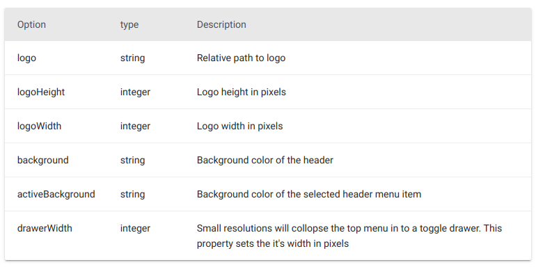


------------------------------------------------------------------------

### Change the font family

Keep in mind only to use the Web Safe Fonts when you select a font
family. You can specify several fonts in order of preference to ensure
maximum compatibility in case one font fails in a given browser/OS.
Start with the font you want, and end with a generic family, to let the
browser pick a similar font in the generic family if no other fonts are
available.

By default we use the values in the following configuration:

``` java
 "typography": {
   "fontFamily": "\"Open Sans\", \"Helvetica\", \"Arial\", sans-serif",
   "fontSize": 12,
   "body2": {
     "lineHeight": 2
   }
 }
``` 

------------------------------------------------------------------------

### Change the default API view

Depending on your requirement you can change the value of `defaultApiView` to either `list` or `grid` by
changing the following configuration:

``` java
 "custom": {
   "defaultApiView": "grid"
 }
```

The **Grid View** will look as follows:

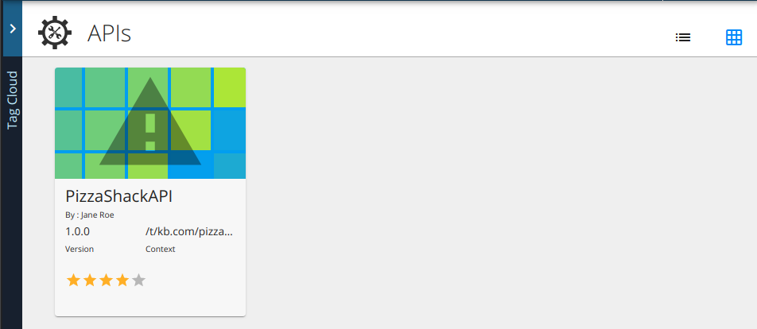

The **List View** will look as follows:

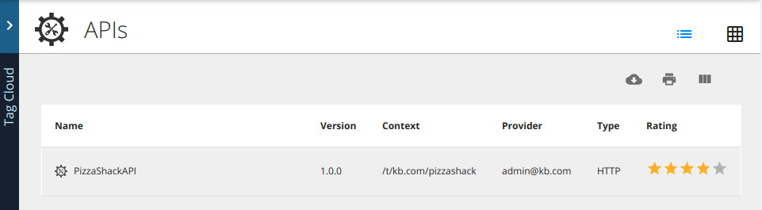

  
------------------------------------------------------------------------

### Add a custom banner to the Devportal

The banner section is hidden by default. If necessary you can configure it as follows to display an announcement on the Devportal.

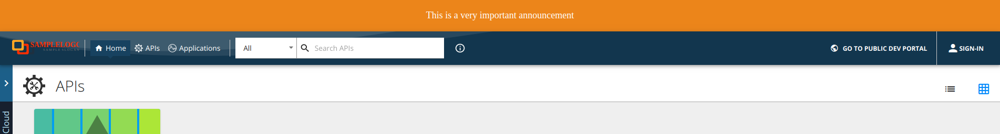 

``` java
 "banner": {
   "active": true,
   "style": "text",
   "image": "/site/public/images/landing/01.jpg",
   "text": "This is a very important announcement",
   "color": "#ffffff",
   "background": "#e08a00",
   "padding": 20,
   "margin": 0,
   "fontSize": 18,
   "textAlign": "center"
 }
```

Following are the attributes you can change to customize the banner:

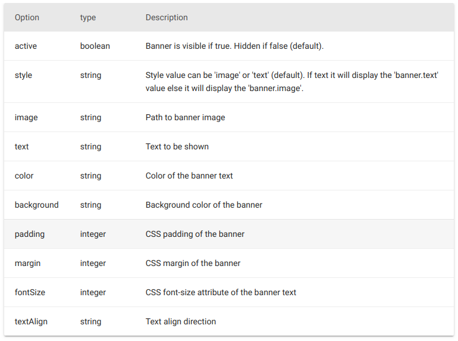
 

------------------------------------------------------------------------

### Customize API detail tabs

When you go to the API details page, all the tabs (i.e., credentials,
comments, tryout, sdks, documents) are displayed. You can enable or
disable them by changing the following configuration:

``` java
 "apiDetailPages": {
   "showCredentials": true,
   "showComments": true,
   "showTryout": true,
   "showDocuments": true,
   "showSdks": true,
   "onlyShowSdks": []
 }
```

Following are the attributes you can change to customize the API details tab:

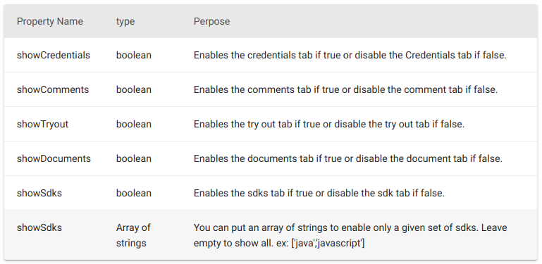

  
------------------------------------------------------------------------

### Override API overview page per API

It is possible to display custom overview content for any API by adding
a document by following the steps given below:

1.  Sign in to the API Publisher and go to the documents tab of the API for which you want to add a custom document.
2.  Create a new document by providing the necessary details.  
    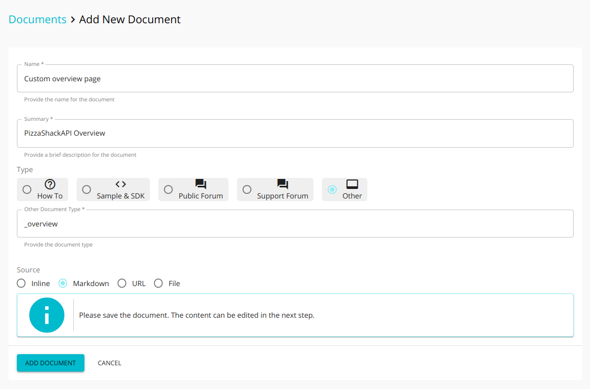  
    Following are the attributes you can change to customize the “Add New Document” page.  
    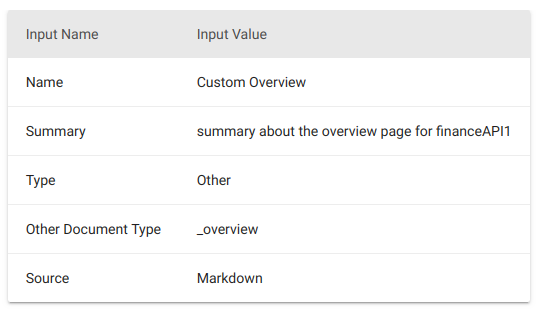
3.  Click **Save** and then select ADD CONTENT.
4.  Add markdown content. </br>
    Following are some of the keys you can use in markdown
    to display some of the API properties.  
    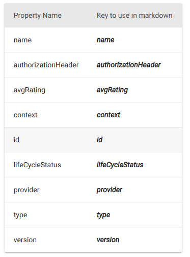</br>


     <html>
     <div class="admonition note">
     <p class="admonition-title">Note</p>
     <p>Key should be surrounded by three underscores such as
        \_\_\_key\_\_\_</p>
     </div>
     </html>
     </br>   

     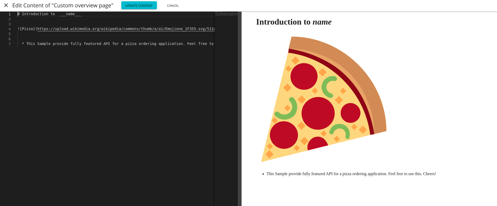</br>
  
     The above image illustrates the use of the key ***name*** to
    display the API name within the markdown content. The overview for the
    selected API will be rendered from the markdown content in the
    Devportal as follows:</br>
  
     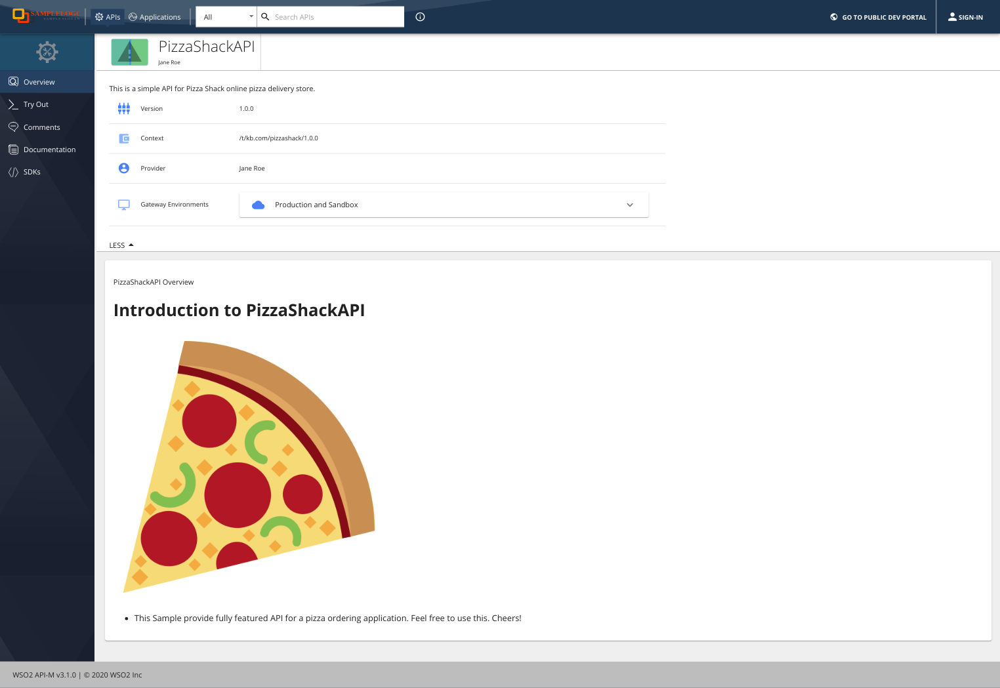

------------------------------------------------------------------------

### Enable or disable rating

The star rating is enabled by default. You can disable the star rating by
changing the following configuration:

``` java
 "social": {
   "showRating": true
 }
```

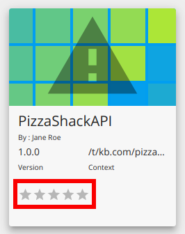

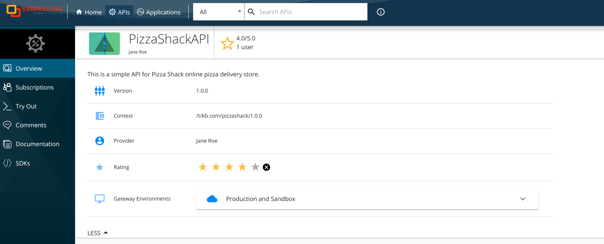

  
------------------------------------------------------------------------

### Customize the tag cloud

The tag cloud is enabled by default. Following is the configuration of the default look and feel: 

``` java
"tagCloud": {
   "active": true,
   "colorOptions": {
     "luminosity": "light",
     "hue": "blue"
   },
   "leftMenu": {
     "width": 200,
     "height": "calc(100vh - 222px)",
     "background": "#1a1f2f",
     "color": "#c7e9ff",
     "titleBackground": "#335c8b",
     "sliderBackground": "#335c8b",
     "sliderWidth": 25,
     "hasIcon": false
   }
 }
```
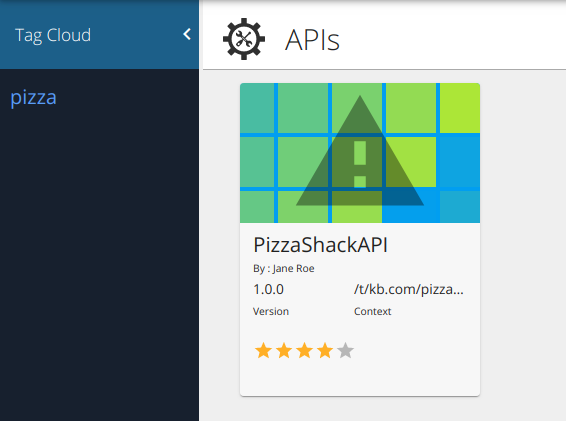


   <html>
     <div class="admonition note">
     <p class="admonition-title">Note</p>
     <p>The LeftMenu object properties are applied only if the following is configured:</br>
    `tagCloud.style='fixed-left'`.</p>
     </div>
     </html>
    

Depending on your requirement, you can change the default parameters in a manner similar to the following to alter the look and feel of the tag cloud component:

``` java
 "tagCloud": {
   "active": true,
   "colorOptions": {
     "luminosity": "dark",
     "hue": "yellow"
   },
   "leftMenu": {
     "width": 150,
     "height": "calc(100vh - 222px)",
     "background": "#4fa6d4",
     "color": "#c7e9ff",
     "titleBackground": "#335c8b",
     "sliderBackground": "#335c8b",
     "sliderWidth": 25,
     "hasIcon": false
   }
 }
```

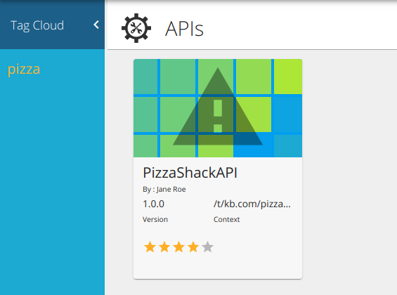

Following are the attributes you can change to customize the tag cloud component:

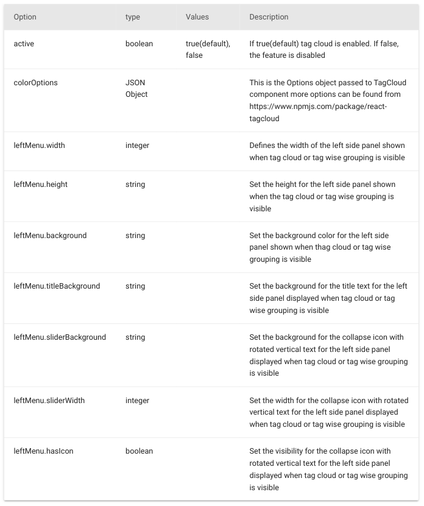

------------------------------------------------------------------------

### Change the footer design

The footer section is visible by default. Following is the default configuration: 

``` java
 "footer": {
   "active": true,
   "text": "",
   "background": "#bdbdbd",
   "color": "#222222"
 }
```


You can change the default footer design by changing the configuration in a manner similar to the following:

``` java
 "footer": {
   "active": true,
   "text": "WSO2 Cloud - Custom Footer | © 2020 WSO2 Inc",
   "background": "#42b691",
   "color": "#222222"
 }
```


!!! note
    
    In addition to the given configuration you can also add the custom CSS
    rules to change the look and feel. Here we have added the following
    style to center the text in the footer and you can find detailed
    information on adding CSS styles later in this document.
    
    ``` java
    #footer {
     justify-content: center;
    }
    ```
    

Following are the attributes that you can change to customize the footer.

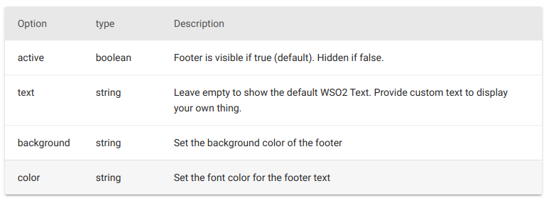

------------------------------------------------------------------------

### Customize the API details left menu

The API details left menu can be customized to match your design needs.

!!! note
    
    These changes will affect in the same way to the application details left menu as well.

Following is the default configuration of the API details left menu: 

``` java
 "leftMenu": {
   "position": "vertical-left",
   "style": "icon left",
   "iconSize": 24,
   "leftMenuTextStyle": "uppercase",
   "width": 180,
   "background": "#1a1f2f",
   "leftMenuActive": "#254061",
   "activeBackground": "rgb(29, 52, 79)",
   "rootIconVisible": true,
   "rootIconSize": 42,
   "rootIconTextVisible": false,
   "rootBackground": "#204d6a"
 }
```
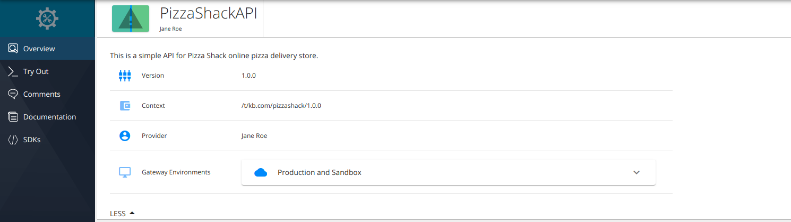

If necessary you can change the position of the left menu depending on your requirement. For example, changing the configuration as follows sets the menu as a toolbar.

``` java
 "leftMenu": {
   "position": "horizontal",
   "style": "no text",
   "iconSize": 24,
   "leftMenuTextStyle": "uppercase",
   "width": 60,
   "background": "#051d46",
   "leftMenuActive": "#254061",
   "activeBackground": "#347eff",
   "rootIconVisible": false,
   "rootIconSize": 42,
   "rootIconTextVisible": false,
   "rootBackground": "#204d6a"
 }
```

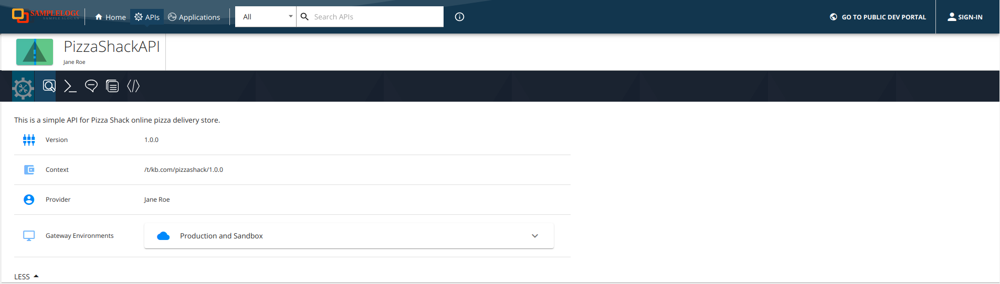

Changing the configuration as follows sets the menu to the right hand side and disables the
icons.

``` java
"leftMenu": {
   "position": "vertical-right",
   "style": "no icon",
   "iconSize": 24,
   "leftMenuTextStyle": "uppercase",
   "width": 180,
   "background": "#444",
   "leftMenuActive": "#000",
   "activeBackground": "rgb(29, 52, 79)",
   "rootIconVisible": true,
   "rootIconSize": 42,
   "rootIconTextVisible": false,
   "rootBackground": "#efefef"
 }
```


Following are the attributes you can change to customize the API details left menu component.

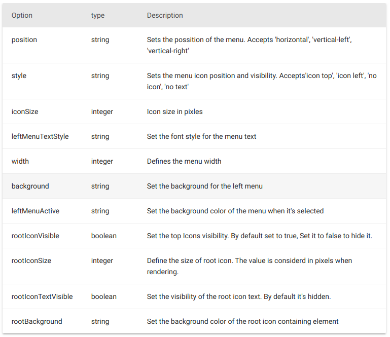

------------------------------------------------------------------------

### Customize the API details info section

The API details info section can be customized to reflect your design
needs. The following JSON defines the default look and feel.

``` java
 "infoBar": {
   "height": 70,
   "background": "#ffffff",
   "showBackIcon": true,
   "showThumbnail": true,
   "starColor": "#f6bf21",
   "sliderBackground": "#ffffff",
   "iconOddColor": "#347eff",
   "iconEvenColor": "#89b4ff",
   "listGridSelectedColor": "#347eff",
   "tagChipBackground": "#7dd7f5"
 }
```

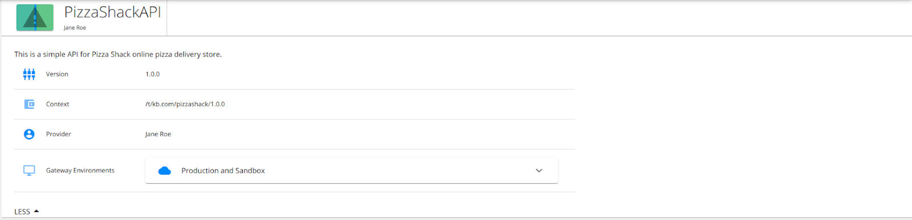

Following example demonstrates a use case of changing the colors of UI
elements and hiding 'back to APIs' link and API thumbnail icon.

``` java
 "infoBar": {
   "height": 50,
   "background": "#000",
   "showBackIcon": false,
   "showThumbnail": false,
   "starColor": "#ff1a1a",
   "sliderBackground": "#000",
   "iconOddColor": "#00e600",
   "iconEvenColor": "#b3ffb3",
   "listGridSelectedColor": "#347eff",
   "tagChipBackground": "#7dd7f5"
 }
```

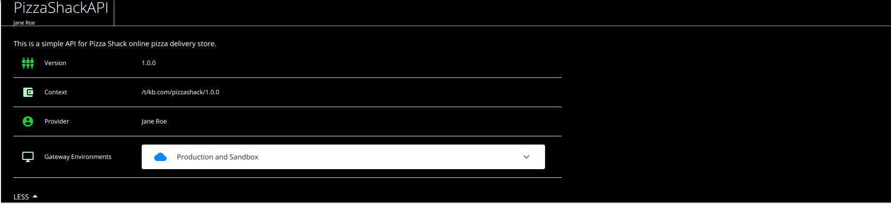

Following are the attributes you can change to customize the API Details section.

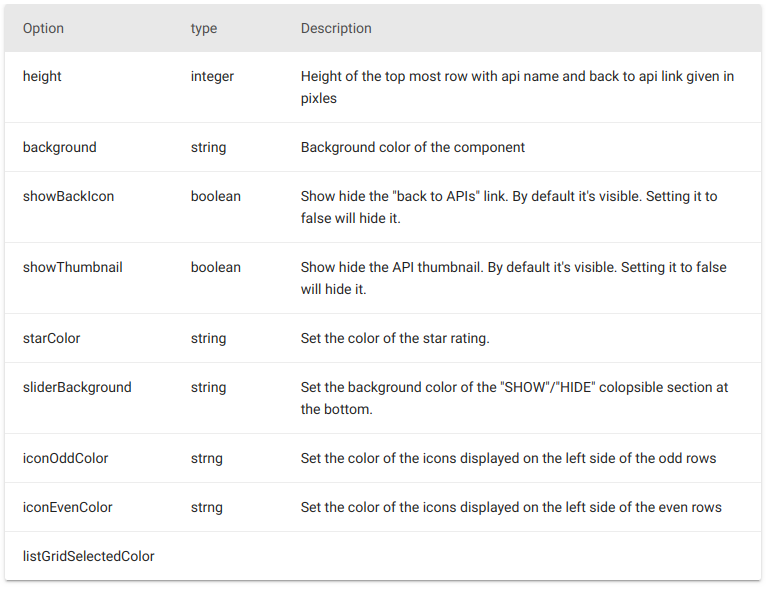

------------------------------------------------------------------------

### Apply CSS rules to change the look and feel

If you prefer to change the styling using CSS rules, you can
change the `\<THEME\_HOME\>/apim/css/custom.css` file accordingly.


   <html>
     <div class="admonition note">
     <p class="admonition-title">Note</p>
     <p> We have injected IDs into the dom elements in the Devportal
UI so that you can use them to apply CSS rules. However, be aware of the
dynamically generated CSS class names. These class names have a number
suffix that changes from version to version. Therefore, it is
recommended not to use them for styling purposes. The CSS file is
referenced in the `defaultTheme.json` file. It is not a
must to replace the `tenant-domain` in the following line because the Devportal will automatically replace it with the
current tenant domain at
runtime.</p>
     </div>
     </html>

  

``` java
   "tenantCustomCss": "/site/public/tenant_themes/<tenant-domain>/apim/css/custom.css",
```

For example, let's change the style of `commonListingAppBar`:

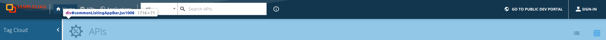

You can find the dom element IDs by inspecting the elements via the
developer tool:


As you can see above, we have injected IDs to the
appBar and its inner components.

``` java
#commonListingAppBar{
   background: rgb(60, 182, 145);
   margin-left: -4px;
}
```

Here we have applied the style to the AppBar main component, where the
component id is `commonListingAppBar`.

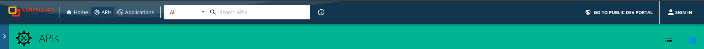

As illustrated in the example, you can explore the Devportal UI and find the IDs
for the corresponding components you want to apply styles to, and follow the
same procedure described above.

