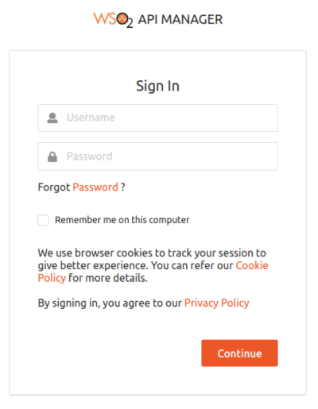
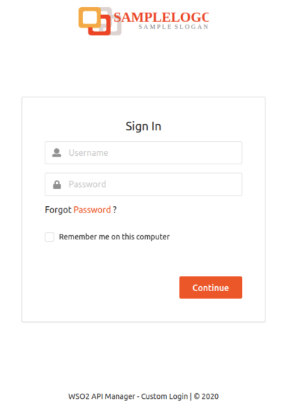

# Customize the Sign In Page

This tutorial walks you through the steps you need to follow to
customize the sign in page.

You can customize this page by:

-   Branding the page to display your company name and logo.
-   Hiding the existing cookie policy and privacy policy.

The parameters in the
`<THEME_HOME>/login/loginTheme.json` file define the
look and feel of the sign in page.

**loginTheme.json**

``` java
{
 "title": "WSO2 API Manager",
 "header": {
   "title": "API Manager"
 },
 "footer": {
   "name": "WSO2 API Manager"
 },
 "favicon": {
   "src": "favicon.ico"
 },
 "logo": {
   "src": "custom-logo.png",
   "alt": "logo",
   "height": "60",
   "width": "60"
 },
 "cookie-policy": {
   "visible": true,
   "text": "<custom cookie policy text>"
 },
 "privacy-policy": {
   "visible": true,
   "text": "<custom privacy policy text>"
 }
}
```

Following is the default look and feel of the page:


Let's make a few changes and see how the look and feel of the sign in
page changes. 

Follow the steps below:

1.  Change the favicon and logo by uploading your custom files to the
    `<THEME_HOME>/login/images/` path.
2.  Change the parameter values in the
    `<THEME_HOME>/login/loginTheme.json` file as
    follows:

    ``` java
        {
         "title": "WSO2 API Manager - Custom Login",
         "header": {
           "title": "API Manager - Custom Login"
         },
         "footer": {
           "name": "WSO2 API Manager - Custom Login"
         },
         "favicon": {
           "src": "favicon.ico"
         },
         "logo": {
           "src": "custom-logo.svg",
           "alt": "logo",
           "height": "240",
           "width": "240"
         },
         "cookie-policy": {
           "visible": false,
           "text": "Custom cookie policy text"
         },
         "privacy-policy": {
           "visible": false,
           "text": "Custom privacy policy text"
         }
        }
    ```

3.  Follow the steps in the [Apply Customizations](/customize/apply-customizations/) page.

Now that you have applied the changes, you can take a look at the
customized sign in page. It will look similar to the following depending
on the favicon and logo you uploaded.



