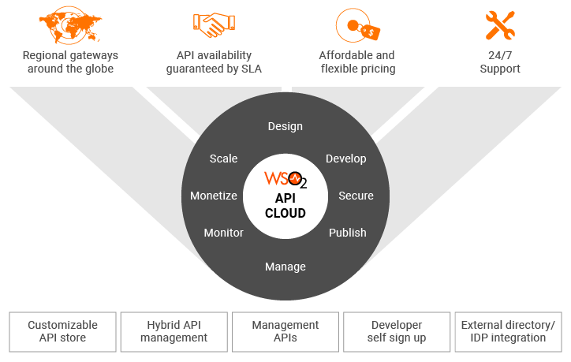

# Overview

WSO2 API Cloud is an enterprise-ready, self-service platform that
allows you to expose business capabilities as managed APIs and leverage
off-the-shelf potential for advertising and selling business APIs. WSO2
API Cloud supports all aspects of an API's lifecycle, from its creation
to publication and retirement.

WSO2 API Cloud is based on [WSO2 API
Manager](http://wso2.com/products/api-manager/), which is WSO2's complete
solution for designing, publishing, and managing APIs.

#### Advantages of the API Cloud

-   **Provides a pre-setup environment** that is ready to go and saves
    time on infrastructure set up.
-   **Reduces the cost** of development and time-to-market because
    developers understand what capabilities are already available as
    APIs and ready for reuse before starting a new development project.
-   **Helps** **build a digital business ecosystem** . The API Cloud
    fosters cross-organizational development collaboration by making
    your APIs public in a storefront and encouraging reuse.
-   **Enables platform service sharing** by tenant-aware and
    service-aware load balancing.
-   **Frees enterprises from vendor locking** . You can start
    hosting and managing your APIs on the API Cloud and then migrate
    between an on-premises instance, a private PaaS, a public PaaS, and
    hybrid cloud environments without rewriting code or reentering data.
-   **Helps manage and monitor** APIs through various
    statistical dashboards.
-   **Provides a consistent, easy-to-use GUI** for 
    creating and managing APIs.
-   The platform **automatically manages dependencies** for you. For
    example, when moving an API from the CREATED state to PUBLISHED
    state, you usually have to connect to different databases. But now,
    the publisher can simply move the application through its lifecycle
    stages while the platform automatically handles the underlying
    tasks.
