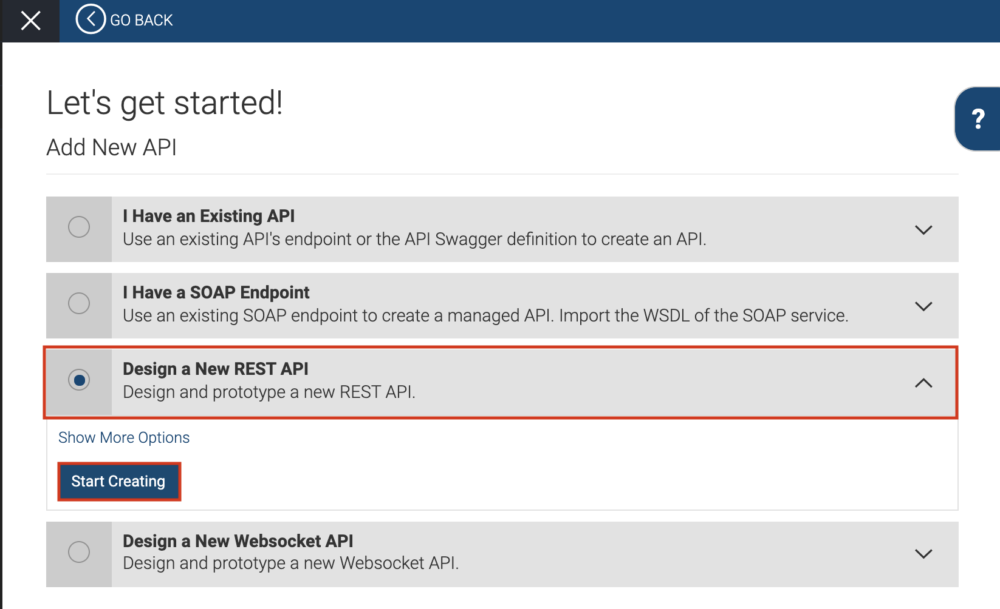

# Quick Start Guide

WSO2 API Cloud provides an intuitive UI guided experience to design and publish an API.

This quick start guide provides step-by-step instructions so that you can quickly design, publish, and invoke an API via WSO2 API Cloud's Publisher Portal and API Store.

## Prerequisites

If you have not yet created an account to start using WSO2 API Cloud, follow the instructions in the [Create a WSO2 Cloud Account](../create-a-wso2-cloud-account) page to quickly sign up for a trial account and try out the capabilities of WSO2 API Cloud. 

## Objectives

1. Design and publish an API via the API Publisher portal.
2. Subscribe to the API via the API Store.
3. Generate keys.
4. Invoke the API with the generated keys.

Let's get started!

### Step 1 - Create and publish your first API

Follow the instructions below to create and publish an API via the API Publisher Portal.

1. Sign in to WSO2 API Cloud using your username and password. This opens the API Publisher portal.                                             

2. Create an API.

     Let's use a mock REST service to create the API from scratch.
 
     1. Navigate to [https://www.mocky.io/](https://www.mocky.io/) on your web browser. 
             
         A mock service with a JSON response `{"hello": "world"}`  is provided by default on the landing page of the site. Let's use the  service URL (`http://www.mocky.io/v2/5185415ba171ea3a00704eed`) that appears in the mock service. Note that we are using the HTTP protocol instead of HTTPS.

        
         
     2. To test this service, copy the service URL [http://www.mocky.io/v2/5185415ba171ea3a00704eed](http://www.mocky.io/v2/5185415ba171ea3a00704eed) and navigate to it on a new browser. You should see the following JSON message.
            
         `{"hello": "world"}`
    
3. Click **ADD NEW API**.
     

4. Select **Design a New REST API** and then click **Start Creating**.
 

5. Provide the following as the API details:

     1. In the **Design** tab specify the following and click **Next: Implement**:

         <table>
         <tr> 
         <th>
         Name
         </th>
         <td>
         HelloWorld
         </td>
         </tr>
         <tr> 
         <th>Context
         </th>
         <td><code>/hello</code>
         </td>
         </tr>
         <tr> 
         <th>Version
         </th>
         <td>1.0.0
         </td>
         </tr>
         </table>

     2. In the **Implement** tab click **Managed API**, then specify the following and click **Next: Manage**:
   
         <table>
         <tr> 
         <th>Endpoint Type
         </th>
         <td>HTTP/REST Endpoint
         </td>
         </tr>
         <tr> 
         <th>Endpoint
         </th>
         <td><code>http://www.mocky.io/v2/5185415ba171ea3a00704eed</code>
         

         
Note

         
<b>Use the HTTP protocol</b>. If you want to use HTTPS you would have to import the <code>mocky.io</code> certificate.

         
 
         </td>
         </tr>
         </table>

     3. In the **Manage** tab select `Gold` and `Bronze` as the **Subscription Tiers**.

        
6. Click **Save & Publish**. 

     This will publish the API to the API Store. You now have an OAuth2.0 secured REST API that is ready to be consumed.

### Step 2 - Subscribe to the API

Follow the instructions below to subscribe to the API and generate the keys via the API Store.

1. Go to the API Store. You will see the published `HelloWorld` API listed in the in the API Store.

2. Click on the API thumbnail to take a look at the overview of the API. 

3. Register an OAuth2.0 application.

    1. Under **Applications** select **New Application**. This takes you to the **Add Application** page. 
    
    2. Specify the following values and click **Add** to register an OAuth2.0 application, which you can use to consume the `HelloWorld` API.
    
         <table>
         <tr> 
         <th>
         Name
         </th>
         <td>
         Greetings
         </td>
         </tr>
         <tr> 
         <th>Per Token Quota
         </th>
         <td>50PerMin
         </td>
         </tr>
         </table>
       This displays a message requesting whether you want to return to the API detail page. Click **Yes**. 

     3. On the API detail page, 
         1. Under **Applications**, select the newly created `Greetings` application.
         2. Under **Tiers**, select `Bronze`. 
     
     4. Click **Subscribe**.
        
     This subscribes the `Greetings` application to the `HelloWorld` API on the selected business plan and displays a message that you have successfully subscribed. Click **View Subscriptions**.

4. Generate production keys for the **Greetings** OAuth2.0 application.

    - Click on the **Production Keys** tab and click **Generate keys** without changing any of the default values.

5. Click copy to copy the generated test access token to the clipboard.

 **Voila!!!** You can now test the 'HelloWorld' API with the OAuth2.0 token that you just generated. 

### Step 3 - Invoke the API

Follow the instructions below to invoke the API you created:

1. Go to the API Store and click on the `HelloWorld` API.

2. When the API opens, click the **API Console** tab. You will see the resources of the API are listed. 

2. Click `GET` resource of the API to expand the resource. 

5. Click **Try It Out**, which is the button on the right. Then click **Execute**.  

     You should see the `{"hello" : "world"}` response from the API.  

__Congratulations!__ You have successfully created your first API, subscribed to it through an OAuth2.0 application, obtained an access token for testing, and invoked your API with the access token.  
