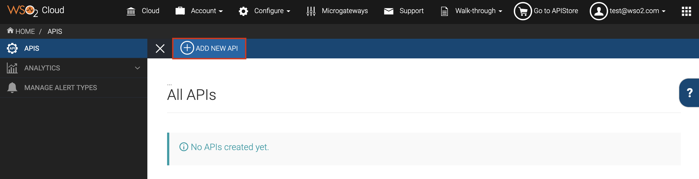

# Create and Publish an API

**API creation** is the process of linking an existing backend API
implementation to the API Publisher so that you can manage and monitor
the API's lifecycle, documentation, security, community, and
subscriptions. Alternatively, you can provide the API implementation
in-line in the API Publisher itself.

In this tutorial , you create an API using a production endpoint and
publish it to the API Store.
    

Let's get started. 

1.  If you have not registered to the API Cloud yet, go to
    <https://cloud.wso2.com/> and sign up.
2.  Sign in to WSO2 API Cloud and the API Publisher web application will
    open automatically.
3.  Close the interactive tutorial that starts automatically if you are
    a first-time user, and then click **ADD NEW API**.  
    
4.  Select **Design a New REST API** and click **Start Creating**.  
    
5.  Specify the following as the API details and click **Add** to add the
    resource.

     <table>
     <colgroup>
     <col style="width: 50%" />
     <col style="width: 50%" />
     </colgroup>
     <thead>
     <tr class="header">
     <th>Field</th>
     <th>Sample value</th>
     </tr>
     </thead>
     <tbody>
     <tr class="odd">
     <td>Name</td>
     <td>PhoneVerification</td>
     </tr>
     <tr class="even">
     <td>Context</td>
     <td>

        
<code>/phoneverify</code>

             
<strong>Tip</strong> : You can define the API's version as a parameter of its context by adding the `version` into the context. For example, `<{version}/phoneverify`. The API Manager assigns the actual version of the API to the `version` parameter internally. For example, <a href="https://gateway.api.cloud.wso2.com:8243/t/companyn/phoneverify/1.0.0">https://gateway.api.cloud.wso2.com:8243/t/companyn/1.0.0/phoneverify</a> . Note that the version appears before the context, allowing you to group your APIs based on versions.

        
</td>
      </tr>
      <tr class="odd">
      <td>Version</td>
      <td>1.0.0</td>
      </tr>
      <tr class="even">
      <td>Visibility</td>
      <td>Public</td>
      </tr>
      <tr class="odd">
      <td>Resources</td>
      <td><ul>
      <li>URL Pattern: <code>CheckPhoneNumber</code></li>
      <li>
Request Types: GET, POST
</li>
      </ul></td>
      </tr>
      </tbody>
      </table>

6.  After you add the resource, click its `           GET          `
    method to expand it and then provide the following parameter details: 

    | Parameter Name                             | Description                                   | Parameter Type | Data Type | Required |
    |--------------------------------------------|-----------------------------------------------|----------------|-----------|----------|
    | `               PhoneNumber              ` | Give the phone number to be validated         | Query          | String    | True     |
    | `               LicenseKey              `  | Give the license key as 0 for testing purpose | Query          | String    | True     |

    
    Once done, click **Implement**.
    Alternatively, click **Save** to save all the changes made to the
    API. You can come back later to edit it further by selecting the API
    and clicking on **Edit**.

7.  Click the **Managed API** option.  

8.  The `Implement` tab opens. Specify the
    information given in the table below:

    <table>
    <colgroup>
    <col style="width: 50%" />
    <col style="width: 50%" />
    </colgroup>
    <thead>
    <tr class="header">
    <th>Field</th>
    <th>Sample value</th>
    </tr>
    </thead>
    <tbody>
    <tr class="odd">
    <td>Endpoint type</td>
    <td>HTTP/REST Endpoint</td>
    </tr>
    <tr class="even">
    <td>Production endpoint</td>
    <td>
This sample service has two operations as <code>                CheckPhoneNumber               </code> and <code>                CheckPhoneNumbers               </code> . Let's use <code>                CheckPhoneNumber               </code> here. 
    <a href="http://ws.cdyne.com/phoneverify/phoneverify.asmx">http://ws.cdyne.com/phoneverify/phoneverify.asmx</a>

    
To verify the URL, click the <strong>Test</strong> button next to it.
</td>
    </tr>
    </tbody>
    </table>

9.  Click **Manage** to go to the `Manage` tab and
    enter the information in the table below:

    | Field             | Sample value | Description                                                                                                                                             |
    |-------------------|--------------|---------------------------------------------------------------------------------------------------------------------------------------------------------|
    | Tier Availability | Select all   | The API can be available at different levels of service. They allow you to limit the number of successful hits to an API during a given period of time. |

10. Click **Save & Publish** . This will publish the API to the API Store. so that subscribers can use it. 

Now you have successfully created and published an API.

