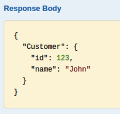

# Expose your On-Premises Backend Services to WSO2 API Cloud

All API calls that go out to your backend services from WSO2 API Cloud
go through the Cloud's API Gateway. The API Gateway handles user
requests, user authentication via OAuth, enforces security policies etc.

When your backend services are **private to your Intranet** , the API
Gateway cannot access them over the Internet. Therefore, you must expose
your internal services to the public so that they can be accessed by the
API Gateway.

**In this tutorial** , you learn the different ways in which you can
allow WSO2 API Cloud to access the private backend services in your
network.


### Expose your services using a DMZ server

You can p lace a reverse proxy in your demilitarized zone (DMZ ),
and connect your backend services to it. All the calls to the backend
services will then be routed by the reverse proxy. The steps below
explain how you can do this using a sample backend service and NGINX as
the reverse proxy.

!!! tip
    
    **Before you begin** ,
    
    -   Be sure to secure your backend services because
        the services will be publicly accessible when you expose them via the
        reverse proxy.
    
    -   Set up NGINX in the DMZ of your Intranet. See NGINX [installation
        instructions](https://www.nginx.com/resources/wiki/start/topics/tutorials/install/)
        and [basic commands](http://nginx.org/en/docs/beginners_guide.html).
    
    
    **Tip** : Although the instructions are the same, the screenshots given here may vary depending on your API and backend service implementation. Also, we use NGINX as the reverse proxy here but you can use any other similar technology.
    

1.  Go to the `< NGINX_HOME>/sites-enabled` folder and create
    a VHost file. It routes the requests that come to NGINX with the
    required hostname to your internal backend service.

2.  Add the following in the config file that you created in step 1:

    -   Create an upstream and point it to the IP and port of the
        actual backend service.

    -   Inside the `server{}` block, give the
        name of the server and the port that the requests are coming in
        from. In this case, it is
        `mycompany.services.com`.

    -   Inside the `location{}` block, route a
        request to the actual backend service if the request comes in
        the pattern of the server\_name mentioned above.

    ``` java
    upstream myservice { 
         server <IP_of the backend_service>:<port_of the backend_service>;
         #For example, server 10.5.10.70:9443; 
    }
    server {
         listen   80;
         server_name mycompany.services.com; 
         location / {
             include /etc/nginx/proxy_params;
             proxy_pass https://myservice/; 
         }
         access_log /mnt/var/log/nginx/mycompnay/access.log; 
         error_log /mnt/var/log/nginx/mycompany/error.log debug; 
    }
    ```

3.  Save and reload your NGINX configuration using the following
    command:  

    ``` java
        service nginx reload
    ```

    Next, let's make sure that the host that we mentioned in the above
    VHost config (i.e., mycompany.services.com) publicly resolves to the
    IP address of the reverse proxy server. If not, when you call this
    endpoint from WSO2 API Cloud, it will not be able to identify the
    location correctly.

4.  In an available DNS server, map the IP of your NGINX with the domain
    name that you specified as the server\_name (i.e.,
    mycompany.services.com ).  

    ``` java
        10.5.10.49 -> mycompany.services.com
        // 10.5.10.49 is the IP addresses of the server where placed your reverse proxy
    ```

    Once you have done the required configs in the NGINX reverse proxy,
    test whether a call is correctly routed through the NGINX to your
    backend services.

5.  Send the following [Curl](https://curl.haxx.se/) request using the
    command-line or the Terminal.  
    In this example, the backend is secured using basic auth. Therefore,
    we pass the
    `           <base64-encoded username:password>          ` in the
    `           Authorization          ` header.

    ``` java
        curl -k -X GET --header "Authorization: Basic <base64-encoded username:password>" http://mycompany.services.com/jaxrs_basic/services/customers/customerservice/customers/123
    ```

6.  Check whether you get a r esult from your actual backend service. If
    so, your reverse proxy configuration has been done correctly.

    Now that the configurations are complete, let's design the API
    using the API Cloud.

7.  Sign in to WSO2 API Cloud and [design a new REST API](../create-and-publish-an-api). Alternatively, you can edit an existing API.  

8.  In the **Design** tab of the API, under the **API Definition** ,
    Specify the URI template that matches the resources of your backend
    service.  
    In this example, the backend requires you to pass a customerId. So,
    the URL pattern is `jaxrs_basic/services/customerservice/customers/{customerId}`.  
    

9.  In the **Implement** tab, specify the endpoint that will be resolved
    at your reverse proxy before calling your backend service. According
    to the reverse proxy configuration in this example, the endpoint is
    `<http://mycompany.services.com/>`.

10. Since the backend service is secured using basic authentication in
    this example, set the **Endpoint Security Scheme** to
    `Secured`, the **Endpoint Auth Type** to
    `Basic Auth` and give the credentials expected
    by the backend service.  
    

11. In the **Manage** tab, select all the available tiers and save and
    publish your API.

12. Go to the API Store, subscribe to the API and click its **API Console**
    tab to invoke the API.  

13. Give a customerId (for example, 123), invoke the API and note the response
    that is displayed. The API Gateway makes a call to your reverse
    proxy, which is resolved using the DNS mapping. The reverse proxy
    then calls your backend service and returns the response to the API
    Console.  
    

With the help of a DMZ server, you have invoked a backend service that
is private to your Intranet using an API in WSO2 API Cloud.

### Expose your services using a VPN

If you are unable to use a reverse proxy, you have the option to create
a VPN connection between your network and WSO2 API Cloud.

         <html>
         <div class="admonition info">
         <p class="admonition-title">Note</p>
         <p>Make sure you secure your backend
    services as the services will be publicly
    accessible when you expose them via the VPN.</p>
         </div>
         </html>
    

This solution is fully secured and managed.

-   Each customer gets a separate subnetwork in the WSO2 Cloud space.
-   The subnetwork has a highly available load-balancer cluster, which
    connects to your network via AWS VPN.
-   To get started, click the **Support** menu in [API
    Cloud](http://wso2.com/cloud/api-cloud) interface and submit your
    request. WSO2 will respond and guide you through the setup process.

