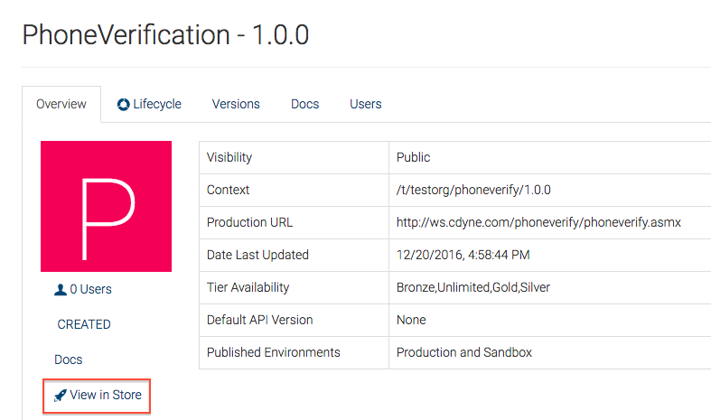
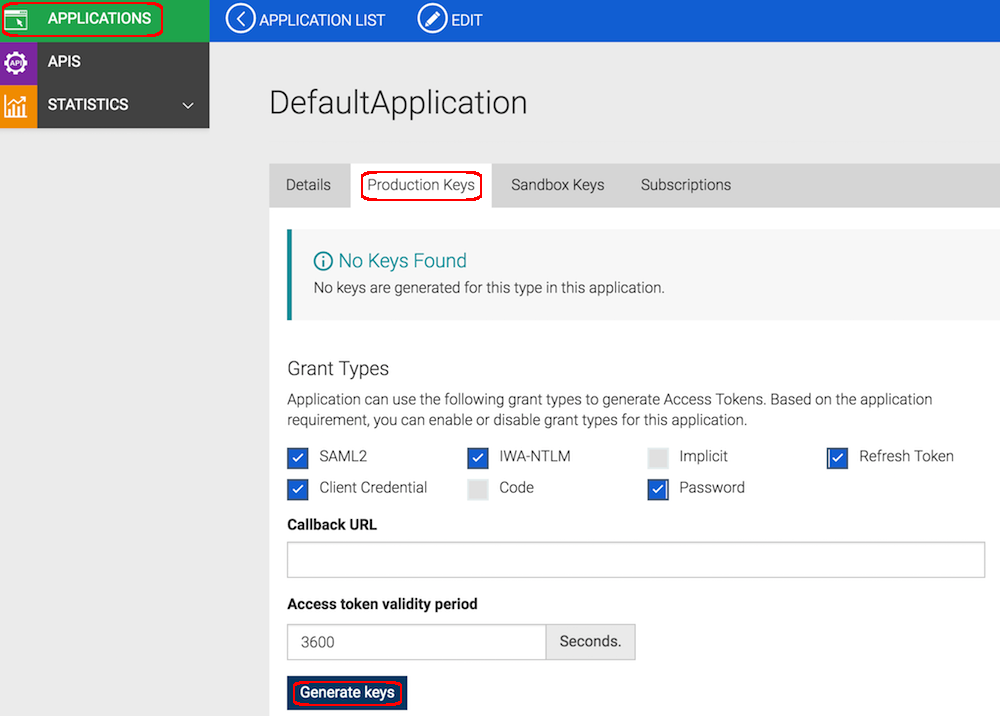
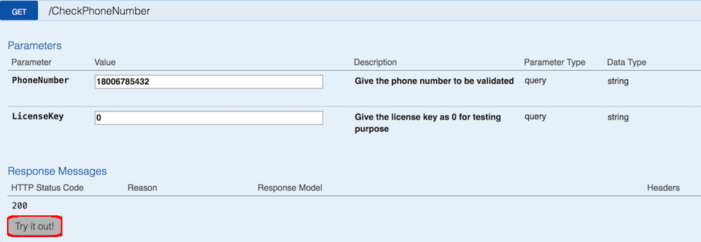

# Subscribe to and Invoke an API

You can **subscribe** to an API via the API Store. WSO2 API Store has an
integrated Swagger
Console, which is part of the Swagger project. You can use it to invoke APIs and
write interactive API documentation.

**In this tutorial** , you subscribe to an API and invoke it using the
integrated API Console. The examples here use the
`PhoneVerification` API, which you published via the tutorial [Create and Publish an API](../create-and-publish-an-api).

!!! note
    
    You can only try out HTTPS based APIs via the API Console, because the
    API Store runs on HTTPS.
    

Let's get started. 

1.  Sign in to WSO2 API Cloud.

2.  In the WSO2 API Publisher, click the
    `PhoneVerification` API to open it.
      

3.  Click the **View in Store** link that appears in the **Overview**
    tab of the API. You can also go to the API Store using the URL
    `http://api.cloud.wso2.com/store/?tenant=<tenant_name>`.
    

4.  Note the subscription options on the right-hand side of the page
    that opens. Select the `Default application` and the `Bronze` tier to
    subscribe to the API.
    

5.  When prompted, choose to view subscriptions. This displays the details of the application that you used to subscribe to the API.

6.  Click the **Production Keys** tab and click **Generate keys**. 
    

    By default the Client Credentials grant type will be used to
    generate the access token. Make sure the Client Credentials grant type
    is selected when generating keys from the UI.

    !!! tip
    
        You can set a token validity period in the given text box. By
        default, it is set to one hour (3600 seconds). If you set a negative
        value (e.g., -1), the token will never expire.
    
        However, this non-expiring token too can be revoked in some
        situations such as changing user password, changing the client
        secret, calling the token revoke api, authorization service provider
        detects that the tokens are compromised due to a security breach
        etc.
    
        Hence,
    
        1.  It is not recommended to hard-code such access tokens in
            client's applications on any production environment to
            communicate with the API Manager.
        2.  You should use the recommended methods of obtaining the token by
            using the relevant grant type.
        3.  Hard coding the token needs to be done with caution and if doing
            so, the application needs to be provisioned to get a new token
            in case the current hard-coded token is invalidated by the
            system.
      

7.  After the keys are generated, click the **APIs** menu in the API
    Store and then click the API that you want to invoke.  
 
8.  When the API opens, click its **API Console** tab.  

9.  Expand the GET method, specify values for the required parameters, and then click
    **Try it Out.** You can specify the following sample details to invoke the API: 

      <table>
      <colgroup>
      <col style="width: 50%" />
      <col style="width: 50%" />
      </colgroup>
      <tbody>
      <tr class="odd">
      <td><strong>PhoneNumber</strong></td>
      <td>E.g., 18006785432</td>
      </tr>
      <tr class="even">
      <td><strong>LicenseKey</strong></td>
      <td>Give 0 for testing purpose</td>
      </tr>
      <tr class="odd">
      <td><strong>Authorization</strong></td>
      <td>The API console is automatically populated by the access token that you generated in step 6 after subscribing to the API.
        
The token is prefixed by the string "Bearer" as per the OAuth bearer token profile. OAuth security is enforced on all published APIs. If the application key is invalid, you get a 401 Unauthorized response in return.
</td>
      </tr>
      <tr class="even">
      <td><strong>Base URL</strong></td>
      <td>

      
Appears at the bottom of the console. Using the base URL and the parameters, the system creates the API URL.

        <html>
         

         
Note

         
If you <strong>cannot invoke the API's HTTPS endpoint</strong> (causes the <strong>SSLPeerUnverified exception</strong> ), it could be because the security certificate issued by the server is not trusted by your browser. To resolve this issue, access the HTTPS endpoint directly from your browser and accept the security certificate.

         

         </html>
       </tr>
       </tbody>
       </table>
     

10. Note the response for the API invocation. As we used a valid phone
    number in this example, the response is valid.  
    

Now you have successfully invoked an API using the Swagger API console.
