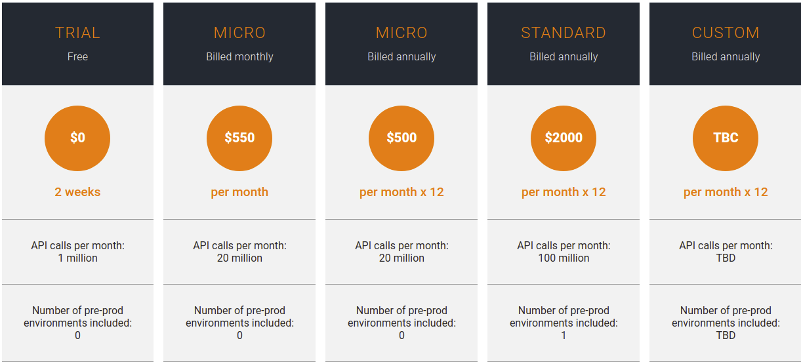

# API Cloud Pricing

WSO2 Cloud is a cost-effective solution that allows you to get started at a low monthly subscription. Our flexible pricing plans allow even budget-constrained startups to scale up to high enterprise volumes because the total subscription depends on the services consumed.

You can either get started with the trial plan and then upgrade to a preferred pricing plan, or directly get started with a preferred pricing plan from the following:

<table>
<tr>
  <td>TBD - <b>Custom</b> plan price to be calculated based on the number of API calls per month, pre-prod environment count, and the required add-ons.</td>
</tr>
<tr>
<td>The specified pre-prod environment counts are the default numbers provided with each plan. You can purchase additional pre-prod environments depending on your requirement. For <b>Standard</b> and <b>Custom</b> plans, the price per additional pre-prod environment is 10% of the plan price. For <b>Micro</b> plans, there is no discount on any pre-prod environment.</td>
</tr>
<tr>
<td>The price of a <b>Micro</b> annual plan has a 10% discount in comparison to the equivalent <b>Micro</b> monthly plan.</td>
</tr>
<tr>
<td>All pricing plans support the complete set of WSO2 API Cloud features.</td>
</tr>
<tr>
<td>Hybrid API gateways are supported only on the Standard tier. <a href="https://wso2.com/contact/">Contact us</a> for more info on hybrid gateway pricing.</td>
</tr>
<tr>
<td>VPN/VPC peering can be configured as an add-on for any subscription plan at $15K per annum.</td>
</tr>
<tr>
<td><a href="https://wso2.com/contact/">Contact us</a> for more details on pricing.</td>
</tr>
</table>
