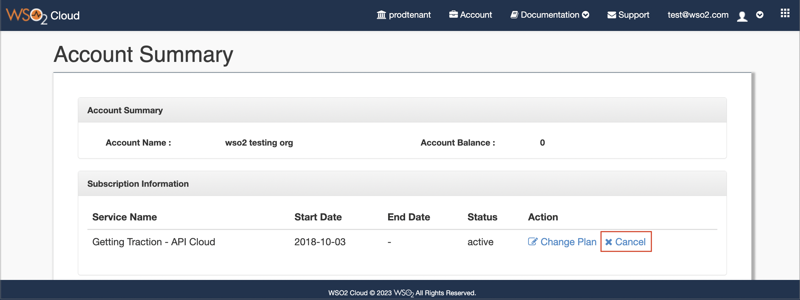

# Cancel Your API Cloud Subscription

If you no longer use WSO2 API Cloud and you want to cancel your subscription, follow these steps:

1. Sign in to the [WSO2 Cloud Management Portal](https://cloudmgt.cloud.wso2.com/cloudmgt/site/pages/index.jag).
2. In the header, click **Account**.  
3. Go to the **Subscription Information** pane and click **Cancel** corresponding to the subscription you want to cancel. 
    
    This displays a message to confirm the cancellation along with information on when the cancellation will become effective.
4. Check the message and click **Yes**. 
   
This triggers the cancellation of your WSO2 API Cloud subscription. For any further assistance, you can [get help via a support request](../get-support/work-with-the-support-team.md#get-help-via-a-support-request).
