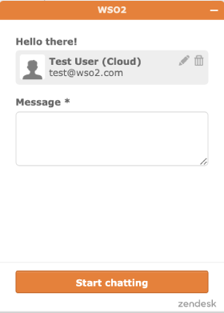

# Work with the Support Team

If you experience problems while working with WSO2 API Cloud, you have several options to get help so that you can understand the cause of the problem and find a feasible solution to it as soon as possible.

Following are the methods in which you get in touch with the WSO2 Cloud support team:

<html>
         

         
Note

         
Before contacting the support team, we recommend that you go through the [FAQ library](../faq-library/api-creation-and-design) to determine whether there is already a solution to the problem you have.

         

         </html>

- Contact WSO2 Cloud Support via a support request. 

	You can sign in to WSO2 API Cloud using your credentials and then click **Support** on the top menu bar to create a support ticket. For more details see, [Open a Support Ticket](../open-a-support-ticket).

	

- Get in touch with an API Cloud support expert via the embedded chat option. 

	You can sign in to WSO2 API Cloud using your credentials and then click **Chat with us** on the bottom right corner of the UI to start chatting with an expert.

	
