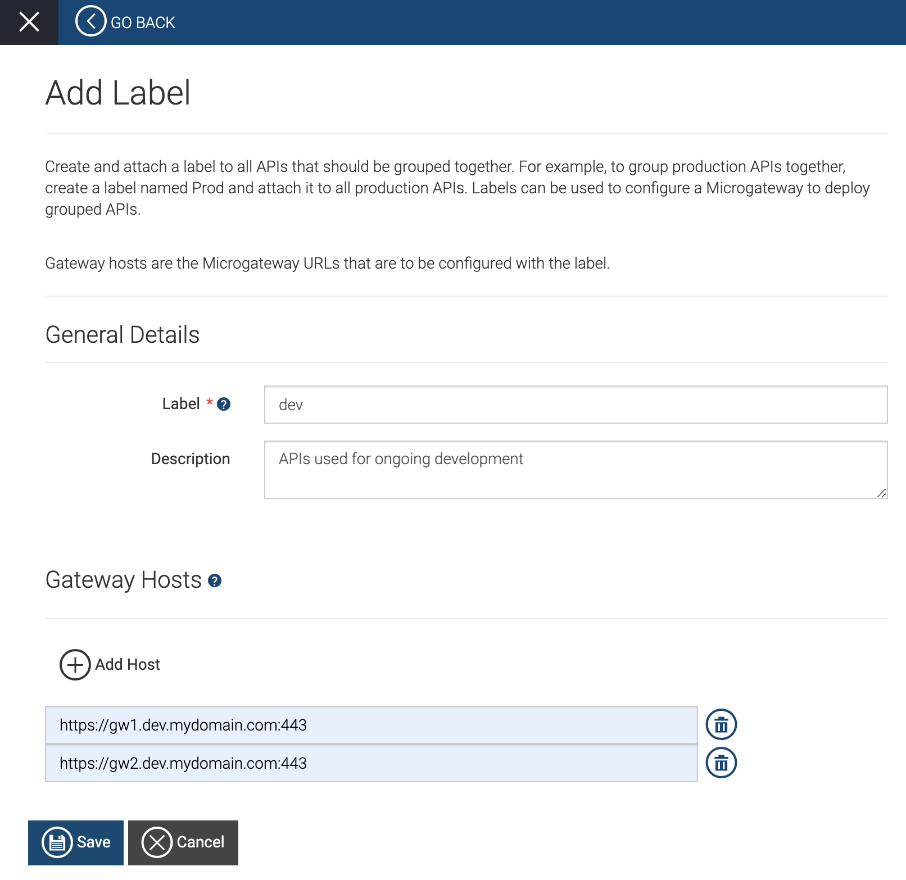
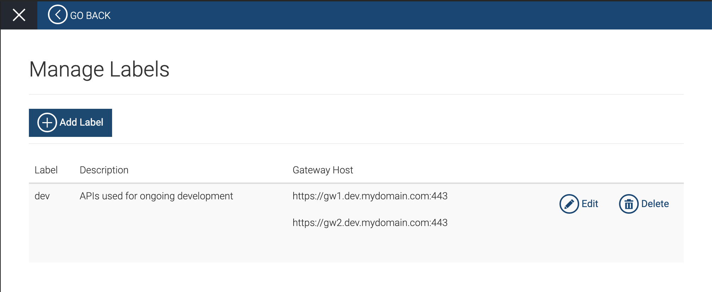
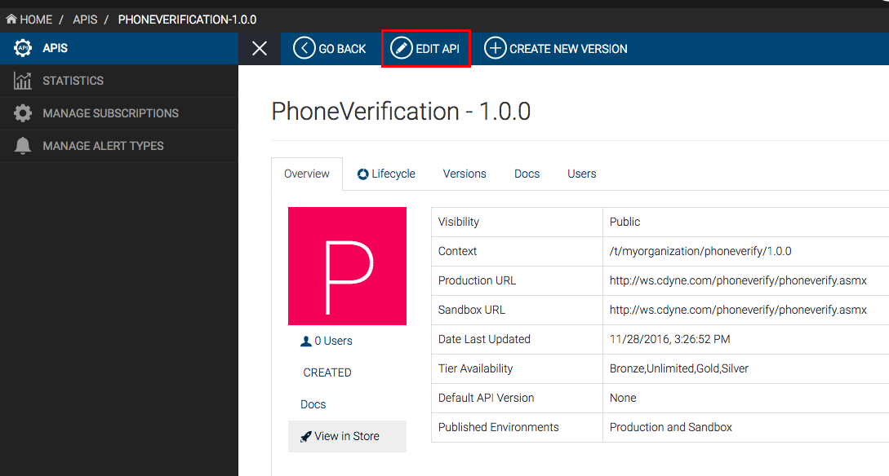
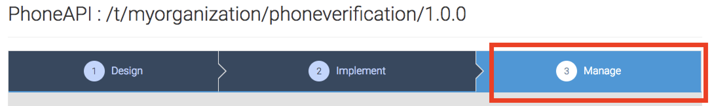
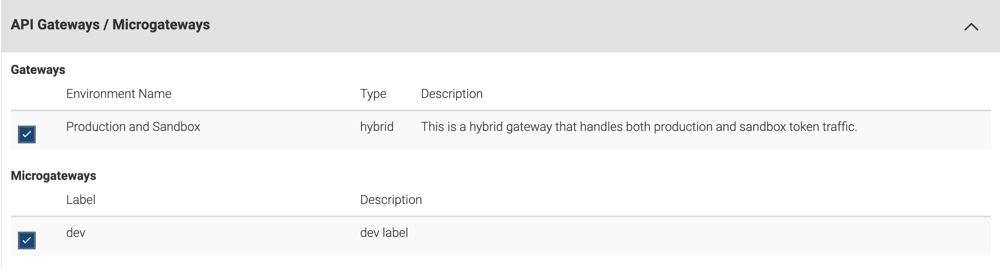
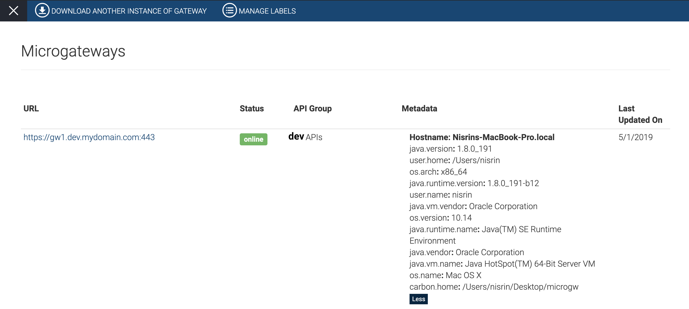

# Deploy Grouped APIs Using a Microgateway

WSO2 API Cloud allows you to add labels to group APIs together. If you
have a business requirement where you want to group a set of APIs
together, first you need to create a label and attach it to all the APIs
that you want to group together. For example, create a label named
`prod` to group all production APIs.

Once you add labels, you can also use any label to configure a
Microgateway so that only APIs with that particular label get deployed
via the Microgateway.

Let's take a look at a sample business use case to understand why it is
useful to group APIs with labels, and then have a look at how you can
use WSO2 API Cloud to group APIs with labels. The following topics walk
you through the sample business use case and how you can use labelling
to address the use case:

### Introduction

Assume that an organization has 4 Microgateway instances as follows for
dev, test, and production environments:

-   1 Microgateway instance as the test environment.

-   2 Microgateway instances as dev environments.

-   1 Microgateway instance as the production environment.

Let's also assume that the organization has a number of APIs and there
is a requirement to deploy APIs in the 4 Microgateway instances as
follows:

-   Deploy all existing APIs in the test environment

-   Deploy APIs related to ongoing development in the dev environment.

-   Deploy the APIs that are exposed for production in the production
    environment.

Now let's take a look at how the requirement above can be addressed.

To start addressing the requirement, the first step is to add required
labels. Here you would need one label to group APIs that are used for
ongoing development, and another to group production APIs.

### Grouping APIs with Labels

To group APIs with labels, you have to first add a meaningful label and
then attach the label to the APIs you want to group together.

#### Adding labels

-   Follow the steps below to add a label named `dev`:
    
    1.  Sign in to WSO2 API Cloud.
    2.  On the API Publisher, click **Microgateways** , and then click
        **Manage Labels** .

    3.  Click **Add Label** and specify the following values:

        | Field           | Value                             |
        |-----------------|-----------------------------------|
        | **Label**       | dev                               |
        | **Description** | APIs used for ongoing development |

    4.  Click **Add Host** and add two hosts as follows:  
        -   Host 1: `https://gw1.dev.mydomain.com:443`
        -   Host 2: `https://gw2.dev.mydomain.com:443`
    5.  Click **Save** .  
          
        This creates a label with the specified details.  
          
          

-   Follow steps 3 to 5 above to add another label with the following
    details:

    | Field            | Value                                                                                                                           |
    |------------------|---------------------------------------------------------------------------------------------------------------------------------|
    | **Label**        | prod                                                                                                                            |
    | **Description**  | Production APIs                                                                                                                 |
    | **Gateway Host** | `                                                https://gateway.mydomain.com:443                                             ` |

    This adds a label named `           prod          ` , which you can
    use to group production APIs together.

    !!! tip
    
        Based on the sample requirement, since all the APIs are supposed to
        be deployed in the test environment, you do not need to create a
        separate label to group APIs for the test environment.
    

Now that you have added all the labels required to address the sample
scenario, you are ready to start attaching labels to APIs.

  

#### Attaching labels to APIs

You can attach a label to an API either during API creation or by
editing an already created API.

Let's take a look at how to attach a created label to an API that you
have already published. Here, we will use the
`PhoneVerification` API that you have already published
by following the [Create and Publish an
tutorial.

1.  Sign in to WSO2 API Cloud. This takes you to the API Publisher Web
    application.
2.  In the API Publisher, browse to the
    `PhoneVerification` API and click **EDIT API**.  
    
3.  Navigate to the **Manage** tab.  
    
4.  Expand the **API Gateways/Microgateways** section and select a
    required label to attach it to the API.  
    In this case, select the `dev` label.  
    
5.  Click **Save & Publish**. This adds the dev label to the
    `PhoneVerification` API.

Similarly you can add labels to appropriate APIs depending on your
requirement.

Once you add the required labels to group APIs based on your
requirement, you can configure a microgateway so that only APIs that
have a particular label attached to it gets deployed via the
microgateway.

Now that you understand how to add labels and attach labels to APIs,
next let's take a look at how to configure a microgateway to deploy a
set of APIs that have been grouped using labels.

### Configuring a Microgateway to use a label

#### Prerequisites
    
- Ensure that you have the **Java SE Development Kit (JDK)** installed. You can install either [OpenJDK 8](https://openjdk.java.net/install/) or [Oracle JDK 1.8.\*](https://www.oracle.com/java/technologies/javase-downloads.html).
  <html>
     <div class="admonition note">
     <p class="admonition-title">Note</p>
     <p>WSO2 recommends installing JDK 8u161 or later.</p>
     </div>
     </html>
            

- Be sure that you meet the following system requirements:

     <table style="width:100%;">
     <colgroup>
     <col style="width: 11%" />
     <col style="width: 88%" />
     </colgroup>
     <tbody>
     <tr class="odd">
     <td>Physical</td>
     <td><div class="content-wrapper">
     <ul>
     <li>3 GHz Dual-core Xeon/Opteron (or latest)</li>
     <li>4 GB RAM (2 GB for JVM and 2 GB for the operating system)</li>
     <li>10 GB free disk space</li>
     <li>~ Recommended minimum - 2 Cores.</li>
     </ul>
            <html>
              <div class="admonition note">
              <p class="admonition-title">Note</p>
              <p>For high concurrencies and better performance you can use 4 Cores.</p>
              </div>
            </html>
          <p>Disk space is based on the expected storage requirement calculated by considering file uploads and backup policies.</p>
     </div></td>
     </tr>
     <tr class="even">
     <td>Virtual Machine (VM)</td>
     <td><ul>
     <li>2 compute units minimum (each unit having 1.0-1.2 GHz Opteron/Xeon processor)</li>
     <li>4 GB RAM</li>
     <li>10 GB free disk space</li>
     <li>One CPU unit for the operating system and one for JVM.</li>
     </ul>
         <p>~ 512 MB heap size. This is generally sufficient to process typical SOAP messages but the requirements vary with larger message sizes and the number of messages processed concurrently.</p></td>
     </tr>
     <tr class="odd">
     <td>EC2</td>
     <td><ul>
     <li>One c5.large instance to run one Microgateway instance.</li>
     </ul></td>
     </tr>
     </tbody>
     </table>

#### Let's get started

Follow the steps below to download a Microgateway instance and configure
it to use a label:

1.  Sign in to WSO2 API Cloud.
2.  On the API Publisher, click **Microgateways** , and then click
    **DOWNLOAD MICROGATEWAY** . This downloads a new Microgateway
    instance.

    !!! tip
    
        Let’s refer to the Microgateway download location as
        `<MICROGATEWAY_HOME>` throughout this section.
    

3.  Open the
    `<MICROGATEWAY_HOME>/repository/conf/on-premise-gateway.properties`
    file and configure the property values depending on your
    requirement.  
    The following code block from the
    `on-premise-gateway.properties` file depicts
    sample values provided to configure a Microgateway with the
    `dev` label.

    ``` java
    ##################################################

    # Configure the API gateway label below.  eg: [sample_label]
    api.hybrid.gateway.label=dev

    # Configure environment metadata properties below
    api.hybrid.meta.env.os.name
    api.hybrid.meta.env.user.name
    api.hybrid.meta.env.java.version

    # custom metadata properties
    api.hybrid.meta.custom.owner=john
    api.hybrid.meta.custom.project=Development

    ################################################
    ```

    Once you configure the property values appropriately, you are ready
    to initialize and run the Microgateway.

### Running a Configured Microgateway to deploy grouped APIs

Follow the steps below to initialize and run the Microgateway that you
configured.

1.  Navigate to `<MICROGATEWAY_HOME>/bin` via the
    command line and execute one of the following commands depending on
    your operating system:

    ``` java
        On Windows: cloud-init.bat --runOn Linux/Mac OS: ./cloud-init.sh
    ```

    This initializes the Microgateway.

2.  Specify appropriate values for the following when prompted:

    -   Organization key used in WSO2 API Cloud. This will be displayed
        in the on screen instructions when you download a Microgateway
        instance.

    -   Email address used to sign in to WSO2 API Cloud.

    -   Password used to sign in to WSO2 API Cloud.

3.  Run the Microgateway by executing one of the following commands
    depending on your operating system:

    ``` java
        On Windows: wso2server.bat --run 
        On Linux/Mac OS: sh wso2server.sh
    ```

    This starts the Microgateway and deploys APIs that are grouped with
    the `dev` label. The Microgateway that you
    started will be displayed in an online state as follows on the
    **Microgateways** page:  
    