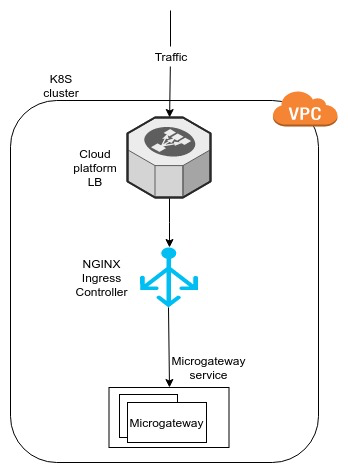

# Deploy the Microgateway on a Kubernetes Cluster

You can easily deploy WSO2 API Microgateway on a Kubernetes cluster.
Follow the step-by-step instructions below to quickly download,
configure, and deploy the Microgateway on a Kubernetes cluster.

!!! note
    
    Before you begin,
    
    -   Install and set up the Kubernetes command-line tool, kubectl. For
        detailed instructions on installing kubectl, see
        <https://kubernetes.io/docs/tasks/tools/install-kubectl/> .
    -   Install Helm in your Kubernetes cluster using the
        `helm init` command. We recommend using the
        latest stable release of Helm. For detailed instructions on
        installing Helm, see
        [https://helm.sh/docs/using_helm/#installing-helm](https://helm.sh/docs/using_helm/#installing-helm).
    
        !!! tip
        
            Follow the steps in [role based access
            control](https://helm.sh/docs/using_helm/#role-based-access-control)
            to ensure that you provide necessary permission to Tiller. This
            creates a service account for Tiller.   


1.  Download the Kubernetes Microgateway Helm chart ZIP file from
    [here](https://wso2cloud-resources.s3.amazonaws.com/on-premise-gateway/k8s-micro-gateway.zip)
    and extract it. Let's refer to the extracted Microgateway Helm chart
    directory location as `<K8S_MICROGATEWAY_HOME>`
    throughout this section.
2.  Edit the `<K8S_MICROGATEWAY_HOME>/values.yaml`
    file and specify appropriate values to configure the Kubernetes
    Microgateway Helm chart.

    **values.yaml**

    ``` java
    # Micro-gateway configurations

    #Define the number of gateways to be deployed
    replicaCount: 2

    #Define a namespace to deploy micro-gateways
    #If you are not changing the below value microgateway will be deployed in a namespace called “wso2-microgateway” 
    namespace: wso2-microgateway

    # Define Docker credentials
    # Use cloud login email as the email
    # Use the value of Base64(cloud-email:cloud-password) as the auth value
    auths:
      https://docker.cloud.wso2.com:
        email: wso2.microgateway@sample.com                                #FIX ME
        auth: d3NvMi5taWNyb2dhdGV3YXlAc2FtcGxlLmNvbTpwYXMkd29yZCEyMw==     #FIX ME

    ## Include the organization authentication information
    organizationDetails:
        tenantName: myCompany                                            #FIX ME
        email: wso2.microgateway@sample.com                              #FIX ME
        password: pas$word!23                                            #FIX ME
        label: gateway_label                                             #FIX ME

    #Define the custom-URL of the microgateway service along with the certificate information
    #Please enter the values of a cert and a key of your domain in a one line as given by the sample below
    #For testing purposes you can use the below details without any change
    ingress:
        host: wso2-microgateway.sample.com                                #FIX ME
        tls:
            tlsCertificate: MIIECjCCAvKgAwIBAgIJAMUo+deRyB48MA0GCSqGSIb3DQEBCwUAMIGZMQswCQYDVQQGEwJTTDEQMA4GA1UECAwHY29sb21ibzEQMA4GA1UEBwwHY29sb21ibzENMAsGA1UECgwEd3NvMjEOMAwGA1UECwwFY2xvdWQxJTAjBgNVBAMMHHdzbzItbWljcm9nYXRld2F5LnNhbXBsZS5jb20xIDAeBgkqhkiG9w0BCQEWEW1hZGVlc2hhQHdzbzIuY29tMB4XDTE5MDcwMjA5NDgyOFoXDTIwMDcwMTA5NDgyOFowgZkxCzAJBgNVBAYTAlNMMRAwDgYDVQQIDAdjb2xvbWJvMRAwDgYDVQQHDAdjb2xvbWJvMQ0wCwYDVQQKDAR3c28yMQ4wDAYDVQQLDAVjbG91ZDElMCMGA1UEAwwcd3NvMi1taWNyb2dhdGV3YXkuc2FtcGxlLmNvbTEgMB4GCSqGSIb3DQEJARYRbWFkZWVzaGFAd3NvMi5jb20wggEiMA0GCSqGSIb3DQEBAQUAA4IBDwAwggEKAoIBAQC6EmPU+PkZ20i+9PXaVa57lBxnlLa6yIzh7NIbaRBNh4jabhNJ2gP4wH1oJI4CwYzf4rqAlI1hzTT0rQJikbJi7fbB9elVVPxrGerL/uA10jWTPq5ynzEl7YyQQ6I2+UzHUDJ/gyGbzj5fk0lKlfhEUxqmxmRyuwlzswTl+iC1taujJmzfJ+osu9saxFDpLXnKBkRyYVBSudLYz1vmXQz7FXVmYAgIQZx0UG+7cx0G96wOemtdHcDxSRNy/usVrOdhqENHwnTulnlEJZMHYInuFEvDfOz5f3zrmTs0k1X+Nbb0sCTwMcxcrvoFsmc7FL0TAZuDvUaPrt+VkEU6CWrjAgMBAAGjUzBRMB0GA1UdDgQWBBSIPiK8UH0LyqPbpp1zfHFHEHXK9jAfBgNVHSMEGDAWgBSIPiK8UH0LyqPbpp1zfHFHEHXK9jAPBgNVHRMBAf8EBTADAQH/MA0GCSqGSIb3DQEBCwUAA4IBAQCnUBjpsVZvPq/KcBN5g4G1/F49GKYj4o6nSysnfnDMU/5X9/TB92qYGaHQ+Gzhl0DtljXIadsQhxiazGpCPYO9v9c05g0oRyr4EFQKJqXbPSrlU16QfpV6iZpIiBuYzMWekLLHuEMBsHLL+jlPwh4O+erx+obKqRnv8tiMSjkP6GzB7a9rldA2hCD+4v1xNVVtMNqqA9KWNJKUSZogzuWgvrEwX7lSYmFHACCA66jVggSQDJKoqAoSyXIBfLD/Bq0JPqqb/2s7X1igjWEgk8/WwW4PWaiiBpwhISEla77tP4EeSjsec8D6Y5x0667MgHF+zy+y/OHvx+z9p6b0RI52
            tlsKey: MIIEvgIBADANBgkqhkiG9w0BAQEFAASCBKgwggSkAgEAAoIBAQC6EmPU+PkZ20i+9PXaVa57lBxnlLa6yIzh7NIbaRBNh4jabhNJ2gP4wH1oJI4CwYzf4rqAlI1hzTT0rQJikbJi7fbB9elVVPxrGerL/uA10jWTPq5ynzEl7YyQQ6I2+UzHUDJ/gyGbzj5fk0lKlfhEUxqmxmRyuwlzswTl+iC1taujJmzfJ+osu9saxFDpLXnKBkRyYVBSudLYz1vmXQz7FXVmYAgIQZx0UG+7cx0G96wOemtdHcDxSRNy/usVrOdhqENHwnTulnlEJZMHYInuFEvDfOz5f3zrmTs0k1X+Nbb0sCTwMcxcrvoFsmc7FL0TAZuDvUaPrt+VkEU6CWrjAgMBAAECggEANvAzFbClK+M46Vi+NkbSC57BfDvGcAPCxPn9VyaAL8Pyvjt96nI6dfmvjU4tt9aZ14jD9C7oR5YlKpDigWPvPZJxJveKey1qkdzHHJAWdw2nz9/T9ffWtRIcTIQLoxucdcTSBCAdjjko5WNBYopBETtQRSmSguWCduzGZ3igq8WE+Md8hVsIxWlBYqGRMu+Uqhx7JcbqGYcTG8jaLhno9B0tDOQm8pV2KZpHfro9KnfKWrzlEW3cGLOyAkca6croYo8HqXGr/S+T3h8fHSdZEW1WoUf6X2v1ccoOT65rmplNEzgQhfYNZxXZ8dyKAFaHM19CD77m2VfDXCoBLK1RYQKBgQDjUmW0ZaMB2PRQBhzAexormTRK5/6Y2jdEyq0T5dnRmKNy/MyXWYgZibkA2TFIaHLHKuySBl5Tnj41cya+67UMtAUl/wLDmUGRe64XNe4xOkTzK8HOZAqUNfTQny2WkCWKxMpw0Uyao0zL8+udjqYgjzIQJql44Z6GpQFM5hvE6QKBgQDRi8dl1EGXfHl51I5S2dzouItqd9ziRu9ZjBw47wV6962AoB7VU5CRZwAYG7tPQHD8Pvuv0aRWnUPukE0OixrihHklX+j6TGue3QobvQo5QflPj8jvptzpX9bZASH3gvReFWwY2nZV4T34GE5DuMFiW3QG5E0pJhP9Vhf9B1jB6wKBgQChrphh/6w6Ayp5xG8sxCHwAo67/FgMNaD7z7/cmC4dspgGkCGgQHDZ4Sfxn4k6+/cvC6upjNgIV1PdxmI3hwSF3YCP7tnzbwzAwhwnrBcXcl9aKbQ17NfNZLcUrzLIlQvusFtgdK0si5tysLHTpYMpQ1ATRrxhGvAayj+rhzsXCQKBgEClyie9W1scGPIgRKSE+GWIAeMgBbJ9xfwvgMmD3IH6hbnILJsOA+0IBPxrGdeyfukjmUy99eCO9lVUiaFyAyJdUm7Yby1BhHZnpWW3Zb8SfpMwPgLJzR/m5IbglZUh/rhEDayBQb7vFcpD3WmBR5BLvLkfmDqYt9QRyqbSrGxvAoGBAJRrFw5Mg/ksp4jzQ9G7qZf0uImWlAq0mrXIIBlfoWkGuy2oqTtN542NqDoEUdpH3UwKaOQOVAriVoMvY8SwrOrh4O6K/KTknnaxo2gMFjgttEMzVZkRM5xsifLUB2ZaV0kK/eiEmdMUnEbuUb0+hzfS7D/Pt2qClSDlCk/rgNEJ


    # Define the allocated resources per gateway
    resources:
       limits:
         cpu: 400m
         memory: 1024Mi
       requests:
         cpu: 400m
         memory: 1024Mi


     
    ```

3.  Navigate to the `<K8S_MICROGATEWAY_HOME>`
    directory using the command line and execute the following command
    to deploy the Microgateway in your Kubernetes cluster:

    ``` java
        helm install --name micro-gateways-deployment .
    ```

    This will set up the following deployment in your Kubernetes
    cluster:  
      
    Once you set up the deployment, you need to obtain the hostname of
    your Nginx load balancer and set it as the DNS of your Microgateway
    custom URL.

4.  Execute the following command to obtain the hostname of the Nginx
    load balancer:

    ``` java
        kubectl get svc micro-gateways-deployment-private-jet-mode-nginx-controller -o yaml
    ```

    This provides an output similar to the following, which displays the
    hostname at the end:

    ``` java
        ...
        loadBalancer:
            ingress:
            - hostname: abc2adaa290d711e994d802f89b5426a-1544968781.us-west-2.elb.amazonaws.com
    ```

5.  Use the hostname obtained above as the DNS record of your custom URL
    domain.

    !!! note

        If you use the sample hostname given in the `values.yaml` file (i.e., `wso2-microgateway.sample.com`), you need to add the following entry in the `/etc/hosts` file of your machine to access the Microgateway:</br>

        ``` java
           <> sample.com
        ```

Now that you have set up the DNS of your Microgateway custom URL, you
can follow the steps
[here](../deploy-the-microgateway/#test-the-deployment)
to test your Microgateway deployment.

Once you test the deployment, you can access the Microgateway via the
Microgateway URL.

