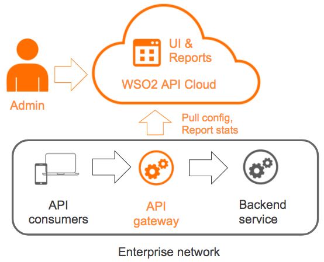

# Hybrid API Management Overview

Hybrid API management allows you to have the benefits of a SaaS
environment in addition to the greater control offered via on-premises
solutions.

In the traditional pure cloud model of API management, all API calls are
directed through cloud gateways. This approach can have the following
inherent limitations:

-   Inefficiencies when both the API backend and API consumers are not
    in the cloud.
-   Security concerns associated with API data going through the cloud.
-   Need for the backend to be exposed to the internet or VPN.

Hybrid API management allows you to overcome these limitations. For a
list of important benefits of hybrid API management, see [Benefits of
hybrid API management](#benefits-of-hybrid-api-management).

!!! tip
    
    To get an in-depth understanding of why and when you would need a hybrid
    API management solution, take a look at our white paper [Hybrid API
    Management: Run Your API Gateways
    Anywhere](https://wso2.com/whitepapers/hybrid-api-management-run-your-api-gateways-anywhere/).
    

WSO2 API Cloud supports hybrid API management by providing the
capability to have API Gateways in a private data center, while having
most of the API management infrastructure including management user
interfaces, developer portal, and analytics in the cloud. This allows
you and your subscribers to always have access to the API management
infrastructure without any maintenance overhead.

The following diagram illustrates how WSO2 API Cloud supports hybrid API
management:

In hybrid API management you would generally have the API Gateway and
possibly the traffic manager component in a private data center. All
other components will be in the cloud.

Now that you have a basic visualization of how WSO2 API Cloud supports
hybrid API management, let's take a look at the benefits of hybrid API
management.

### Benefits of hybrid API management

-   **High performance** : You can have your API gateway close to your
    backend services and API subscribers. This avoids the cost of extra
    hops to the Cloud and back.
-   **Lower total cost of ownership (TCO)** : API management operations
    such as lifecycle management of APIs, subscribing to APIs, defining
    various policies, performing analytics on API events and generating
    statistics are handled in API Cloud, while actual API requests are
    routed through the Microgateway instances. This leads to lower total
    cost of ownership.
-   **Rapid deployment** : Deployment is faster because of the
    simplicity of the Microgateway. The only requirement is to have Java
    or Docker installed infrastructure to deploy the Microgateway.
-   **Capability to deploy anywhere** : You can deploy
    the Microgateway on any cloud infrastructure as well as on any
    container management system such as Kubernetes.
-   **Better security and com** **pliance** : API calls and payload data
    does not leave your network. This results in better security and
    compliance.
-   **Effective connectivity** :  Since you can deploy the gateway
    anywhere including on your own network, there is no need for VPN or
    any other network connectivity solution.

Now that you understand the basics of hybrid API management and its
benefits, let's try out the Microgateway of WSO2 API Cloud. Click
[here](/hybrid-api-management/deploy-the-microgateway/) for instructions on how you can
quickly download, configure, and run the Microgateway.

If you want to run the Microgateway on Docker, see [Deploying the
Microgateway as a Docker
Container](/hybrid-api-management/deploy-microgateway-as-docker-container/).

