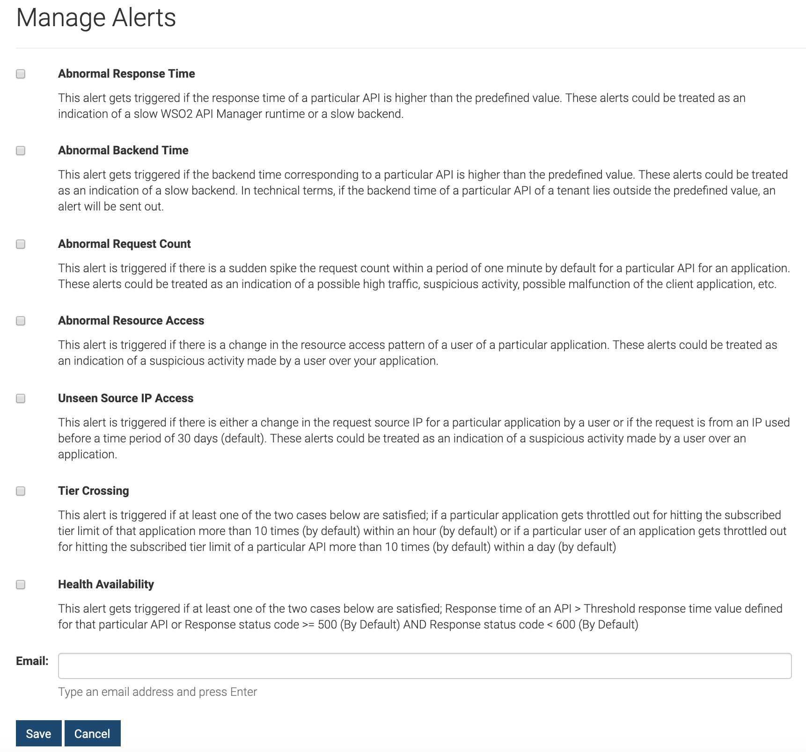
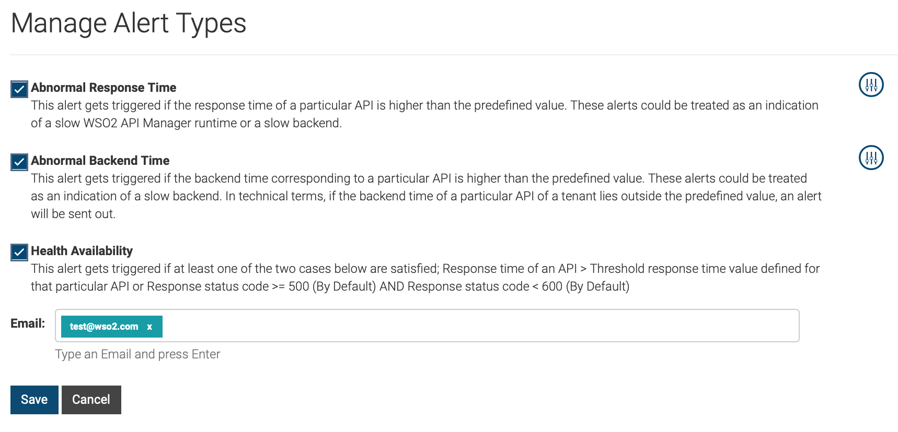
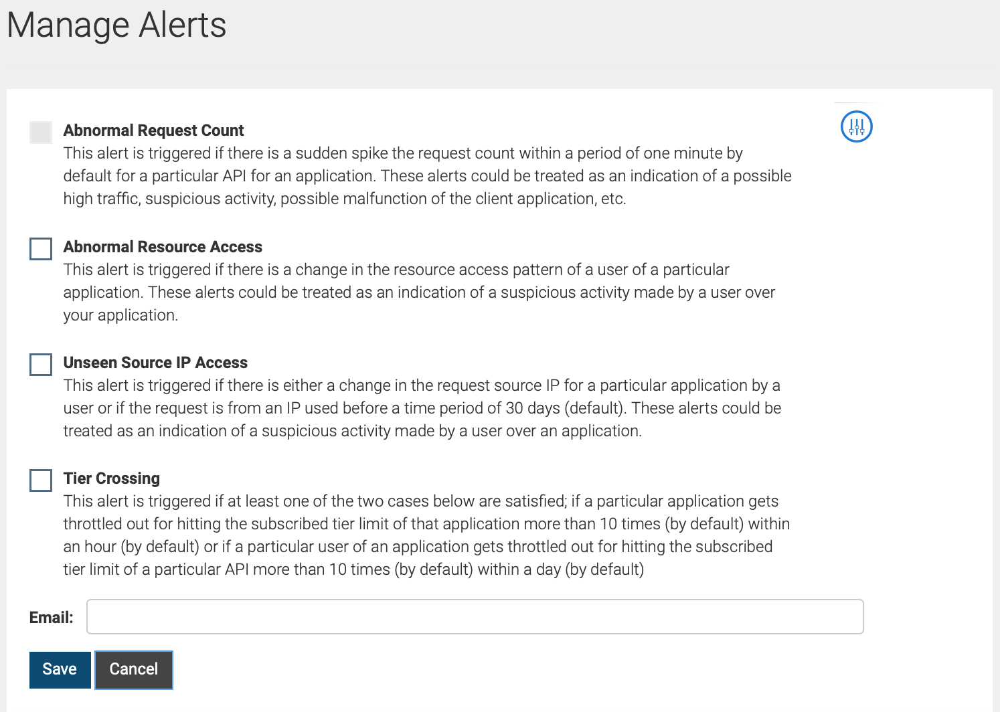
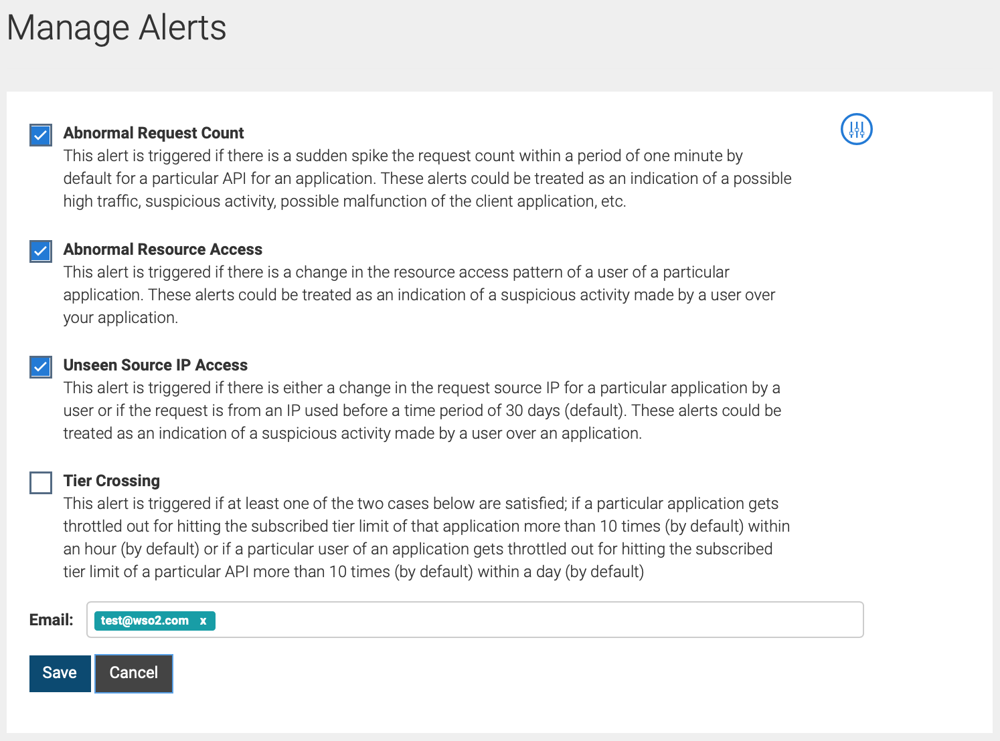

# Subscribe to Alerts

Alert subscription can be performed by system administrators,
publishers, and subscribers. The alert types available for subscription
depend on your role.

The following topics describe how to subscribe to alerts depending on your role:

!!! tip
    
    If you have administrator privileges, you can subscribe to alerts via
    the Admin Portal to receive alert notifications for all APIs. If you
    subscribe to alerts via the Publisher, you can only receive alert
    notifications for APIs that you have created.
    
### Subscribe to alerts as an administrator

As a system administrator, you can subscribe to all alert types
supported by WSO2 API Cloud.

You can decide on the alert types that you want to subscribe to, and
then specify a list of email addresses to which the alerts should be
sent. Follow the steps below to subscribe to alerts via the Admin Portal
of WSO2 API Cloud.

1.  Sign in to [WSO2 API Cloud Admin Portal](https://api.cloud.wso2.com/admin) with your credentials.                                                                               
2.  Click to expand **Analytics** on the left navigator and click **MANAGE ALERT
    TYPES** to open the **Manage Alert Types** page.  
    
3.  Select the alert types that you want to subscribe to.
4.  In the **Email** field, enter a list of email addresses to which the
    selected alerts should be sent.
5.  Click **Save**.

This subscribes users of the specified email addresses to the selected alert types.

### Subscribe to alerts as an API Publisher

As an API publisher, you can subscribe to required alerts either
individually or as a recipient in a list of email addresses to which the
alerts are sent.

!!! note
    
    -   The following alert types are disabled by default and cannot be
        subscribed to until you [configure the
        alerts](../configure-alerts) for required APIs:  
        -   **Abnormal Response Time**
        -   **Abnormal Backend Time**
    
        Once you configure these alerts for required APIs, the alert types
        will be enabled for selection on the **Manage Alert Types** page.
    
    
    -   The health availability alert type is configured by default.
        Therefore, you can subscribe to **Health Availability** alerts via
        the **Manage Alert Types** page right away. Select **Health Availability**, specify a list of email addresses to which the alert should be sent, and then click Save.
       

Follow the steps below to subscribe to required alerts types:

1.  Sign in to [WSO2 API Cloud](https://api.cloud.wso2.com/publisher/) with your credentials. This opens the API Publisher portal.
2.  Click **MANAGE ALERT TYPES** on the left navigator to open the
    **Manage Alert Types** page.
3.  Select the alert types that you want to subscribe to.
4.  In the **Email** field, specify a list of email addresses to which the
    selected alerts should be sent.  
    
5.  Click **Save**.  

This subscribes users of the specified email addresses to the selected alert types.

### Subscribe to alerts as an API subscriber

As an API subscriber, you can subscribe to required alerts either
individually or as a recipient in a list of email addresses to which the
alerts are sent.  

!!! note
    
    -   The abnormal request count alert type is disabled by default and
        cannot be subscribed to until you [configure the
        alert](../configure-alerts) for required API resources.  
          
        Once you configure alerts for required API resources, the **Abnormal
        Request Count** alert type will be enabled for selection on the
        **Manage Alerts** page.
    
    -   The following alert types are configured by default and are enabled
        for you to subscribe via the **Manage Alerts** page right away.
        -   **Abnormal Resource Access**
        -   **Unseen Source IP Access**
        -   **Tier Crossing**
  

1.  Sign in to the [WSO2 API Cloud Store](https://api.cloud.wso2.com/store) with your credentials.
2.  Click **MANAGE ALERT TYPES** on the left navigator to open the
    **Manage Alert Types** page.
3.  Select the alert types that you want to subscribe to.
4.  In the **Email** field, enter a list of email addresses to which the
    selected alerts should be sent.  
    
5.  Click **Save**.

This subscribes users of the specified email addresses to the selected alert types.

  
