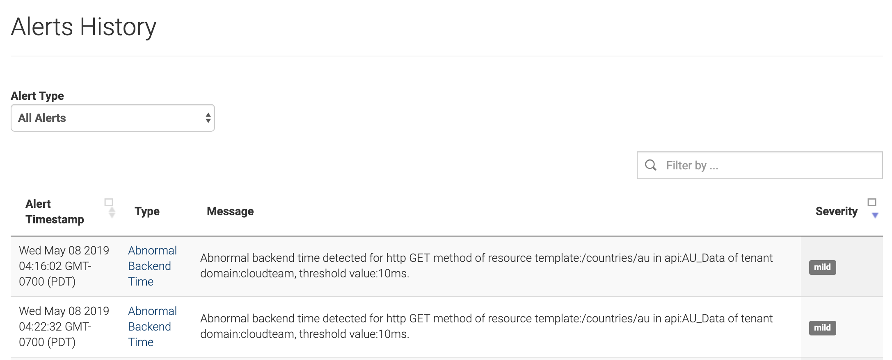
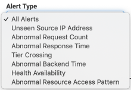

# View Alerts

System administrators, API publishers, and API subscribers receive
alerts via notification emails if they have subscribed to alerts.

As a system administrator, you can view alerts that you have subscribed
to.

Follow the steps below to view alerts:

1.  Access the WSO2 API Cloud **Admin Dashboard** via
    `https://api.cloud.wso2.com/admin`, and sign in with your credentials.
2.  On the **Admin Dashboard**, click **Alerts** on the top menu. This
    displays the **Alerts History** page similar to the following:  
    

    !!! tip
    
        -   In the default view, **All Alerts** is selected as the **Alert
            Type** . Therefore, all the alerts generated are displayed by
            default on this page.
        -   If you want to filter the displayed alerts by a specific alert
            type, select a required alert type from the **Alert Type**
            list.  
            
