# View API Statistics

WSO2 API Cloud allows you to view API statistics related to both the API Publisher and the Store.

The following sections describe how you can access the statistical dashboards to view required statistics:

### API Publisher statistics

The gadgets that display publisher statistics can be viewed only by
users who have permission to create APIs.

Sign in to the API Publisher. Anyone who can create and/or publish APIs
can click on a selected API and take a look the **Versions** and **Subscriptions**
tabs to view API-level usage and subscription statistics.

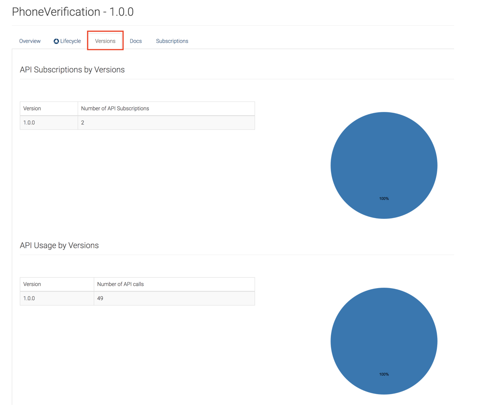
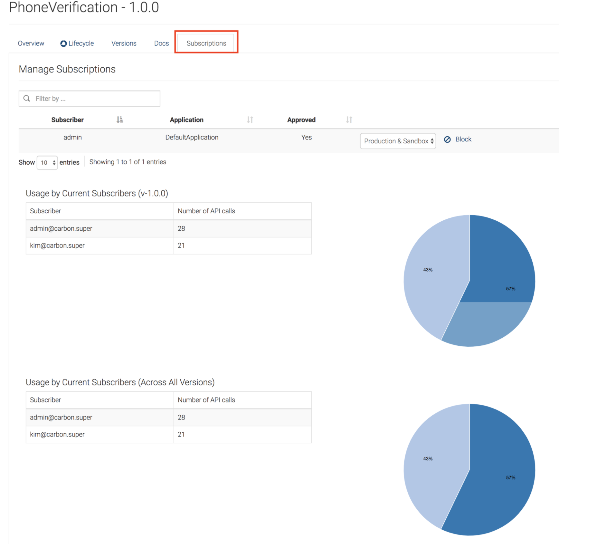

Given below are the statistical dashboards that can be accessed via the
**Analytics** menu.
  
  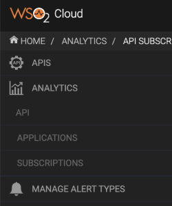  
   

On each of the dashboards, you can choose to view all APIs you have subscribed to.

!!! tip

    If you are an API creator, you can either view all the APIs you have subscribed to or choose to view only the APIs you have created.

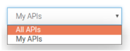

You can also select the date range and time period for which you want to
view statistics.

 <html>
         

         
Note

         
The date and time picker is bound to the local time of your browser.

         

 </html>
  

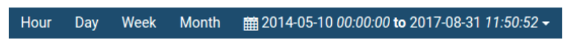

The following topics describe and walk you through each of the supported usage and performance statistics:

#### Created APIs Over Time

The number of APIs published over a given time period.  
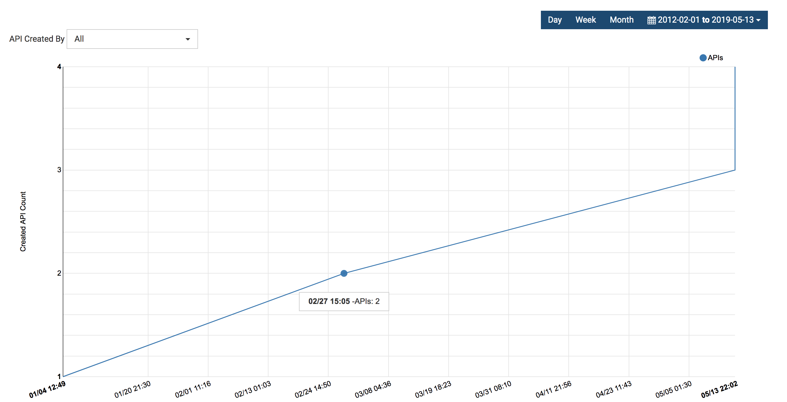

#### API Usage

The number of subscriptions of each API with a graphical view of the
count.  
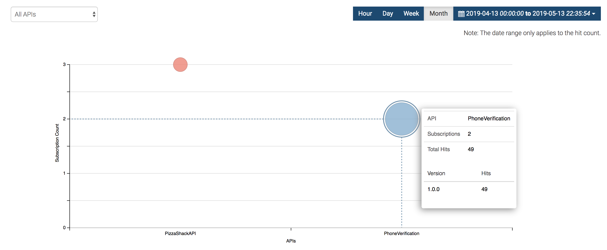

#### API Last Access Times

A tabular representation of the last access times of an API, according
to the version and the accessed subscriber.  
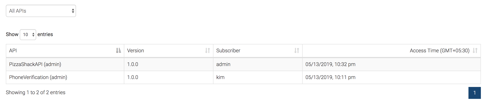

#### Usage by Resource Path

The number of invocations made by resources for an API, represented in a
tabular view.  
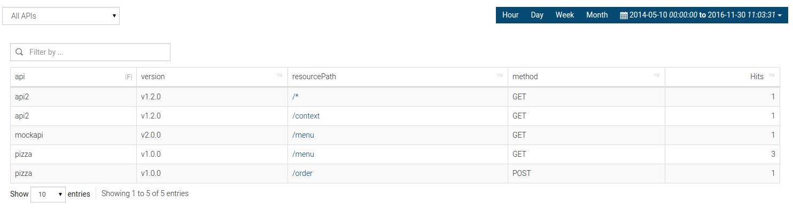

#### Usage by Destination

The number of times an API was accessed based on the destination,
represented in a tabular view.  
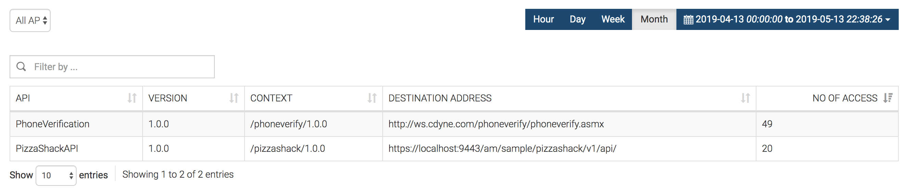

#### API Usage Comparison

The number of invocations made for an API represented as a combination
of all resources and all versions of the API.  
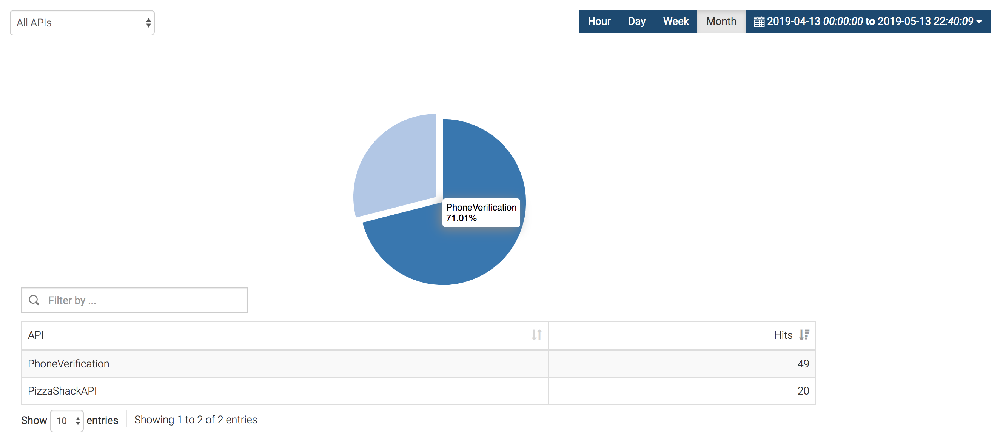

#### API Throttled Requests

The total count of the successful request count and throttled request
count towards an API over time.  
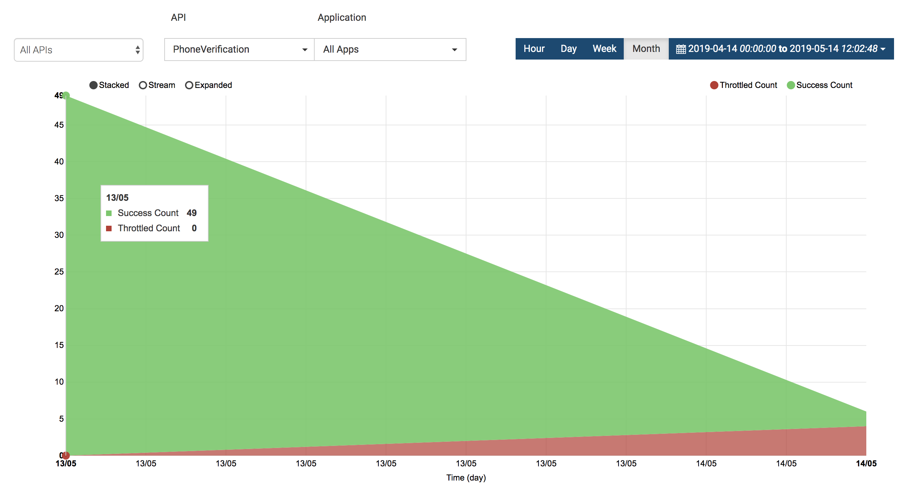

#### Faulty Invocations

A successful invocation is when an API receives the expected response.
In Analytics, if a runtime exception that is related to the backend
communication occurs, it is considered as a faulty invocation. However,
authentication related issues are not considered as faulty invocations.
The total number of invocations of an API represented as a combination
of successful and faulty invocations is denoted in the faulty
invocations graph.

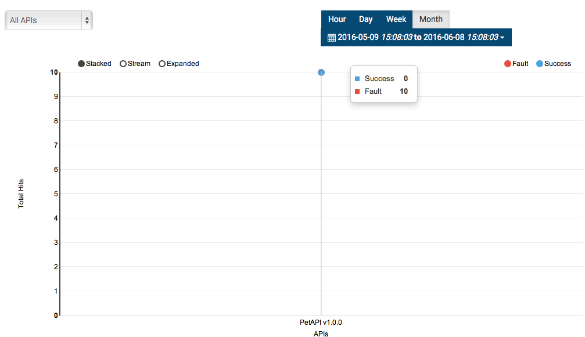

#### API Latency Time

The execution time of an API represented as a combination of throttling,
In mediation, Out mediation, backend response time, and authentication
time.

Depending on your requirement, you can select **Hour** , **Day** ,
**Week** , or **Month** to view latency data hourly, daily, weekly, or
monthly. The depth of data you see will vary depending on your selection
criteria. You can also see a comparison view of the latencies.

-   If you select to view data hourly, you will see data up to the past
    hour with a sensitivity of one minute.  
    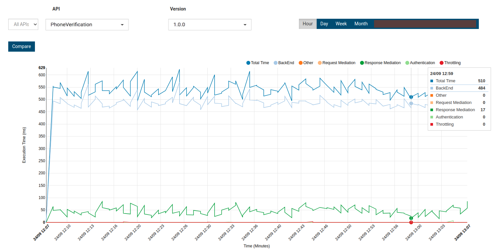
-   If you select to view the daily breakdown of data, you will see data
    up to the past 2 weeks with a sensitivity of one hour.  
    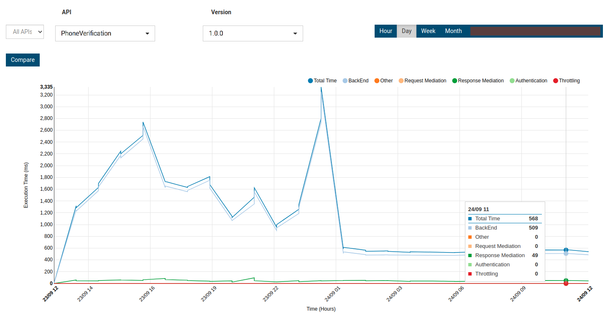

!!! note
    
    If you select **Hour** , **Day** , **Week** , or **Month** to view data,
    you cannot use the time picker to apply time range.
    

#### API Usage Across Geo Locations

Geolocation based statistics are used to carryout detailed monitoring of
geographic locations.

The data script that updates statistics related to geo locations is
executed once a day. Therefore, at a given time, some statistics
generated within the last 24 hours may not be displayed in this gadget.

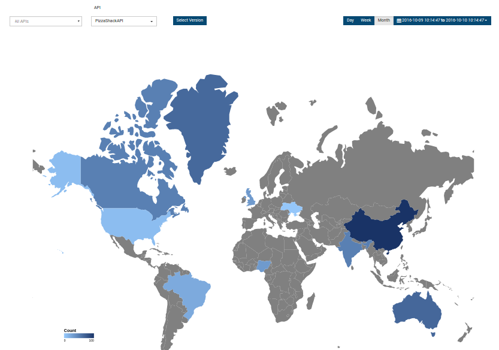

#### API Usage Across User Agent

The proportional distribution of the usage (invocation) of each API
differentiated by the user agent HTTP header received in requests
towards the API.  
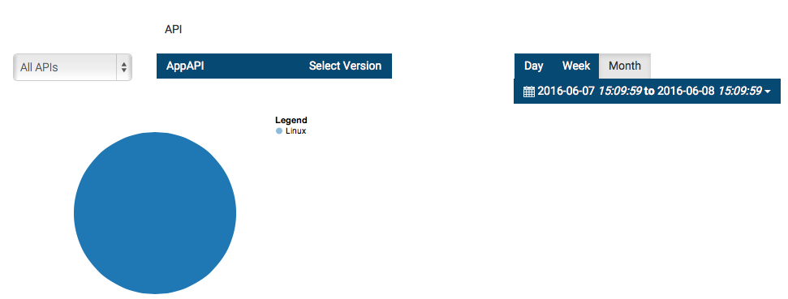

#### App Throttled Requests

The successful request count and throttled request count of each API
invoked by each application.  

#### Applications Created Over Time

The number of applications created over a given time period.  

#### API Subscriptions

The subscriptions created for each of the APIs as a distribution of API
versions.  
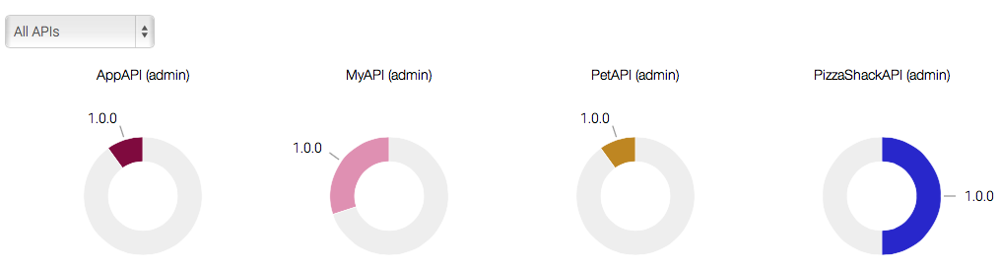

#### Developer Signups Over Time

The number of developers who signed up to the API Store over time.  
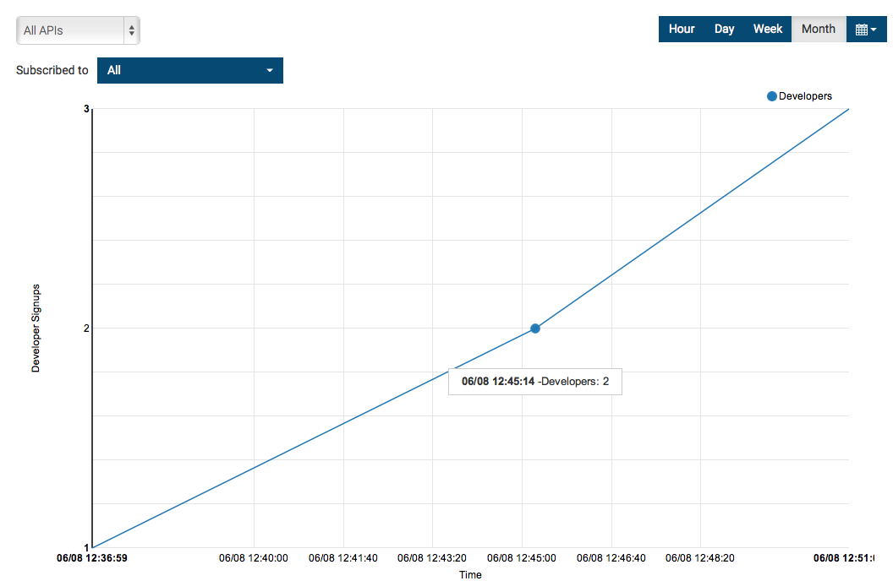

#### Subscriptions Created Over Time

The number of subscriptions created for an API over a given period.

First, select the API for which you wish to view subscriptions.

### API Store statistics

Sign in to the API Store. You can
[self-subscribe](https://docs.wso2.com/display/APICloud/Enable+Self+Signup+to+the+API+Store)
to the store. Next, click the **Statistics** menu.

Given below are the statistical dashboards that are available:

-   **API** **Usage** : The usage of the API per application
-   **Top Users** : Users who make the most API invocations per
    application
-   **Resource Usage** : Usage of an API and from which resource path
    per application
-   **Faulty Invocations** : Number of faulty API invocations per
    application  
    In a faulty API invocation, the message is mediated though the
    `fault` sequence. By default, the API Manager
    considers an API invocation to be faulty when the backend service is
    unavailable.

Several examples of usage and performance statistics are given below:

#### API Usage per Application

The number of invocations of each API by each application is depicted in this graph.

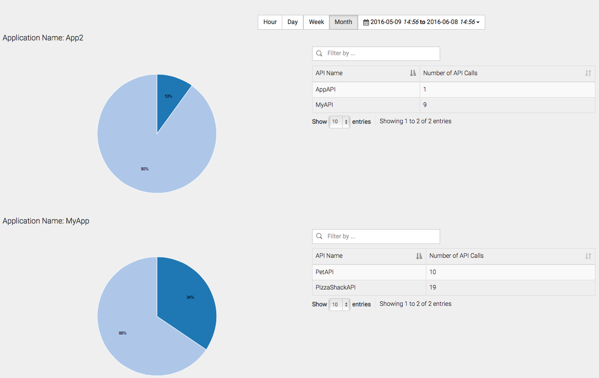

#### Top Users per Application

The users who have made the highest number of API calls by application
are depicted in this graph.

#### Resource Usage per Application

API usage from resource path per application is depicted in this graph.  
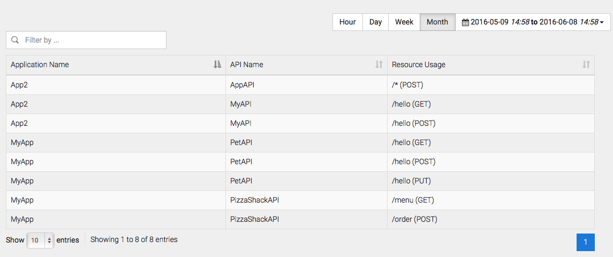

#### Faulty Invocations per Application

The total number of invocations by each unsuccessful (faulty) application are depicted in this graph.
  
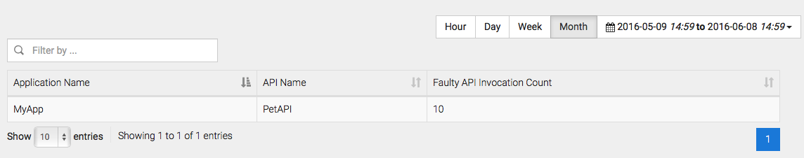

### Admin Portal Statistics

#### Availability of APIs

As an admin user, you can can view API availability statistics via
the WSO2 API Cloud Admin Dashboard **.** Follow the steps below to view
API availability statistics of all API versions in a tabular format:

1.  Access the WSO2 API Cloud Admin Dashboard via
    <https://api.cloud.wso2.com/admin>, and sign in with your
    credentials.
2.  Navigate to **ANALYTICS/API AVAILABILITY** .  
    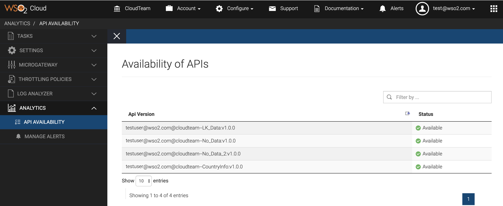  
    Here, the **Status** can either be **Available** or **Limited**.
    -   **Available** - This status indicates that the API has traffic
        with normal successful invocations. By default, if an API
        receives successful invocations for at least one out of five
        invocations within 30000 milliseconds, the status of the API
        becomes **Available** .

        !!! note
        
                This tabular representation only displays the APIs that have
                traffic.
        

    -   **Limited** - If an API receives an alert due to one of the
        reasons indicated in health
        availability, the
        API status changes to **Limited**.

        !!! note
        
                For more information on how to view the generated alerts, see
                Viewing Alerts.
        

    The availability of API statistics is directly related to the
    health availability alert type.
