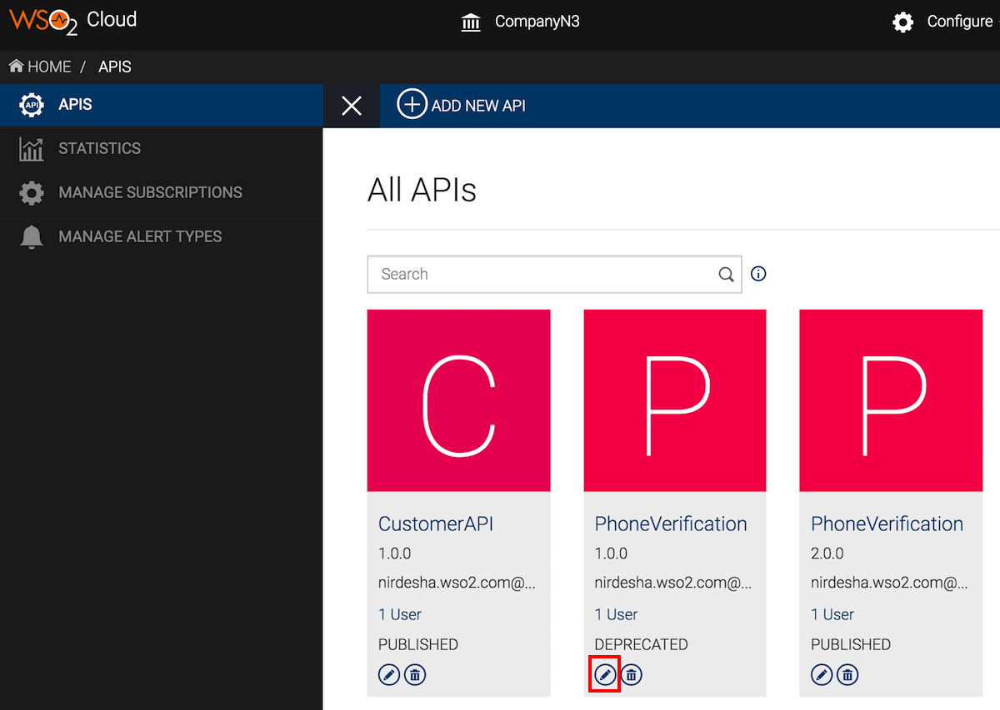
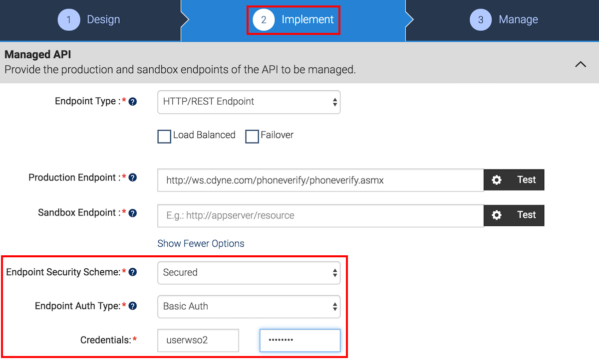
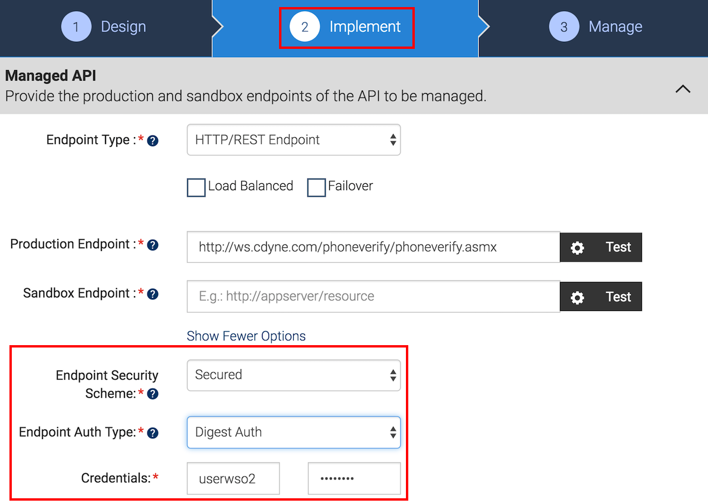
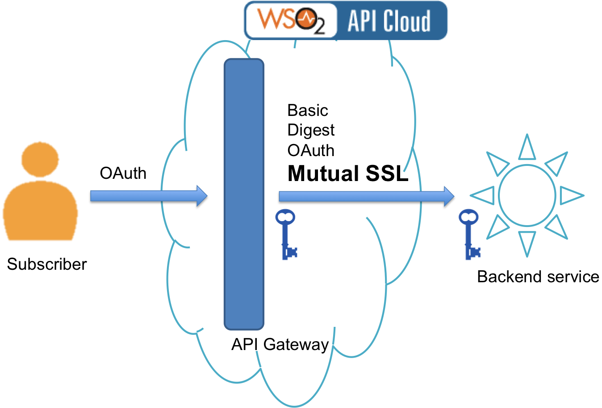

# Secure your Backend Services

WSO2 API Cloud allows you to turn your backend services into managed
APIs so that subscribers can consume your backend services.
According to the architecture of WSO2 API Cloud, all API calls that go
out to your backend services go through the Cloud's API Gateway. The API
Gateway handles aspects such as user requests, user authentication via OAuth, security policy enforcement, etc.

The API Gateway has the ability to intercept API requests and apply
various security policies and mechanisms to secure the connection
between the API Gateway and your backend service. Upon validation of a
policy, the Gateway passes Web service calls to the actual backend.

Let's take a look at the different ways in which you can
secure the link between WSO2 API Cloud and the backend services of
APIs.

### Use basic authentication

One of the simplest mechanisms to enforce access control to web resources is
the use of a user name and password (i.e., basic authentication).

Follow the steps below to try out enforcing basic authentication:

1.  Secure your backend services using a user name and password.

2.  Design your API in WSO2 API Cloud in a manner that the API sends
    the authentication details with the request going to the
    backend.

3.  Sign in to the API Publisher and click **Edit** to edit an API
    that points to a public backend service you secured.  
    

4.  Go to the **Implement** tab of the API and click **Show More
    Options**. Then, set the **Endpoint Security Scheme** to
    `Secured`, the **Endpoint Auth Type** to
    `Basic Auth` and finally provide the credentials you
    used to secure your backend service.  
      

You have now configured an API to send the basic auth credentials with
a request that goes to the backend.

### Use digest authentication

Digest authentication is similar to basic authentication, but is more
secure and prevents replay attacks. It applies an MD5 cryptographic
hash using nonce values (a one-time-use string) to the credentials
before sending the credentials to the backend.

Follow the steps below to try out enforcing digest authentication:

1.  Secure your backend services using digest authentication.

2.  Design your API in WSO2 API Cloud in a manner that the API sends
    the authentication details with the request going to the
    backend.

3.  Sign in to the API Publisher and click **Edit** on an API
    that points to a public backend service you secured.  
     

4.  Go to the **Implement** tab of the API, and click the **Show More
    Options** link. Then, set the **Endpoint Security Scheme** to
    `Secured`, the **Endpoint Auth Type** to
    `Digest Auth`, and finally provide the credentials that you
    used to secure your backend service.  
      

You have now configured an API to send digest auth credentials with
a request that goes to the backend.

### Use a custom authorization token

Rather than using credentials, you can pass a token (usually a string or
a series of numbers) to the backend with API calls. This custom
authorization token needs to be recognized and validated by your
backend in order to grant access. For step-by-step instructions, see
[Pass a Custom Authorization Token to the
Backend](../pass-a-custom-authorization-token-to-the-backend) .

### Use mutual SSL (certificate-based API Gateway)

In Mutual SSL, which is also known as certificate-based mutual authentication,
trust between WSO2 API Cloud and your backend service is established by
verifying a provided certificate so that both parties are aware of each
other's identity. The diagram below depicts this scenario:

 

To set up mutual SSL, you need to follow the instructions below and provide a trusted certificate to the WSO2 Cloud team:

1.  Sign in to WSO2 API Cloud and on the top menu bar click **Support**.  
    

2.  Submit a request to the WSO2 Cloud team specifying your backend host name. Once submitted, you will receive a response email from WSO2. 

3.  When you receive the response, send the WSO2 Cloud team your
    backend certificate with which you want to configure mutual SSL
    (For example, `your_backend_cert.crt`).

    We will add your certificate to WSO2 servers and send you our public
    certificate.
5.  Add the public certificate to your backend servers.

### Add IPs as trusted sources

You can secure your backend in a manner that it only accepts calls
proxied by WSO2 API Cloud. To do so you can configure your network to accept the IPs of
trusted sources such as WSO2 API Cloud. This results in making your backend services
accessible to API consumers who make requests via WSO2 API Cloud.

If you want to add IPs as trusted sources, click the **Support** menu on the [WSO2 API
Cloud](http://wso2.com/cloud/api-cloud) UI and submit your
request. WSO2 will respond with the IP ranges that you need to configure as trusted sources.
