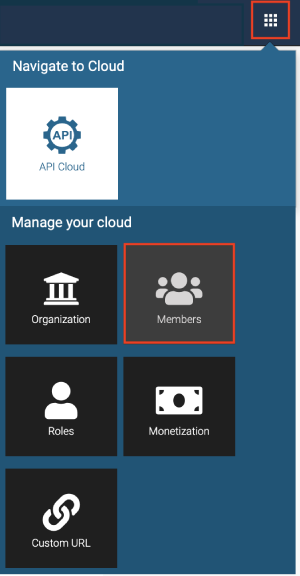
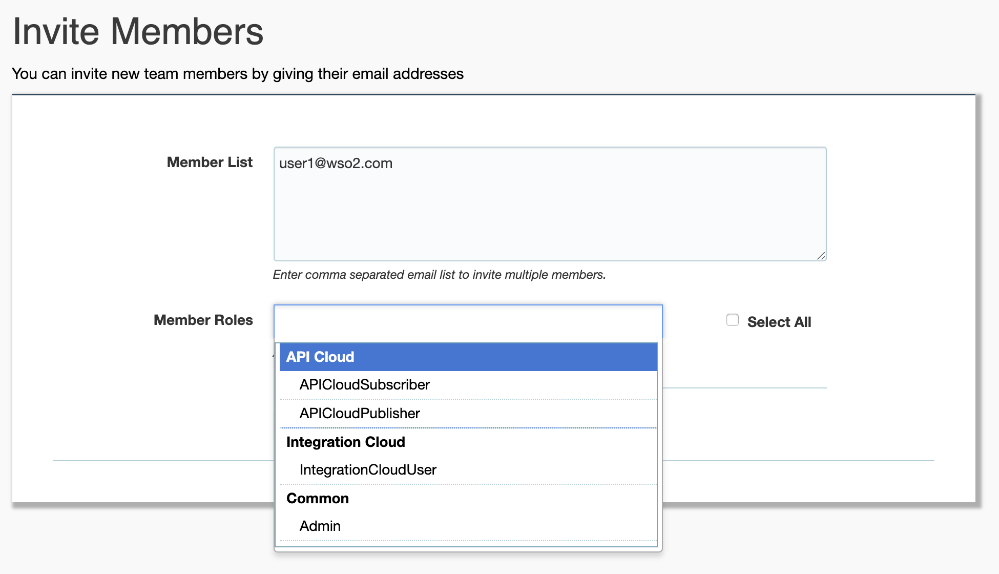

# Add Members to Your Organization

When you [sign up to WSO2 API Cloud](../../../get-started/create-a-wso2-cloud-account) using your email address and create an account, you become the administrator of your organization. As the administrator, you can add new members to the organization and assign them appropriate roles.

!!! note
    
        Administrator Role

        WSO2 API Cloud comes with a common administrator role. Any user with administrator
        privileges can create new users, roles, and assign permissions for the roles. 

Follow the steps below to add members and assign them roles:
 
1.  Go to [http://cloud.wso2.com](http://cloud.wso2.com/), sign in with your credentials, and select your organization when prompted. This opens the WSO2 API Publisher portal.

2.  Click the settings icon on the upper right-hand corner of the UI and then
select **[Members](https://cloudmgt.cloud.wso2.com/cloudmgt/site/pages/user.jag)**.

     

    This opens a page where you specify user details and invite new members.

3.  Click **Invite Members** .  
    

4. Provide the e-mail addresses of the members, specify the role, and
   invite. (API Cloud specific roles will be listed under the API Cloud
   category)  
   

    !!! tip
    
        You can customize the invitation emails by applying your own logo
        and changing the content. For information on how to do this, see
        [Customize invitation emails](../../../customize/customize-invitation-emails).
    
    
Invited members will recieve an invitation e-mail, which they need to accept in order to be added as registered members to WSO2 Cloud.

