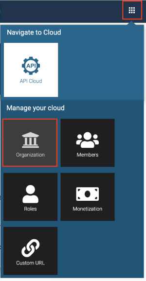
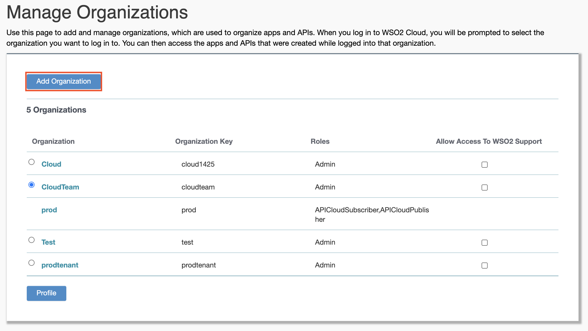
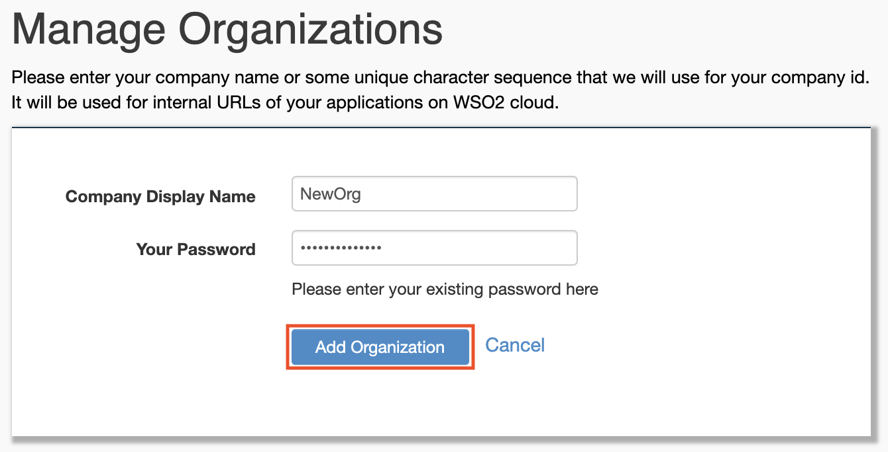

# Add a New Organization

If you have already signed up and created a Cloud account and now you want to add a new
organization to the same Cloud account, do the following:

1.  Sign in to [WSO2 API Cloud](https://wso2.com/api-management/cloud/) with your credentials. This opens the API Publisher.
2.  Click the settings icon on the upper, right-hand corner of the UI
    and click **[Organization](https://cloudmgt.cloud.wso2.com/cloudmgt/site/pages/organization.jag)**.
      
3.  On the **Manage Organizations** page that opens, click **Add
    Organization**.
    
4.  Specify a name for the organization, enter your WSO2 Cloud account password, and then click **Add Organization**.
    
    This creates a new organization with the name you specified.

