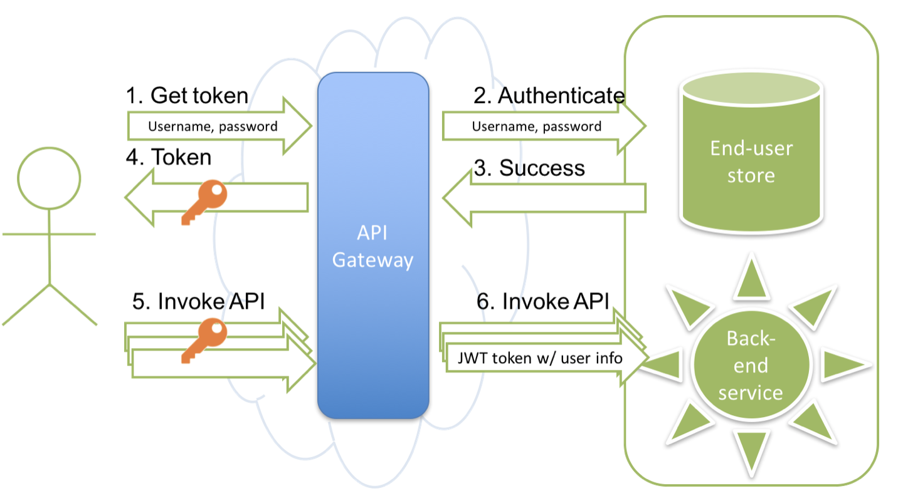
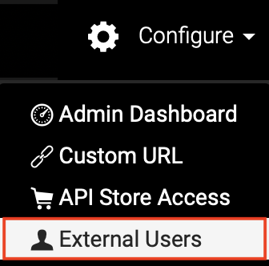

# Authenticate External Users for API Invocation

There are different types of users who use your APIs in WSO2 API Cloud:

-   Publishers create the APIs and publish them to the Developer Portal,
-   Subscribers subscribe to the APIs and develop applications that
    invoke these APIs,
-   End-users use the applications (for example, web or mobile
    applications) invoking the APIs.

The identities of the **end-users** often reside in a directory (such as
LDAP) or a database that is external to WSO2 Cloud, or are authenticated
using an identity provider.

In this case, you would likely use one of the following scenarios:

-   The application is already using an Identity Provider (IdP) and now
    needs to substitute the SAML2 token from that IdP for an OAuth2
    token and then invoke the APIs. For more information on this
    scenario, see [SAML Extension Grant](_SAML_Extension_Grant_) .
-   There is a directory or database containing the identities. The
    application gets the username and password from the end-user and
    needs to use them to fetch the OAuth2 token and then invoke the
    APIs. This scenario is depicted in the following diagram (click to
    expand) and explained below.

The diagram below depicts the process of authenticating external subscribers.

 

The following points describe the depicted process in detail:  

1.  The application invokes the Token API by passing the user's username
    and password.

2.  The API Gateway checks whether the user exists in the primary user
    store, which is the WSO2 Cloud user store. If the user is not there,
    it checks whether there is a secondary user store and if the user
    exists there. If so, the Gateway checks whether the username and
    password are valid.

3.  The user store performs the check and reports success or failure.

4.  If authentication is successful, the API Gateway generates an OAuth
    token and passes it back to the application.

5.  For all subsequent actual API calls, the application passes the
    OAuth token in the Authorization header.

6.  The Gateway checks the token to authorize the call and passes to the
    back end user identity information in the form of a JWT token.

Now you can follow the instructions below to authenticate subscribers who are
not in WSO2 Cloud's user store but are in some other directory or
database.

Let's get started.

1.  On the **Configure** menu, click **External Users**.

    
    
    This opens a page where you can provide necessary details to authenticate external users. 

2.  On the page that opens, click the **API Consumer Authentication** tab, and then click **Connect your RESTful Authentication Service**.
        
 
    You need to implement a web service that expects a POST invocation
    with the following JSON payload.

    ``` java
    {
        "credentials": {
            "username": "userx",
            "password": "mypass"
        }
    }
    ```

    If the end-user record is valid, the web service responds with the
    following,

    ``` java
        {
            "response": {
                "status": "true"
            }
        }
    ```

    !!! note
    
        -   The web service itself should be protected with a user name and
            password.
        -   If your existing authentication web service is using a different
            JSON format, contact WSO2 Cloud support (via the **Support**
            menu on the Publisher portal UI) so we can change the format on our side.
        -   If the userstore is behind a firewall and cannot be exposed to
            WSO2 cloud directly, we support various secure mechanisms of doing so
            including VPN, reverse proxy services in DMZ,
            etc.
    

3.  WSO2 adds your external user store as a secondary user store to WSO2
    API Cloud and informs you. The users in this secondary user store
    have permission to invoke APIs in your tenant domain.

4.  Invoke the following cURL command to generate an access token for a
    user via the Token API.

    !!! tip
    
        The token API allows you to generate and
        renew user and application access
        tokens. The
        response of the token API is a JSON message. You extract the token
        from the JSON and pass it with an HTTP Authorization header to
        access APIs in the API Store.
    

    ``` java
    curl -k -d "grant_type=password&username=<username@organization_name>&password=<PASSWORD>" -H "Authorization: Basic <Base64Encoded Consumer key:consumer secret>" https://gateway.api.cloud.wso2.com/token
    ```

    !!! warning
    
        When you have connected your user store to the API Cloud via a
        RESTful service, you cannot generate tokens for different scopes .
        If you need to restrict access to different resources of your API
        based on scopes, you should not connect the user store via a
        RESTful service.
    
    
        When passing the username, take the username that the user
        has in your system and add "@\<organization name that you have in
        the Cloud\>" to the end.
    
        For example, if the username in your database is **testuser** and
        the organization name in WSO2 Cloud is **my\_company** , then the
        username that you pass in the token request is
        **testuser@my\_company** .
    
    
        **Tip:** To get the consumer key and consumer secret pair, go to the
        API Store and click **My Subscriptions** in the top menu bar. The
        **Subscriptions** page that opens lists the keys.
    

5.  Using the OAuth access token that you got in the previous step,
    invoke an API in the API Cloud. For example,

    ``` java
    curl -k -X GET --header 'Accept: application/xml' --header 'Authorization: Bearer <OAuth token from step 3>' 'https://gateway.api.cloud.wso2.com/t/companyn/dmzdemo/1.0.0/jaxrs_basic/services/customerservice/customers/123'
    ```

6.  See the actual identity of the user in your user store by examining
    the JWT token that is passed with each API call. The end user
    identity is passed in the
    `http://wso2.org/claims/enduser`
    property as shown in the example below:

    **Sample JWT Token**

    ``` java
        {
            "typ":"JWT",
            "alg":"NONE"
         }{
            "iss":"wso2.org/products/am",
            "exp":1345183492181,
            "http://wso2.org/claims/subscriber":"user.email.com@org",
            "http://wso2.org/claims/applicationname":"app2",
            "http://wso2.org/claims/apicontext":"/placeFinder",
            "http://wso2.org/claims/version":"1.0.0",
            "http://wso2.org/claims/tier":"Silver",
            "http://wso2.org/claims/enduser":"jane"
         }
    ```

You have now tried out adding your external user store as a secondary
user store in WSO2 Cloud. You have also generated access tokens for the users
using WSO2 API Cloud's Token API.  
