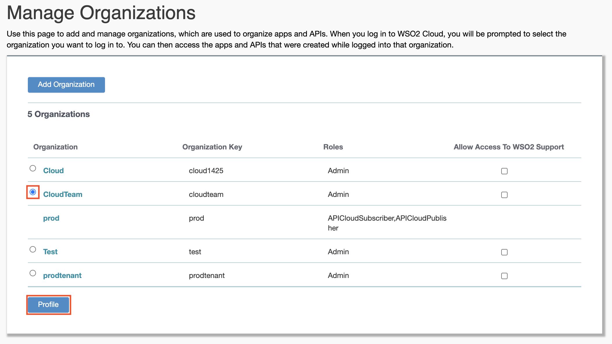

# Change the Organization Name

If you want to change the name of your organization, do the following:

1.  Sign in to [WSO2 API Cloud](https://wso2.com/api-management/cloud/) with your credentials. This opens the API Publisher.
2.  Click the settings icon on the upper, right-hand corner of the UI
    and click **[Organization](https://cloudmgt.cloud.wso2.com/cloudmgt/site/pages/organization.jag)**.
    
3.  On the **Manage Organizations** page that opens, select the
    organization that you want to change the name of, and click
    **Profile**.
    
4.  Give the new name and click **Update Profile**.This updates the organization