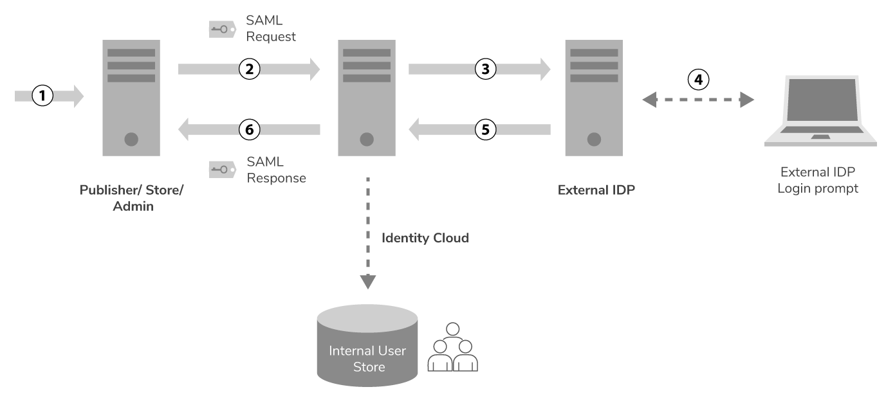
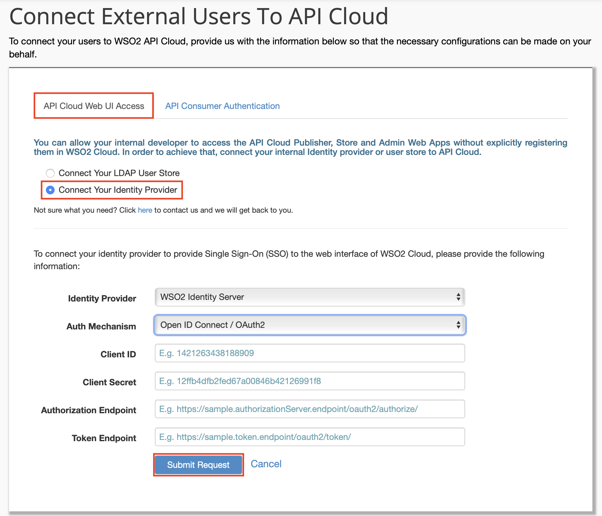

# Configure an External Identity Provider for API Cloud Authentication

Single Sign-On (SSO) allows users, who are authenticated against one
application, to gain access to multiple other related applications
without having to repeatedly authenticate themselves. It also allows web
applications to gain access to a set of backend services with the
signed-in user's access rights. The backend services can authorize a
user based on different claims such as the user role. An Identity Provider
(IdP) is responsible for issuing identification information and
authenticating users by using security tokens. 

WSO2 API Cloud uses WSO2 Identity Server as the default Identity provider (IdP). An
organization can have its own IdP that provides authentication for
internal users. In such scenarios, the organization can link their IdP
to WSO2 Cloud to provide SSO based authentication for WSO2 API Cloud
apps.

The diagram below depicts how an external IdP-based SSO can be configured.

The following points describe the depicted configuration in detail: 

1.  A user visits the API Cloud application.

2.  A SAML authentication request is sent to WSO2 Identity Cloud.

3.  WSO2 Identity Cloud is configured to forward the authentication requests
    received for a particular organization to an external IdP.

4.  The organization’s IdP prompts the user to sign in and the user submits
    credentials.

5.  An authentication success response is sent back to WSO2 Identity
    Cloud.

6.  WSO2 Identity Cloud sends a SAML response to the corresponding WSO2 API Cloud
    application. Before sending the response, Identity Cloud stores
    (provisions) the permission information of the authenticated user in
    an internal user store. The API Cloud applications refer to this
    user store for authorization.

  

Now you can follow the instructions below to configure an external identity
provider for WSO2 API Cloud authentication.

1.  Sign in to WSO2 API Cloud as an admin user. This opens the API Publisher portal.

2.  On the API Publisher, click **Configure** and then select **External Users**. 
    
    This opens a page where you can provide necessary details to connect external users to WSO2 API Cloud. 
  
3.  On the page that opens, click the **API Cloud Web UI Access** tab, select **Connect Your Identity Provider**, and then select your identity provider from the identity provider list.
    

    !!! note
    
        If your IdP is not listed in the given identity provider list, select **Other**.
    

4.  Click **Submit Request**. This submits your identity provider details to the WSO2 Cloud team.

   
5.  The WSO2 Cloud team will contact you and assist you to successfully
    configure your IdP in the Identity Cloud.

    !!! note

        - Since users in your user store can have different roles, you may want to  consider restricting access to WSO2 API Cloud applications for users in your user store. If you need to do so, you can send a `roles` attribute with the IdP authentication response and this attribute will be mapped to the cloud-related roles. This capability depends on your IdP.
        - When role information is not present in the response (e.g., Google OpenID-Connect), Identity Cloud maps the authenticated user to the organization’s default internal role. You can assign subscribe/create/publish/admin permissions to this role. All the authenticated users will have the same role and the same set of permissions. Appropriate permissions can be determined depending on your organization's requirements.
           
        !!! tip
        
            WSO2 supports only the email address as the user ID. Therefore, your IdP will have to send the email address in the response. 

    

6.  Configure custom URLs for SSO.
    
    !!! note

        WSO2 API Cloud applications identify organizations with an external IdP
        configured, based on a specific custom header. When the header is
        available in the request, the application executes the external
        IdP-based authentication flow. If the header is unavailable, the
        default authentication flow is executed. This custom header is sent
        through custom URL configurations. Let’s say we have configured a
        load balancer to send the custom header with
        `api.customdomain.organization.com/publisher`.
        Then,
        `api.cloud.wso2.com/publisher`, 
        which does not have a custom header, is executed with the default
        authentication flow. However,
        `api.customdomain.organization.com/publisher`, 
        which includes a custom header, is executed with the external
        IdP-based authentication flow.

        For details on how to configure a custom URL for the API Cloud
        Store, see [Customize the API Store Domain](../../../customize/customize-api-store-domain).

        If necessary you can always use the default cloud URLs and sign in to your account
        for administrative tasks.
    

    Once you configure custom URLs for SSO, you will
    be able to create, publish, subscribe and invoke APIs.  
      

    
    
