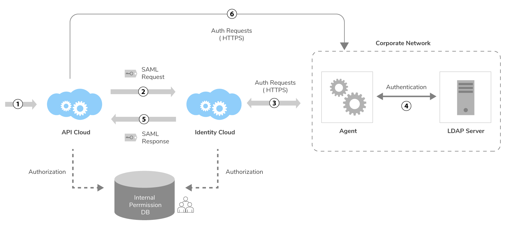
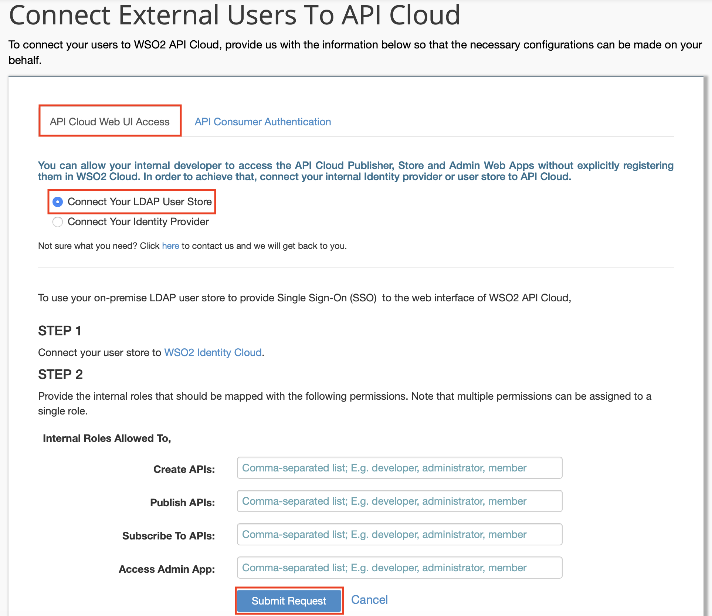

# Configure an On-Premise User Store for API Cloud Authentication

When you [sign up to WSO2 API Cloud](../../../get-started/create-a-wso2-cloud-account) using your email address and create an account, you will have administrator access and can invite and register
your corporate users to the WSO2 Cloud user store. Instead of having to explicitly invite each and every user, some
organizations might want to directly connect their internal user store
to WSO2 API Cloud. If you have a similar requirement, you can connect your local
LDAP user stores to WSO2 Cloud through the WSO2 Outbound
Agent. This will allow your organization to authenticate users
in the LDAP, without having to share the credentials of the LDAP with WSO2
Cloud.

!!! Note

    As WSO2 Cloud only supports email addresses as the user IDs to connect
    with WSO2 Cloud, your user stores should use the email address as the
    user ID.

!!! tip
    
    For information on authenticating users who are not in the WSO2 Cloud
    user store, see [Authenticate External Users for API
    Invocations](../authenticate-external-users-for-api-invocations) .
    

The diagram below depicts how authentication happens with an on-premises
user store in WSO2 API Cloud:  
  

The following points describe the depicted authentication process in detail: 

1.  The user visits WSO2 API Cloud.

2.  A SAML authentication request is sent to WSO2 Identity Cloud.

3.  WSO2 Identity Cloud sends an authentication request (HTTPS) to the
    outbound agent that is configured in the customer’s environment.

4.  The agent completes the authentication and sends the response back
    to WSO2 Identity Cloud.

5.  WSO2 Identity Cloud sends the SAML Auth response to WSO2 API Cloud and
    the user is able to access the requested application after
    authorizing.

6.  WSO2 API Cloud directly calls the outbound agent for authentication
    requirements that are not related to SSO.

Now that you understand the authentication process, let's configure an on-premise (secondary) user store for WSO2 API Cloud authentication.

Let's get started.

1.  Sign in to WSO2 API Cloud as an admin user. This opens the API Publisher portal.

2.  On the API Publisher, click **Configure** and then select **External Users**. 
    
    This opens a page where you can provide necessary details to connect external users to WSO2 API Cloud.  

3.  On the page that opens, click the **API Cloud Web UI Access** tab, select **Connect Your LDAP User Store**, and provide the requested details. 
 
    Role permission mappings will be as follows:

    -   Create APIs: Roles allowed to create APIs
    -   Publish APIs: Roles allowed to publish APIs
    -   Subscribe to APIs: Roles allowed to subscribe to APIs
    -   Access Admin App: Roles allowed to access the Admin app

    

4.  Click **Submit Request**. This submits your identity provider details to the WSO2 Cloud team.

5.  Configure custom URLs for SSO login.

    !!! note
    
        WSO2 API Cloud applications identify organizations with an external IdP
        configured, based on a specific custom header. When the header is
        available in the request, the application executes the external
        IdP-based authentication flow. If the header is unavailable, the
        default authentication flow is executed. This custom header is sent
        through custom URL configurations. Let’s say we have configured a
        load balancer to send the custom header with
        `api.customdomain.organization.com/publisher`.
        Then,
        `api.cloud.wso2.com/publisher`, 
        which does not have a custom header, is executed with the default
        authentication flow. However,
        `api.customdomain.organization.com/publisher`, 
        which includes a custom header, is executed with the external
        IdP-based authentication flow.

        For details on how to configure a custom URL for the API Cloud
        Store, see [Customize the API Store Domain](../../../customize/customize-api-store-domain).
    
        If necessary you can always use the default cloud URLs and sign in to your account
        for administrative tasks.
    

    WSO2 Cloud team will inform you once the configurations are completed so users
    can create, publish, subscribe, and invoke APIs.
