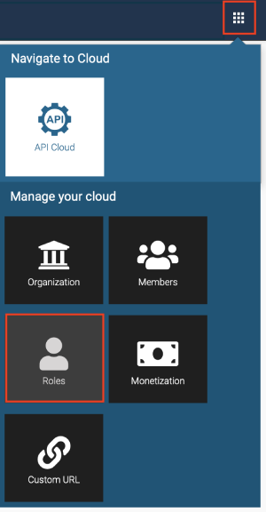
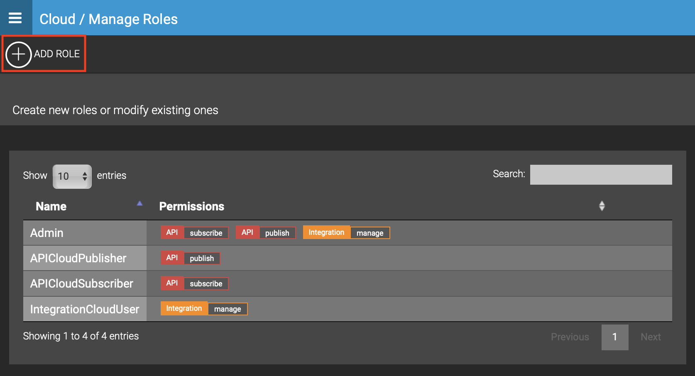
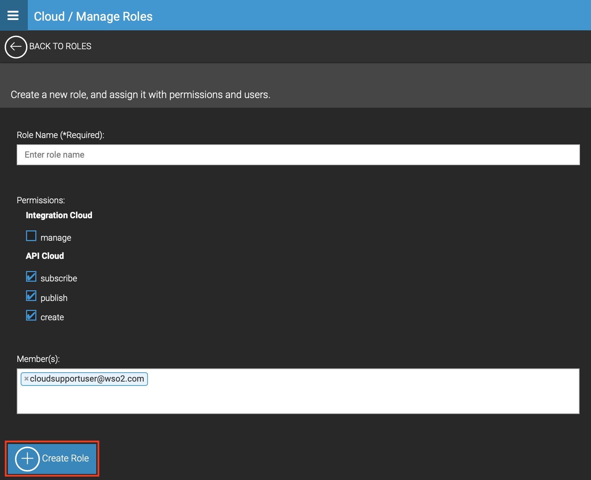

# Create Custom Roles

Roles contain permissions for users. They can be reused and they
eliminate the overhead of having to grant permission to users
individually. You can define different user roles depending on your
organization requirement.

Follow the instructions below to add a custom role to your organization.

1.  Go to [http://cloud.wso2.com](http://cloud.wso2.com/), sign in with your credentials, and select your organization when prompted. This opens the WSO2 API Publisher portal.
2.  Click the settings icon on the upper right-hand corner of the UI
    and then select **Roles**.  
    

3.  Click **Add Role**.  
      
    

4.  Specify an appropriate **Role Name** and the **Permissions** to be granted. To add a custom role to members of your organization, provide their email address.

    !!! note
    
        You can only assign roles to users who have been already added to your
        organization. You need to add new members to the organization,
        before you assign custom roles to them. For details on how to add new
        members, see [Add Members to Your Organization](../add-members-to-your-organization).

5.  Click **Create Role**.
      
  
Now you have successfully created a custom role and assigned it to relevant members in your organization.

  
