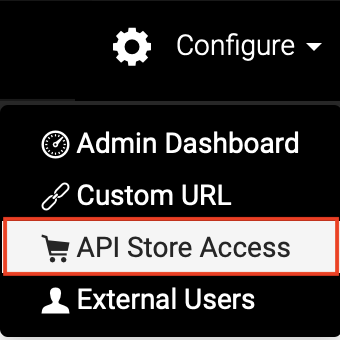
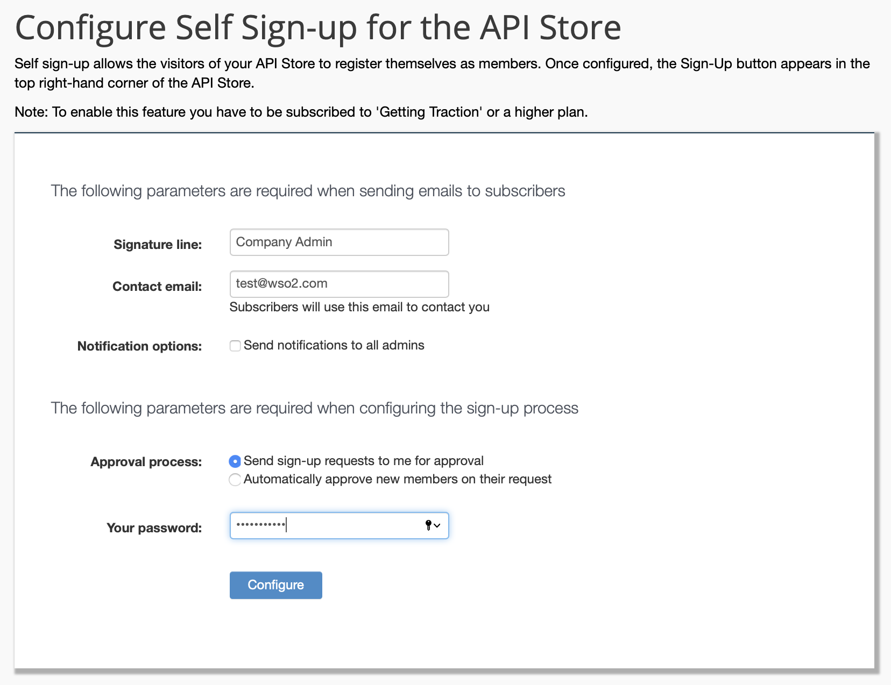
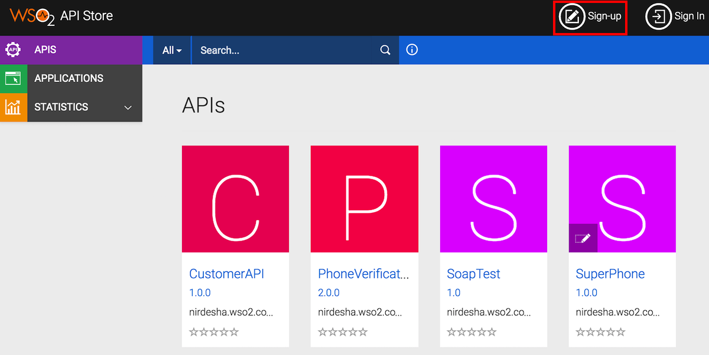
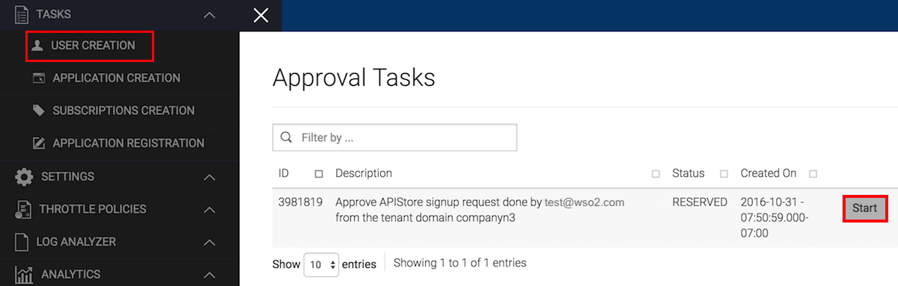
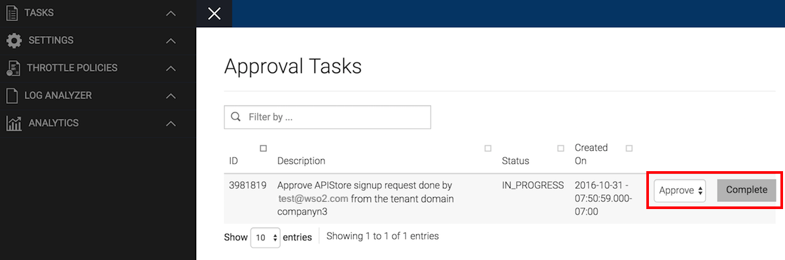
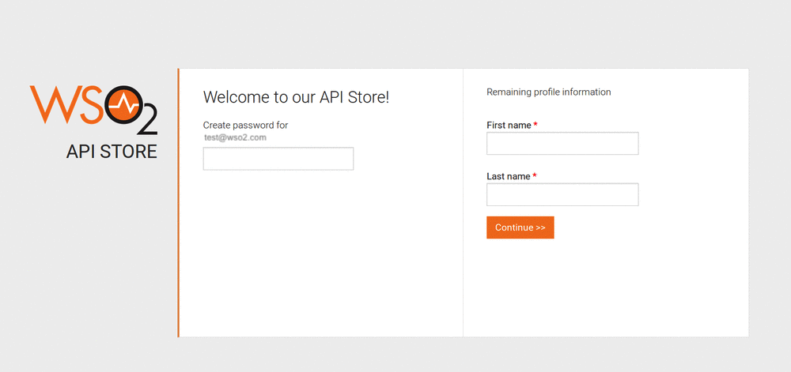

# Enable Self-Sign-up to the API Store

By default, users who are not members of your organization cannot
subscribe to and consume APIs in your default API Store. Only
invited members can subscribe and use APIs. However, an admin user of the
organization can enable self sign-up to the API Store so that
any visitor to the Store can register and become a community
member.

If you want to enable self sign-up, you need to have a paid subscription. Therefore, If you are on a trial account, you need to [upgrade to a preferred pricing plan](https://wso2.com/api-management/cloud/#pricing).

Follow the step-by-step instructions below to enable self sign-up to your API Store and
observe how subscribers can register and become community members. 

!!! note
    
    When self sign-up is enabled, users who visit your store can register to
    it themselves. Therefore, depending on your need to have more control over this capability, you can select one of the following options when you enable self sign-up:
    
    -   Allow registration requests to be approved automatically.
    -   Make the registration requests go through an approval process first.
   

1.  Sign in to WSO2 API Cloud as an admin user. This opens the API Publisher portal.
2.  On the API Publisher, click **Configure** and then select **API Store Access**.  
     

    This opens a page where you need to specify values to configure self sign-up for the API Store. 
3.  Specify appropriate values and click **Configure**. The parameters you need to specify
    are described below:  
     

    <table>
    <colgroup>
    <col style="width: 50%" />
    <col style="width: 50%" />
    </colgroup>
    <thead>
    <tr class="header">
    <th>Parameter</th>
    <th>Description</th>
    </tr>
    </thead>
    <tbody>
    <tr class="odd">
    <td>Signature line</td>
    <td>An email is sent to the users who self sign-up to the API Store. Give the name that you want to appear as the sender of this email.</td>
    </tr>
    <tr class="even">
    <td>Contact email</td>
    <td>

    
Give an email address using which new registrants can contact the administrator in case they need further assistance.

       !!! tip
           
<strong>Tip:</strong> To edit this value later, change the <code>                 fromAddress</code> and <code>contactEmail</code> attributes under the <code>                 &lt;UserSignUp&gt;</code> element in the <code>/_system/governance/apimgt/applicationdata/workflow-extensions.xml</code> registry resource.

     
</td>
     </tr>
     <tr class="odd">
     <td>Notification options</td>
     <td>Determines whether or not to send notifications to all admins.</td>
     </tr>
     <tr class="even">
     <td>Approval process</td>
     <td>Select either of the two options:
     <ul>
     <li><strong>Send sign-up requests to me for approval</strong> - tenant admin approves or rejects sign-up requests.</li>
     <li><strong>Automatically approve new members</strong> - sign-up requests are approved automatically.</li>
     </ul></td>
     </tr>
     <tr class="odd">
     <td>Your password</td>
     <td>Tenant admin's password.</td>
     </tr>
     </tbody>
     </table>

    If necessary you can customize the invitation email that is sent to self sign-up users. You can apply your own logo and also change the content based on your preference. For detailed information on
    how to customize invitation emails, see [Customize Invitation
    Emails](../../../customize/customize-invitation-emails).

4.  Go to the API Store using the following URL and sign out of the store if you are still signed in:
    `https://api.cloud.wso2.com/store/?tenant=<your organization name>`.

    Note the
    **Sign-up** link that appears on the upper right-hand corner of the
    API Store UI.

    !!! tip
    
        It can take up to 15 minutes for the configuration changes
        to take effect. Therefore, you might not see the **Sign-up** link
        immediately.
    

     
    Now you have successfully configured self sign-up for the API Store.
    Next, let's sign-up to the API Store as a visitor.

Follow the steps below to self sign-up to the API Store as a visitor.

1.  Go to the API Store, click **Sign-up**, and then specify a new email address to sign up to the Store.

    !!! tip
    
        You can use a temporary email address from
        <http://www.fakemailgenerator.com/> to try out these steps.
    

     
    !!! note
    
        - If you opted to allow automatic approval of new
        self sign-up requests, you don't need to follow steps 2, 3, and 4 given below.
        - If you opted to go with the approval process, a user sign-up notification will be sent to the email address of the particular WSO2 Cloud account's administrator and you need to follow steps 2, 3, and 4 given below. 

2.  Sign in to specific WSO2 Cloud account administrator's email to view the user sign-up notification. The notification will have a link to
    the particular WSO2 Cloud account's Admin Dashboard. Click the link and sign in to the Admin Dashboard using the WSO2 Cloud account admin credentials. This opens the **Approval Tasks** page.

3.  Click **Start** next to the registration request to approve it.  
    

4.  Select **Approve** from the drop-down list and then click **Complete**.  
      
    The registration request is now approved.

5. Check the email inbox of the newly registered user you specified
   and note the welcome email received. 

6. Click the one-time
   registration link provided in the email.

7. Complete the registration process by providing a password in the
   form that opens.   

   

8. Sign in to the API Store and note that you can now subscribe to and
    consume published APIs as a registered user.

### Disable self sign-up

Now, let's see how you can disable self sign-up.

1.  Sign in to WSO2 API Cloud as an admin user. This opens the API Publisher portal.
2.  On the API Publisher, click **Configure** and then select **API Store Access**. 

3.  On the form that opens, click **Disable Self Signup** to disable self sign-up to your API store.  

3.  Go to the API Store (
    `https://api.cloud.wso2.com/store/?tenant=<your organization name>          `
    ), sign out from it if you are signed in, and note that the
    **Sign-up** link does not show up.

    !!! tip
    
        It can take some time for self sign-up to be disabled once you do so. This is because the previous settings persist in the cache until it is refreshed. Cache refresh happens every 15 minutes.
    

