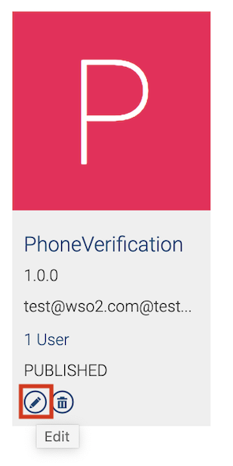
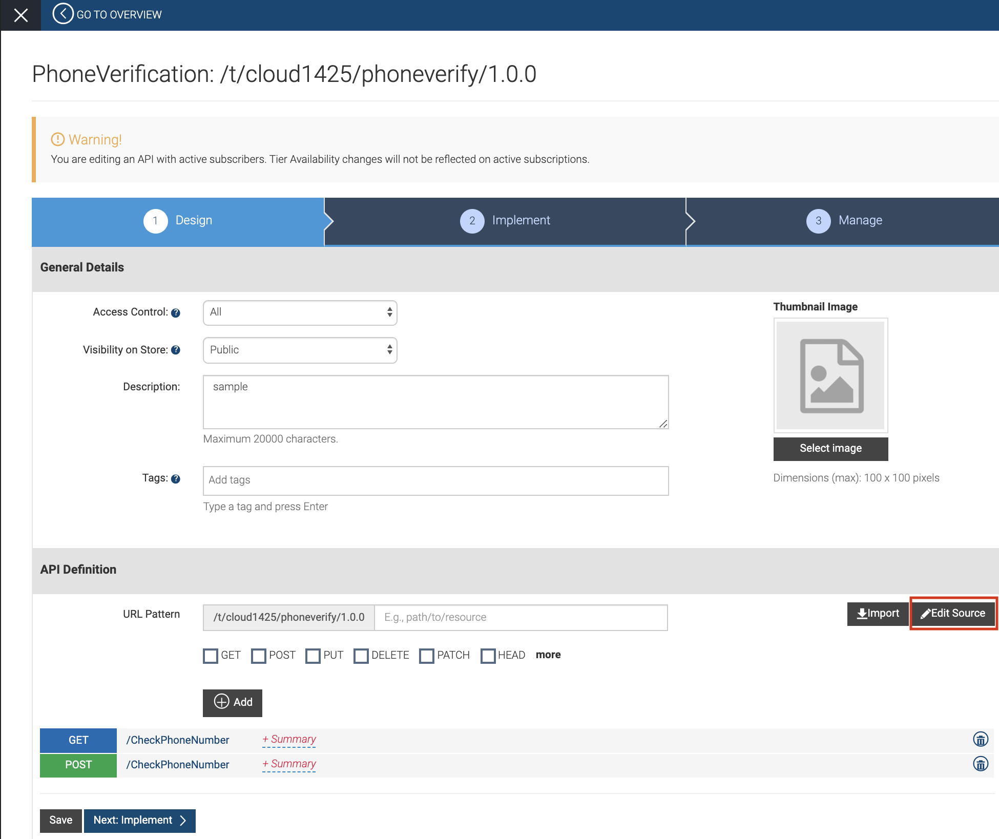
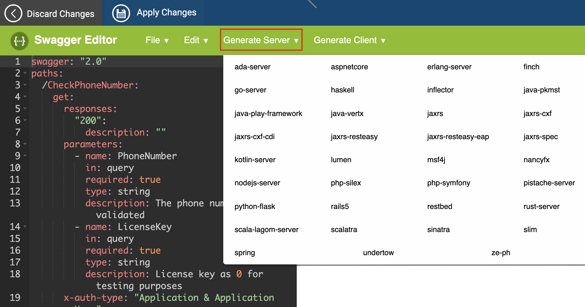
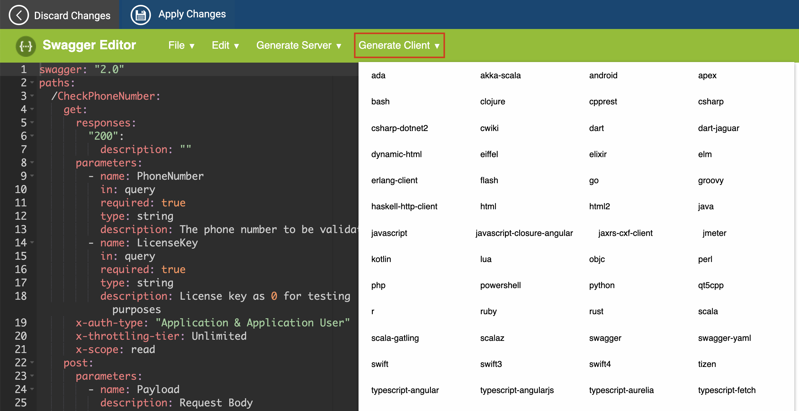

# Download SDKs for a Published API

A Software Development Kit (SDK) is a set of tools, libraries, relevant
documentation, code samples, and processes that a developer needs to
create software applications on a specific platform.

WSO2 API Cloud allows you to download any of the following client-side
Software Development Kits (SDKs) for any published API:

-   java
-   android
-   JavaScript
-   node.js
-   python
-   ruby
-   C\#.NET2
-   C\#

These SDKs provide native programming libraries that give access to
consume a subscribed API within the application code. Therefore, if an
API consumer wants to create an application that consumes subscribed
APIs, they can download the client-side SDK for the required language or
framework and use it within the application code.

WSO2 API Cloud allows API subscribers and publishers to download SDKs
for any published API either via the API Store or the Publisher.

### Download an APIs client-side SDKs from the API Store

Follow the steps below:

1.  Go to the **API Store** , click on a required API, and then click
    the **SDKs** tab.  
      
    You will see the available client-side SDKs.

2.  Click on a required SDK to download it as a ZIP file.

### Download an APIs SDKs from the API Publisher

Follow the steps below to either get a stub for the server-side
implementation of the API or to generate the client for the client-side
SDK:

1.  Sign in to WSO2 API Cloud. This takes you to the API Publisher Web
    application.
2.  On the API Publisher listing, click the edit icon on an API for
    which you want to download SDKs.  
      
    This displays the **Manage** tab where you can edit required
    details.
3.  Under the **API Definition** section, click **Edit Source** to open
    the embedded swagger editor.  
    
4.  On the swagger editor, follow the appropriate step from below
    depending on whether you want to download the server stub or the
    client-side SDK.

    -   If you want to generate and download a server stub, click
        **Generate Server** and select a required framework to get the
        server stub.

        !!! tip
        
                API developers can use the **Generate Server** option to
                generate the REST API structure based on the swagger definition.
                The actual backend implementation can be developed on top of the
                code generated using swagger code generator. You can select from
                a list of frameworks to generate the actual backend
                implementation stub of the REST API.
        

           
        This downloads the server stub as a ZIP file.  
          

    -   If you want to generate and download a client SDK, click
        **Generate Client** and select a required framework to get the
        client-side SDK.  
          
        This downloads the client-side SDK as a ZIP file.

Now that you understand how to download SDKs for any published API
either via the API Store or the Publisher, you can use the downloaded
SDK to [write a client application that consumes a subscribed
API.](../write-a-client-app-using-an-sdk)

  
