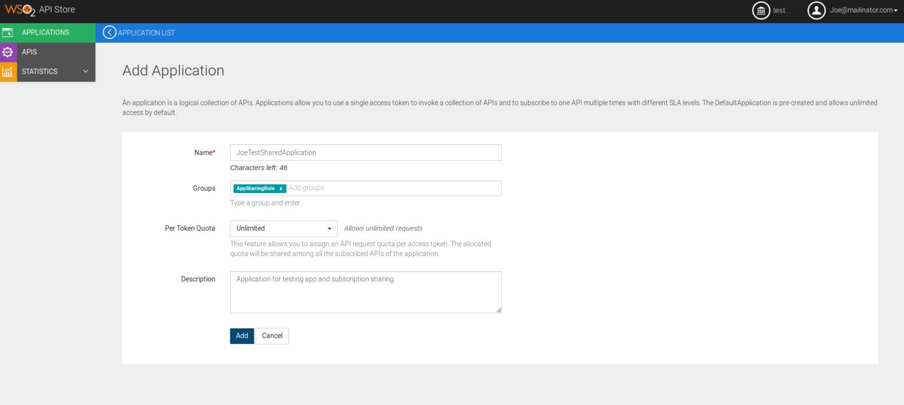
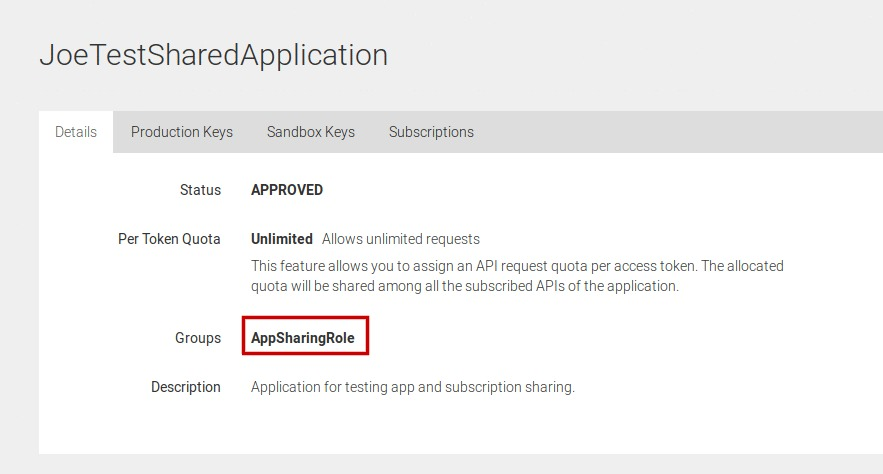
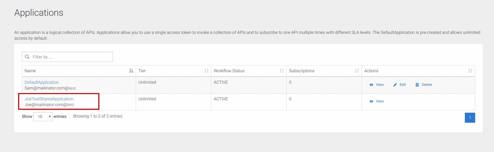
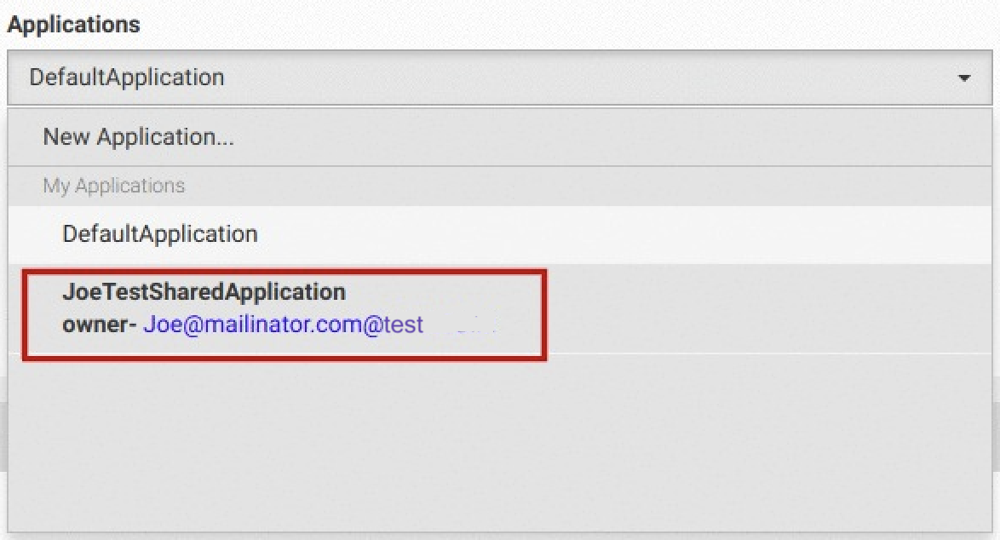
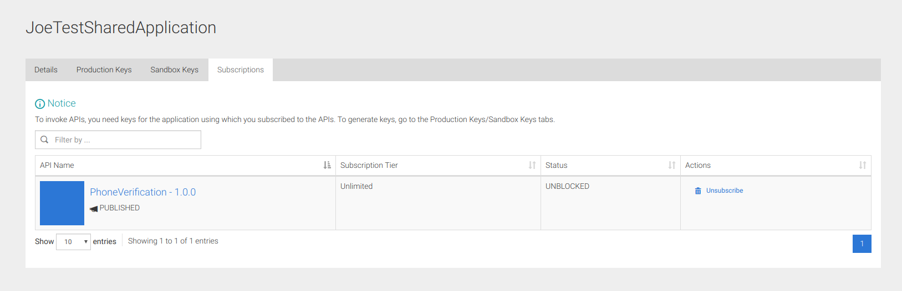
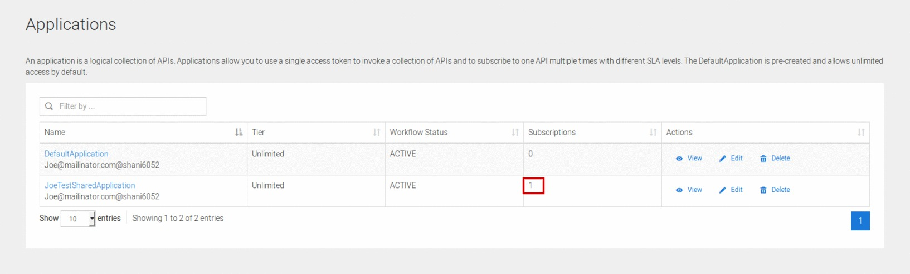

# Share an Application With Your Team

WSO2 API Cloud allows users to share their
applications and subscriptions with a specific group(s) of users if necessary. When sharing is allowed, users can view and manage applications and subscriptions belonging to other users in the same group.

WSO2 API Cloud uses role names as the grouping entity. In order to
enable sharing, a role name must be specified when
creating an application. All users who have been assigned that role, 
will share the application and subscriptions within the organization.

Let's take a look at the steps you need to follow to share an application and a subscription among two users who have the same role within the same organization.

Before you begin,

-   Create two users and add them to a common role. For demonstration we've created
    Sam@mailinator.com and Joe@mailinator.com as the two users and added them to a custom role 'AppSharingRole'.
    !!! tip
        The role used for grouping can be a [new custom role created in WSO2
    API Cloud](../../cloud-administration/create-custom-roles) or an existing role . Make sure
    that you have two [users who are members of the
    role](../../cloud-administration/add-members-to-your-organization) you want to use as a the
    grouping entity.
-   Deploy the sample API from one user's account.

Let's get started!

1.  Sign in to WSO2 API Cloud as `Joe@mailinator.com` and then access the API Store.

2.  Create an application named
    'JoeTestSharedApplication'. Make sure to add the role
    'AppSharingRole' in the Groups field. Please note that the role
    'AppSharingRole' is a role used in the tutorial for better
    explanation. Alternatively, an already existing role or a [custom
    role](_Create_Custom_Roles_) can be used for this purpose.  
    

3.  View the application details and verify that the group is correctly set.  
    

4.  In a separate browser session, Sign in to the store as
    `Sam@mailinator.com`.

5.  Click **Applications** to view all applications. You will see the shared
    application being listed. You can see the application because Sam is allowed to view  Joes application that Joe
    shared using the 'AppSharingGroup' role.  
    

6.  Click **APIs** and select `PhoneVerification` API.

7.  Expand the **Application** drop down list select `JoeTestSharedApplication` as the application.  
     

8.  Click **View All Subscriptions** on the
    pop up box that appears and verify the Subscription. Alternatively, click **Applications**, select `JoeTestSharedApplication` and then click the **Subscriptions**
    tab to verify the subscriptions.  
    

    Note that at this point, Sam cannot create keys for the application
    because Sam is not the owner of the application. When Joe generates
    the keys for the application, the keys will be visible to Sam and then Sam will be
    able to regenerate keys for the application.

9.  On the Joe@malinitaor.coms API store, click **Applications** and
    observe the subscriptions count. This confirms that subscriptions are
    shared.  
    

10. Click on the Application `JoeTestSharedApplication` and then go to the
    **Production Keys** tab.  

11. [Generate
    Keys](../generate-application-keys)
    for the application.

12. Now from Sam's store view check the visibility of the
    keys
    . Sam can also regenerate keys for the shared application.

Now you have succesfully tried out sharing applications and subscription among users within the same organization who have the same role assigned. 