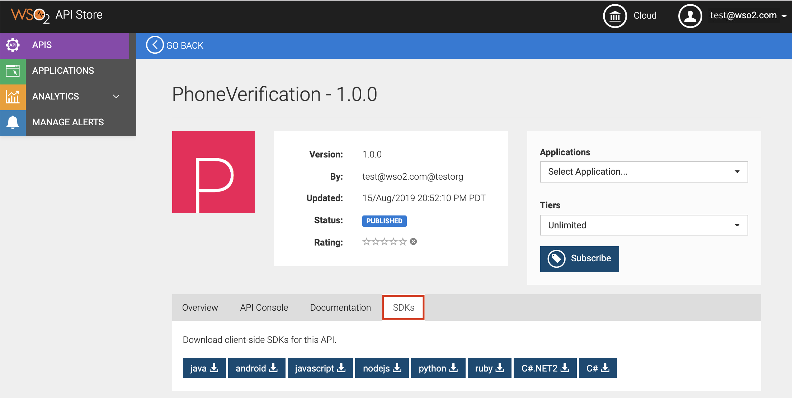

# Writing a Client Application Using an SDK

WSO2 API Cloud allows API consumers to [download any of the supported
client side SDKs for a Published
API](../download-sdks-for-a-published-api). API consumers can then use a
downloaded SDK to write a software application to consume the subscribed
APIs. This tutorial walks you through step-by-step instructions to write
a client application using a downloaded SDK.

### Write a client application with a static access token

!!! tip
    
    Follow the tutorial [Create and Publish an
    API](../../tutorials/create-and-publish-an-api)
    to create and publish the `PhoneVerification` API.  We
    will use the `PhoneVerification` API to download the
    Java SDK to be used when writing the client application.  
    If you use a different API, the SDK functions to invoke the API should
    be based on the specifications of that API.
    

1.  Follow the tutorial [Subscribe to and Invoke an
    API](../../tutorials/subscribe-to-and-invoke-an-api)
    to deploy the sample API, subscribe to it, and then generate keys.

     <html>
         <div class="admonition info">
         <p class="admonition-title">Access Token</p>
         <p>Once you generate the keys, copy the access token. You can use this
    token to invoke APIs that you subscribe to using the same
    application. </p> 
         </div>
     </html>

2.  Go to the API Store, click on the
    `PhoneVerification` API, and then click the
    **SDKs** tab.  
      
    You will see the available client-side SDKs.
3.  Click **java** to download the java SDK of the
    `PhoneVerification` API as a ZIP file. This
    downloads the `PhoneVerification_1.0.0_java.zip` file.

    !!! tip
    
        When you download an SDK, you will see that the file name includes
        the API name, version, and language of the SDK.
    

4.  Unzip the `PhoneVerification_1.0.0_java.zip`
    file. Once you unzip the file, you will see a directory structure
    similar to the following:

    Click here to see the directory structure of the unzipped file

    ``` java
    PhoneVerification_1.0.0_java
    ├── build.gradle
    ├── build.sbt
    ├── docs
    │   ├── DefaultApi.md
    │   └── Payload.md
    ├── git_push.sh
    ├── gradle
    │   └── wrapper
    │       ├── gradle-wrapper.jar
    │       └── gradle-wrapper.properties
    ├── gradle.properties
    ├── gradlew
    ├── gradlew.bat
    ├── pom.xml
    ├── README.md
    ├── settings.gradle
    └── src
        ├── main
        │   ├── AndroidManifest.xml
        │   └── java
        │       └── org
        │           └── wso2
        │               └── client
        │                   ├── api
        │                   │   ├── ApiCallback.java
        │                   │   ├── ApiClient.java
        │                   │   ├── ApiException.java
        │                   │   ├── ApiResponse.java
        │                   │   ├── auth
        │                   │   │   ├── ApiKeyAuth.java
        │                   │   │   ├── Authentication.java
        │                   │   │   ├── HttpBasicAuth.java
        │                   │   │   ├── OAuthFlow.java
        │                   │   │   └── OAuth.java
        │                   │   ├── Configuration.java
        │                   │   ├── GzipRequestInterceptor.java
        │                   │   ├── JSON.java
        │                   │   ├── Pair.java
        │                   │   ├── PhoneVerification
        │                   │   │   └── DefaultApi.java
        │                   │   ├── ProgressRequestBody.java
        │                   │   ├── ProgressResponseBody.java
        │                   │   └── StringUtil.java
        │                   └── model
        │                       └── PhoneVerification
        │                           └── Payload.java
        └── test
            └── java
                └── org
                    └── wso2
                        └── client
                            └── api
                                └── PhoneVerification
                                    └── DefaultApiTest.java
    ```

5.  Use Maven to build the SDK. For detailed information, see [Building
    a Project with Maven](https://maven.apache.org/run-maven/) .  
    Once you build the SDK, you can include the SDK as a dependency in
    your software project. For details on the Maven dependency, take a
    look at the `README.md` file.

    **Maven dependency** Expand source

    ``` java
    <dependency>
        <groupId>org.wso2</groupId>
        <artifactId>org.wso2.client.PhoneVerification</artifactId>
        <version>1.0.0</version>
        <scope>compile</scope>
    </dependency>
    ```

    Build using maven

    You can build the SDK using the
    `mvn clean install` command inside the root
    directory. For more information see [Maven Start
    Guide](https://maven.apache.org/guides/getting-started/).

6.  After creating a maven project, import the following with respect to
    the SDK. These classes will be accessible from the code once the SDK
    is built using maven and will be included as maven dependencies in
    the project.

    ``` java
    import org.wso2.client.api.*;
    import org.wso2.client.api.auth.*;
    import org.wso2.client.model.PhoneVerification.*;
    import org.wso2.client.api.PhoneVerification.DefaultApi;
    ```

7.  Create an instance of the `DefaultApi` object
    in the java code. This instance is necessary to get the API client,
    which handles the operations related to consuming the API, using the
    resources of the API.

    ``` java
    DefaultApi defaultApi = new DefaultApi();
    ```

8.  Use the API client of the `DefaultApi`
    object instance to set HTTP request headers with required data. The
    HTTP request header might differ from one API to another depending
    on the implementation of the API. Following is a sample:

    ``` java
    ApiClient apiClient = defaultApi.getApiClient();
    apiClient.addDefaultHeader("Accept", "application/json");
    ```

9.  Include the access token as a header in the API client object as
    follows to invoke the API:

    ``` java
    String accessToken = "bc392b16-6ce2-3208-9023-8938fbc376ea";
    apiClient.addDefaultHeader("Authorization", "Bearer " + accessToken);
    ```

    !!! warning
    
        You need an access token to invoke the API. It is important to have
        a valid subscription to obtain an access token before using the SDK.
        Note that the obtained access token has an expiration time.
    

10. Set the base path to the API client.

    ``` java
    apiClient.setBasePath("https://gateway.api.cloud.wso2.com/t/testorg/phoneverify/1.0.0")
    ```

    The base path for the client application is the production (or
    sandbox) URL of the API, which you see in the **Overview** tab of
    the API.

11. Once the `ApiClient` object has all the
    required data, set the `ApiClient` for the
    instance of the `DefaultApi` object.

    ``` java
    defaultApi.setApiClient(apiClient);
    ```

12. Call the available function in the SDK to get the response from the
    API.

### Write a client application with a renewable access token

The client application in the example above uses a hard coded access
token when sending the request. However, in real world use cases, you
should not hard code the access token because it expires after
a specific period.  
Following is a sample code that demonstrates how you can use an access
token that renews and is auto-generated before sending the API request.
In addition, the following example also demonstrates how you can
regenerate the token and retry the request upon failure. The following
custom client application uses an interceptor that is plugged into the
client to achieve the specified customization.

``` java
import com.squareup.okhttp.Interceptor;
import com.squareup.okhttp.Request;
import com.squareup.okhttp.Response;
import org.wso2.client.api.ApiClient;
import org.wso2.client.api.ApiException;
import org.wso2.client.api.PhoneVerification.DefaultApi;
 
import java.util.HashMap;
import java.util.List;
import java.util.Map;
 
public class APIClient {
 
    public static void main(String[] args) throws ApiException {
        DefaultApi defaultApi = new DefaultApi();
        ApiClient apiClient = defaultApi.getApiClient();

        // Creates an interceptor that intercepts every request sent by the client to include the authorization header
        Interceptor renewTokenInterceptor = new Interceptor() {
            String accessToken = null;

            public Response intercept(Chain chain) throws IOException {
                // If there is an access token already, use it for the next request, otherwise generate a token
                if (accessToken == null) {
                    getAccessToken();
                }

                // Send the original request with the Authorization header added and get the response
                Request originalRequest = chain.request().newBuilder().addHeader("Authorization", accessToken)
                        .build();
                Response response = chain.proceed(originalRequest);

                // If the response failed, retry the request with a new access token
                if (!response.isSuccessful()) {
                    getAccessToken();
                    Request newRequest = originalRequest.newBuilder().removeHeader("Authorization")
                            .addHeader("Authorization", accessToken).build();
                    response = chain.proceed(newRequest);
                }
                return response;
            }

            private void getAccessToken() throws IOException {
                // Implement this method to call the token API and retrieve the access token
                accessToken = "Bearer " + // set access token here
            }
        };

        // Set the interceptor to the client
        apiClient.getHttpClient().interceptors().add(renewTokenInterceptor);

        apiClient.addDefaultHeader("Accept", "application/json");
        apiClient.setLenientOnJson(true);
        apiClient.setBasePath("https://gateway.api.cloud.wso2.com/t/testorg/phoneverify/1.0.0");
        
        // TODO: call the available function in the SDK to get the response from the API

       
    }
}
```
