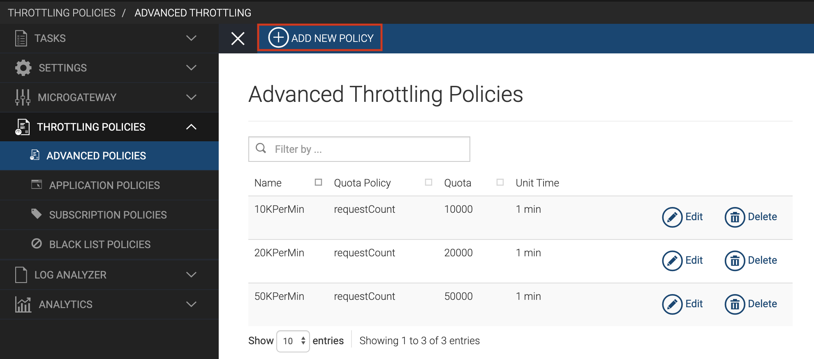
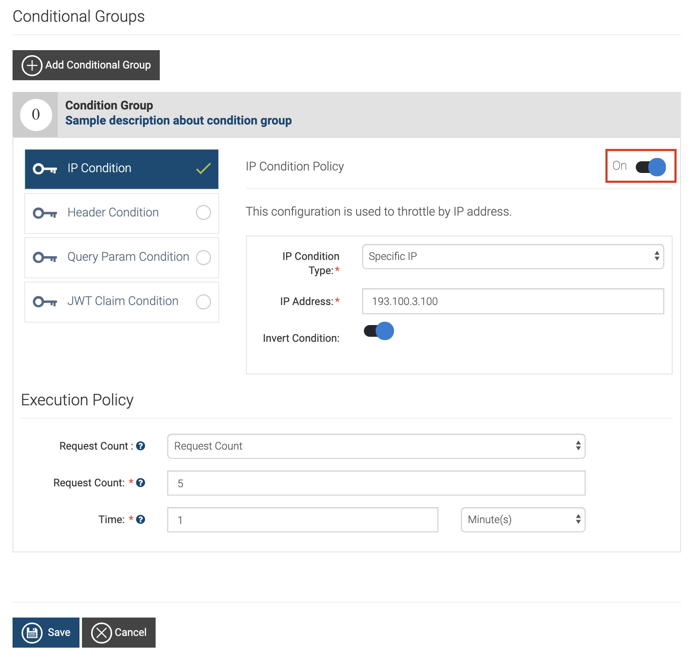
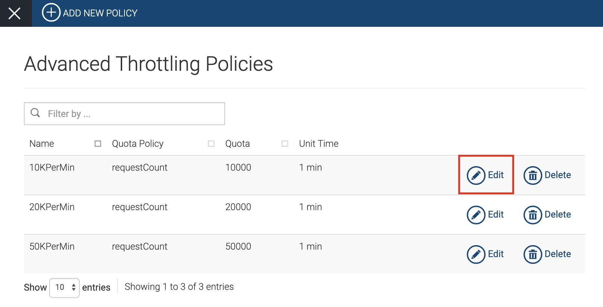

# Advanced Throttling Policies

WSO2 API Cloud allows you to apply advanced throttling policies either
at the API level or resource level. These policies can be created to
perform throttling based on either request count or request bandwidth.
When you create an advanced throttling policy, you can also go on to
configure various conditions such as IP address, IP address ranges,
headers, query parameters, and JWT claims to apply a throttling limit
based on a specific condition.

The following topics walk you through the steps to add, edit, and delete
advanced throttling policies.

### Add a new advanced throttling policy

Follow the steps below to add a new advanced throttling policy:

!!! Note
     Depending on your requirement, you can apply an advanced throttling
policy either to the API or per API resource. If you apply the policy at
resource level, then the API level policy selection will be disabled and
vice versa.

1.  Sign in to WSO2 API Cloud (
    [https://api.cloud.wso2.com](https://api.cloud.wso2.com/) ) as an
    admin user.
2.  On the top pane of the API Publisher, click **Configure** and then
    click **Admin Dashboard**.    
    This takes you to the **Admin Dashboard**.
3.  On the left navigation pane, click **THROTTLING POLICIES** , and
    then click **ADVANCED POLICIES**. This displays the **Advanced
    Throttling Policies** screen with the existing policies.
4.  Click **ADD NEW POLICY** .  
     
    This displays the **Add Advanced Throttle Policy** screen.
     
5.  Specify appropriate values for each of the fields.  
    -   Under **Default Limits**, you will see two options, namely
        **Request Count** and **Request Bandwidth**. Select an option
        depending on your requirement.  
        For example, If you are using an API for file sharing or data
        transmission, select **Request Bandwidth** to limit the data
        bandwidth for a given time unit.
    -   Under **Conditional Groups**, you can add a required condition
        to the throttling policy to apply a throttling limit based on a
        specified condition.

        Click here for instructions on how to add conditional groups.

        1.  Click **Add Conditional Group**.
        2.  Click on the condition group to expand it, then select a
            required condition and turn it on. The conditions you can
            add are as follows:

            | Condition             | Description                                                                                                                                                                                                                                                             |
            |-----------------------|-------------------------------------------------------------------------------------------------------------------------------------------------------------------------------------------------------------------------------------------------------------------------|
            | IP Condition          | Allows you to set a throttling limit for a specific IP address or a range of IP addresses.                                                                                                                                                                              |
            | Header Condition      | Allows you to set a throttling limit to specific headers and parameters. If you select this condition, you can specify a regular expression as the **Param Value** . The regex pattern can be specified to make either an exact match or a pattern match for the value. |
            | Query Param Condition | Allows you to set a throttling limit to specific query parameters.                                                                                                                                                                                                      |
            | JWT Claim Condition   | Allows you to set a throttling limit to specific claims. If you select this condition, you can specify a regular expression as the **Param Value** . The regex pattern can be specified to make either an exact match or a pattern match for the value.                 |

            !!! tip
            
                        You can configure multiple condition groups when creating an
                        advanced throttling policy. For example, if necessary it is
                        possible to apply an IP condition and a query pram condition
                        to the same advanced policy that you create.
            

        3.  Specify appropriate values for each of the fields depending
            on the condition you selected.

        4.  Under **Execution Policy**, specify appropriate values for
            the fields depending on your requirement.

            !!! note
            
                        An execution policy is applicable only to the condition it
                        is specified for. For example, if you select IP condition
                        and set the request count as shown in the diagram given
                        below, then only 5 requests are allowed per minute via the
                        specified IP address. Any request that is not from the
                        specified IP address falls to the default limit.
            

            

6.  Click **Save** .

Now you have successfully added a new advanced throttling policy, which
you can apply to an API or a resource.

If necessary, you can configure multiple conditional groups when
defining an advanced throttling policy. For example, it is possible to
apply an IP based condition together with a query param condition for a
particular advanced throttling policy that you create.

### Editing an existing advanced throttling policy

Follow the steps below to modify an existing advanced throttling policy
depending on your requirement .

1.  Sign in to WSO2 API Cloud (
    [https://api.cloud.wso2.com](https://api.cloud.wso2.com/) ) as an
    admin user.
2.  On the top pane of the API Publisher, click **Configure** and then
    click **Admin Dashboard**.   
    This takes you to the **Admin Dashboard**.
3.  On the left navigation pane, click **THROTTLING POLICIES**, and
    then click **ADVANCED POLICIES**. This displays the **Advanced
    Throttling Policies** screen with the existing policies.
4.  Click **Edit** on the policy you want to modify.  
      
    This displays the existing policy details so that you can
    do necessary changes.
5.  Edit the existing values depending on you requirement.

    !!! tip
    
        You can follow the steps provided in step 5
        above to update the
        policy fields appropriately depending on your requirement.
    

6.  Click **Update** to save the modified policy.

### Deleting an existing advanced throttling policy

Follow the steps below to delete an advanced throttling policy that you
no longer need to have.

1.  Sign in to WSO2 API Cloud (
    [https://api.cloud.wso2.com](https://api.cloud.wso2.com/) ) as an
    admin user.
2.  On the top pane of the API Publisher, click **Configure** and then
    click **Admin Dashboard**.   
    This takes you to the **Admin Dashboard**.
3.  On the left navigation pane, click **THROTTLING POLICIES**, and
    then click **ADVANCED POLICIES**. This displays the **Advanced
    Throttling Policies** screen with the existing policies.
4.  Click **Delete** on the policy you want to remove.  
      
    This deletes the particular policy.
