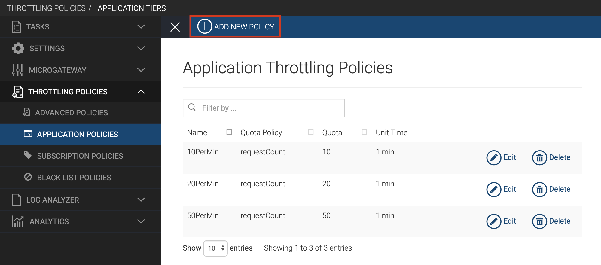
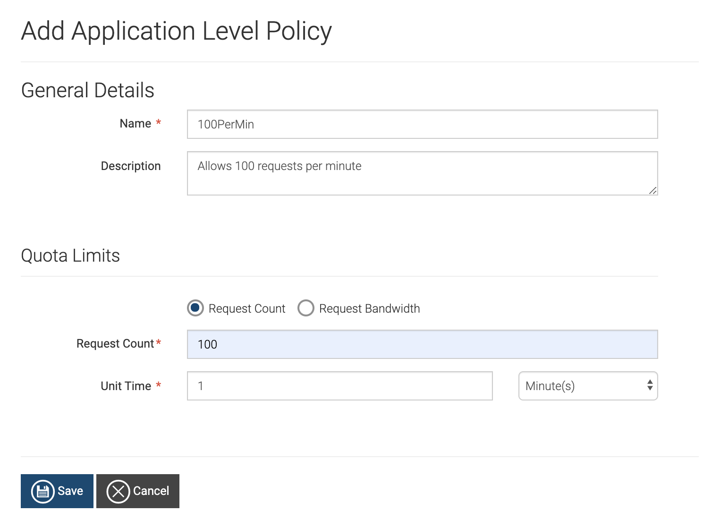
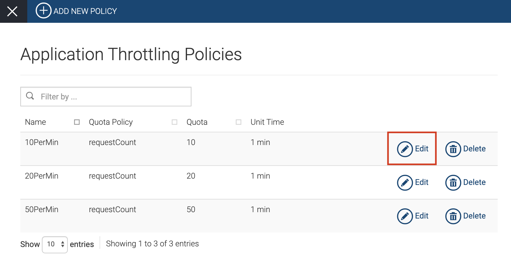
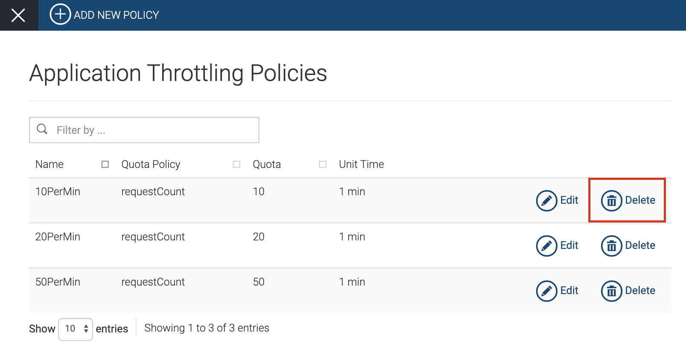

# Application Throttling Policies

Application throttling policies allow you to limit API access depending
on the subscribed applications of an API. The throttle limits will be
applicable per token for an application.

The following topics walk you through steps-by-step instructions to add,
edit, and delete application throttling policies.

### Adding a new application throttling policy

Follow the steps below to add a new application throttling policy, which
you can apply to any application that you create.

1.  Sign in to WSO2 API Cloud ([https://api.cloud.wso2.com](https://api.cloud.wso2.com/)) as an
    admin user.
2.  On the top pane of the API Publisher, click **Configure** and then
    click **Admin Dashboard**.  

    This takes you to the **Admin Dashboard** .

3.  On the left navigation pane, click **THROTTLING POLICIES** and then
    click **APPLICATION POLICIES**. This displays the **Application
    Throttling Policies** screen.
4.  Click **ADD NEW POLICY**.  
     
    This displays the **Add Application Level Policy** screen.  
    
5.  Specify appropriate values for each of the fields and then click
    **Save**.

Now you have added a new application throttling policy.

  

### Editing an existing application throttling policy

Follow the steps below to modify an existing application throttling
policy depending on your requirement.

1.  Sign in to WSO2 API Cloud (
    [https://api.cloud.wso2.com](https://api.cloud.wso2.com/) ) as an
    admin user.
2.  On the top pane of the API Publisher, click **Configure** and then
    click **Admin Dashboard**.  

    This takes you to the **Admin Dashboard**.

3.  On the left navigation pane, click **THROTTLING POLICIES** and then
    click **APPLICATION POLICIES**. This displays the **Application
    Throttling Policies** screen with the existing policies.
4.  Click **Edit** on the policy you want to modify.  
      
    This displays the existing policy details so that you can
    do necessary changes.
5.  Edit the existing values depending on you requirement.
6.  Click **Update** to save the modified policy.

### Deleting an existing application throttling policy

Follow the steps below to delete an advanced throttling policy that you
no longer need to have.

1.  Sign in to WSO2 API Cloud (
    [https://api.cloud.wso2.com](https://api.cloud.wso2.com/) ) as an
    admin user.
2.  On the top pane of the API Publisher, click **Configure** and then
    click **Admin Dashboard**.    
    This takes you to the **Admin Dashboard**.
3.  On the left navigation pane, click **THROTTLING POLICIES**, and
    then click **APPLICATION POLICIES**. This displays the
    **Application Throttling Policies** screen with the existing
    policies.
4.  Click **Delete** on the policy you want to remove.  
      
    This deletes the particular policy.
