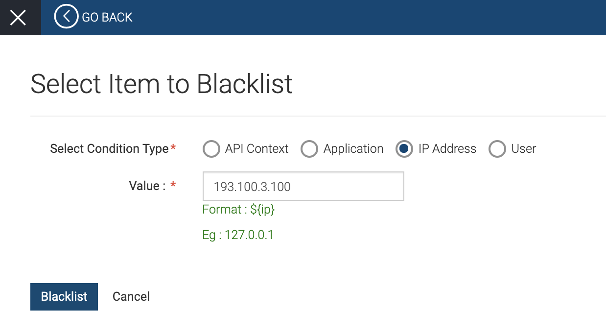
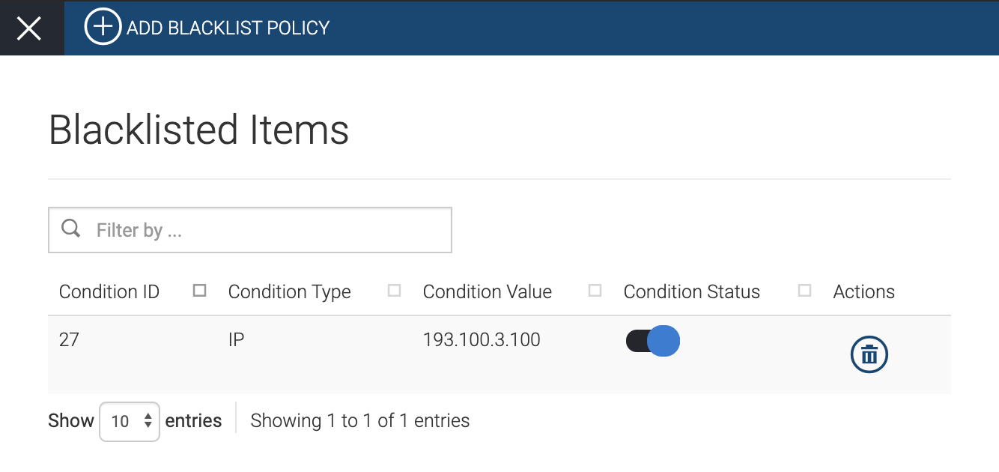
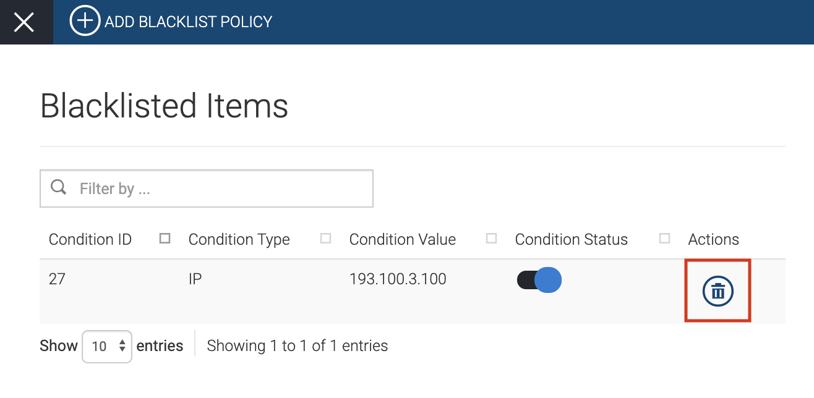

# Denylist Policies

There are certain instances where it is necessary to block requests to
protect servers from common attacks and abuse by users. For example,
when you identify a malicious user who misuses the system, you may need
to block all requests coming in from that particular user. WSO2 API
Cloud allows tenant administrative users to create blacklist policies in
order to block requests based on the following parameters:

-   Block calls to specific APIs.
-   Block all calls from a particular application.
-   Block requests coming in from a specific IP address.
-   Block a specific user from accessing APIs.

The following topics walk you through the steps to add, edit, and delete
denylist policies:

### Adding a new denylist policy

1.  Sign in to WSO2 API Cloud (
    [https://api.cloud.wso2.com](https://api.cloud.wso2.com/) ) as an
    admin user.
2.  On the top pane of the API Publisher, click **Configure** and then
    click **Admin Dashboard**.   
    This takes you to the **Admin Dashboard**.
3.  On the left navigation pane, click **THROTTLING POLICIES** , and
    then click **BLACKLIST POLICIES** . This displays the **Blacklisted
    Items** screen where you can see the blacklisted items if you have
    created any.
4.  Click **ADD BLACKLIST POLICY**.  
      
    This displays the **Select Item to Blacklist** screen.
5.  Depending on what you need to blacklist, select the relevant
    condition type and specify an appropriate value.  
    For example, if you need to blacklist a specific IP address, select
    **IP Address** as the condition and specify the specific IP address
    as the **Value**.  
    
6.  Click **Blacklist** . Now you have successfully added a new
    blacklist item and can view the added item on the **Blacklisted
    Items** screen.

!!! Note
    Once you add a denylist item, the **Condition Status** will be
    enabled by default. If there is a need to temporarily disable the
    **Condition Status**, you can do so by turning it off.

    

### Deleting a denylist policy

Follow the steps below if you want to delete a denylist policy:

1.  Sign in to WSO2 API Cloud (
    [https://api.cloud.wso2.com](https://api.cloud.wso2.com/) ) as an
    admin user.
2.  On the top pane of the API Publisher, click **Configure** and then
    click **Admin Dashboard**.    
    This takes you to the **Admin Dashboard**.
3.  On the left navigation pane, click **THROTTLING POLICIES** , and
    then click **BLACKLIST POLICIES**. This displays the **Blacklisted
    Items** screen where you can see the blacklisted items you have
    created.
4.  Click **Delete** on the policy you want to remove.  
      
    This deletes the particular policy.  
      

  
  
