# Deploy WSO2 API Cloud as an Add-on for Heroku

You can integrate WSO2 API Cloud with Heroku to provide API management
capabilities for your Heroku applications and services.

Let's take a look at how you can expose and manage a Heroku backend
using the [WSO2 API Cloud
add-on](https://elements.heroku.com/addons/wso2apicloud).

!!! tip
    
    Before you begin,
    
    -   [Create a WSO2 Cloud
        account](../../../get-started/create-a-wso2-cloud-account) and sign in.
    -   Go to <https://www.heroku.com/> and create a Heroku account if you
        do not have one already.
    -   Download and Install the [Heroku command line
        interface (CLI)](https://devcenter.heroku.com/articles/heroku-cli#download-and-install).
    

Let's get started.

### Deploy a sample application on Heroku

You need to create a sample application on Heroku to understand how you
can use WSO2 API Cloud to expose an application as an API.

Here we will use a [simple node.js REST service
application](https://github.com/wso2/cloud-heroku-samples) to create and
deploy a sample application on Heroku. The sample application implements
a simple echo service that takes a text parameter and returns the word
Hello along with the specified parameter.

Follow the steps below to deploy a sample `node.js`
application on Heroku:

1.  Execute the following command to clone the sample node.js REST
    service application:

    ``` java
    git clone https://github.com/wso2/cloud-heroku-samples.git
    ```

2.  Navigate to the directory where the sample application got cloned.
3.  Execute the following command to create a new Heroku application:

    ``` java
    heroku create
    ```

4.  Execute the following command to deploy the sample code to the new
    Heroku application:

    ``` java
    git push heroku master
    ```

5.  Execute the following command to Ensure that you have at least one
    instance of the service running:

    ``` java
    heroku ps:scale web=1
    ```

6.  To verify that your web service is running, append
    `/hello?name=World` to the root URL of your
    Heroku application and navigate to it via your browser. For
    example,  if
    `https://boiling-scrubland-10078.herokuapp.com/`
    is the root URL of your Heroku application, append
    `/hello?name=World` to the URL (i.e.,
    `https://boiling-scrubland-10078.herokuapp.com/hello?name=World`).  
    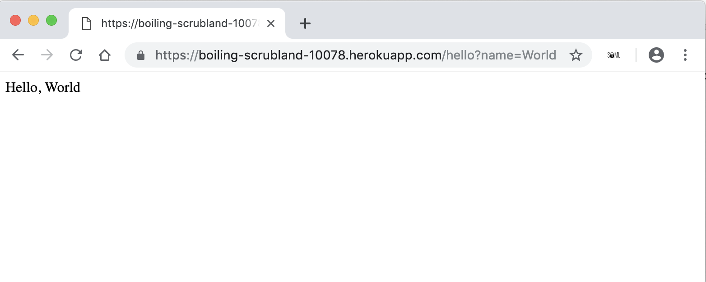
 
### Associate your Heroku application with WSO2 API Cloud

Follow the steps below to provision the WSO2 API Cloud add-on to your
Heroku application.

1.  [Sign in to Heroku](https://id.heroku.com/login) and go to the
    **Resources** page of the new Heroku application you created.  
    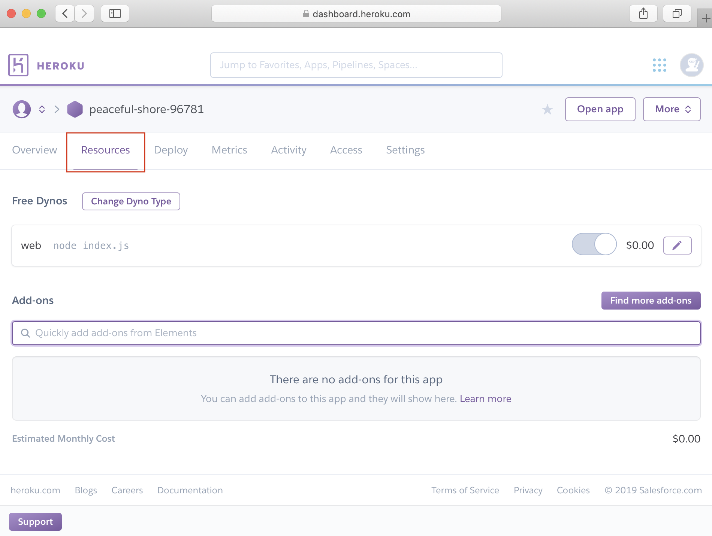
2.  Under the **Add-ons** section, search for WSO2 API Cloud and select
    it to provision the add-on.  
    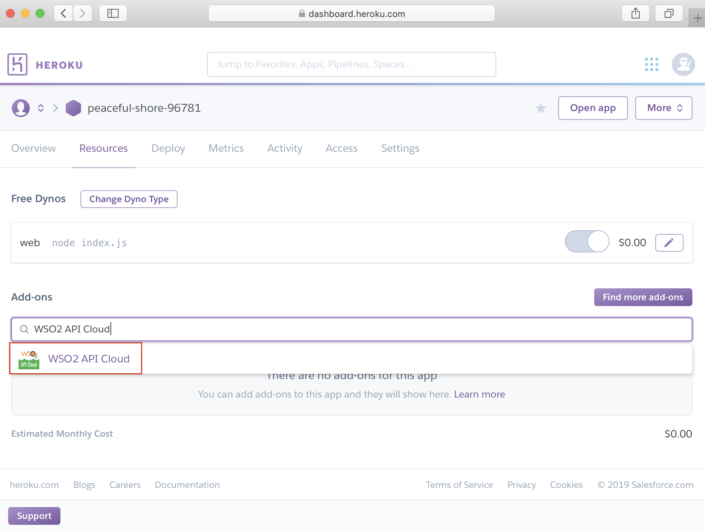 
3.  Select the appropriate **Plan name** and click **Provision** . This
    lists **WSO2 API Cloud** under the **Add-ons** section.  
    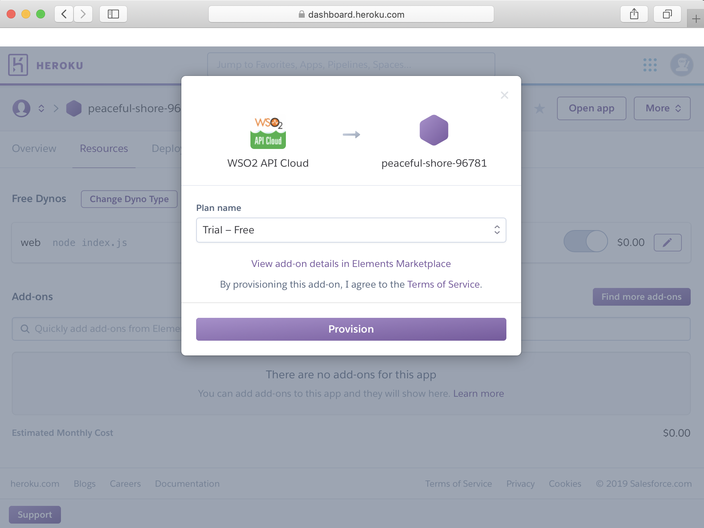 
4.  Click the WSO2 API Cloud add-on. You will be asked to provide your
    WSO2 API Cloud password.  
     
5.  Enter your WSO2 API Cloud password and click **Submit** . This takes
    you to a page where you need to select your WSO2 Cloud organization.
6.  Select the WSO2 Cloud organization that you want to associate with
    your Heroku account and click **Go**. This takes you to your WSO2
    API Cloud dashboard.

Now that you have associated your Heroku application with the WSO2 API
Cloud add-on, see the next section for information on how you can expose an
API to your Heroku backend.

### Define a managed API for your Heroku backend

Follow the steps below to expose an API to your Heroku backend.

1.  On your WSO2 API Cloud dashboard, click **ADD NEW API**.

2.  Select **Design a New REST API** and then click **Start Creating**.  
    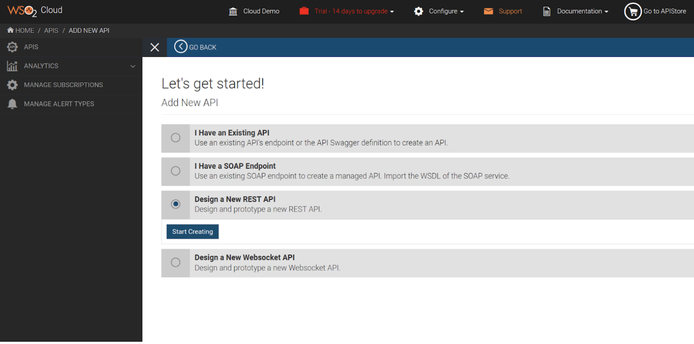  

3.  Enter the following general details to design your API
    appropriately:

    -   **Name** : `Heroku`
    -   **Context** : `heroku`
    -   **Version** : `1.0`
    -   **Visibility on Store** : `Public`

        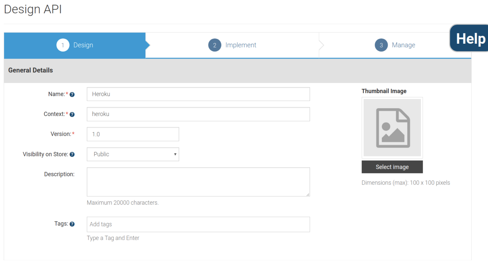

4.  In the API Definition section, enter `hello` as
    the **URL Pattern**, select **GET**, and then click **Add**.  
    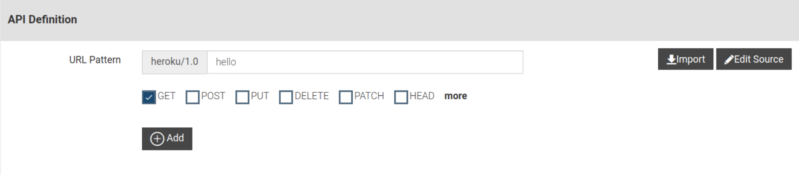

5.  Expand the new `/hello GET` method and add a new
    parameter as follows:  
    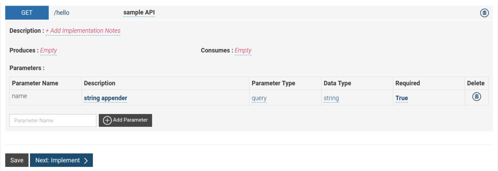 
6.  Click **Implement**.
7.  Expand the Managed API section and provide your Heroku app’s root
    URL as the **Production endpoint**.  
    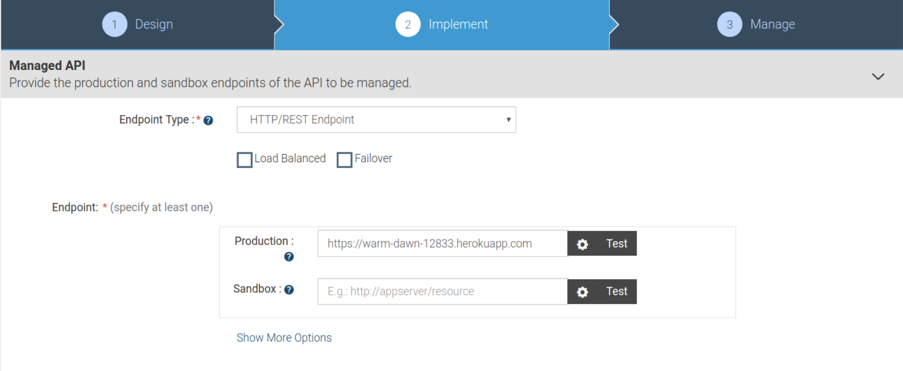
8.  Click **Manage**.
9.  Under the **Throttling Settings** section, select **Unlimited** as
    your API’s **Subscription Tier**.  
    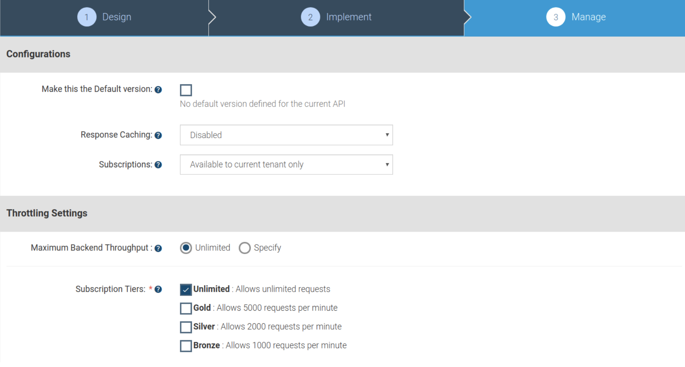 
10. Set the API resource auth type to **None** :  
    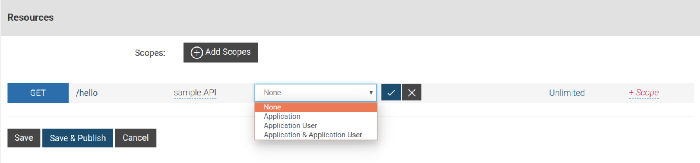
11. Click **Save & Publish** . This displays a message confirming that
    you have successfully published your API.    
    
12. Click **Go to API Store** to open your API in the API store. API
    store is the developer portal of WSO2 API Cloud.
13. In the API Store, click the **API Console** tab.
14. Expand the `/hello` method of your API, provide a
    value for name (for example, World), and click **Try it out!**.  
    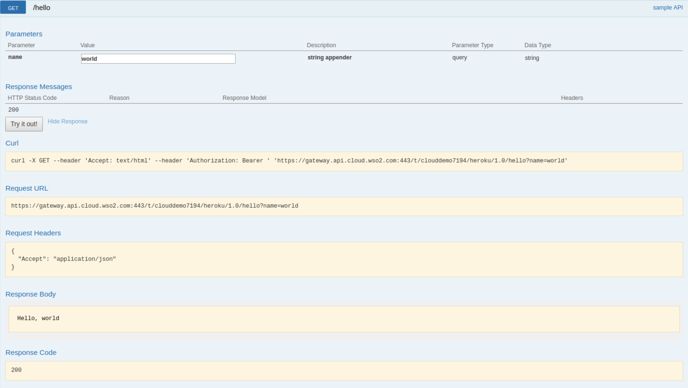  
    You will see that the API calls your backend service in Heroku and
    displays the execution results.

Now that you have successfully created an API for your Heroku
application, you can try out the other [API management capabilities that
the WSO2 API Cloud add-on
supports](../overview-of-integrating-with-heroku).

  
