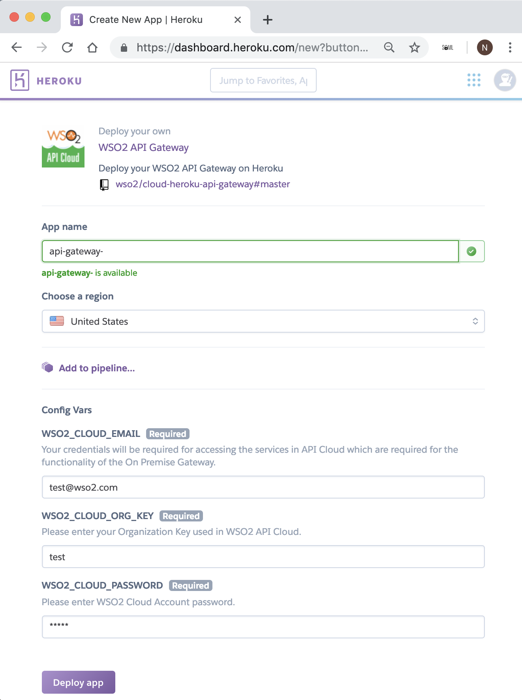

# Directly Deploy WSO2 API Gateway on Heroku

You can integrate WSO2 API Cloud with Heroku to provide API management
capabilities for your Heroku applications and services.

Let's take a look at how you can deploy WSO2 API Gateway on Heroku
without leaving your web browser.

!!! tip
    
    Before you begin,
    
    -   [Create a WSO2 Cloud
        account](../../../get-started/create-a-wso2-cloud-account) and sign in.
    -   Go to <https://www.heroku.com/> and create a Heroku account if you
        do not have one already.
    -   Sign in to your Heroku account.
    

Let's get started:

1.  Go to [WSO2 API Gateway in the Heroku elements
    marketplace](https://elements.heroku.com/buttons/wso2/cloud-heroku-api-gateway).
2.  Click **Deploy to Heroku** .
3.  Specify appropriate values for the fields on the page.

    !!! tip
    
        You can obtain the value for **WSO2_CLOUD_ORG_KEY** from your WSO2 Cloud organization page.<br/>

        
      
    

4.  Click **Deploy app**. This deploys WSO2 API Gateway on Heroku.

You can execute the following command to check your application logs and
confirm the deployment:

``` java
$ heroku logs --tail -a <application-name>
```
