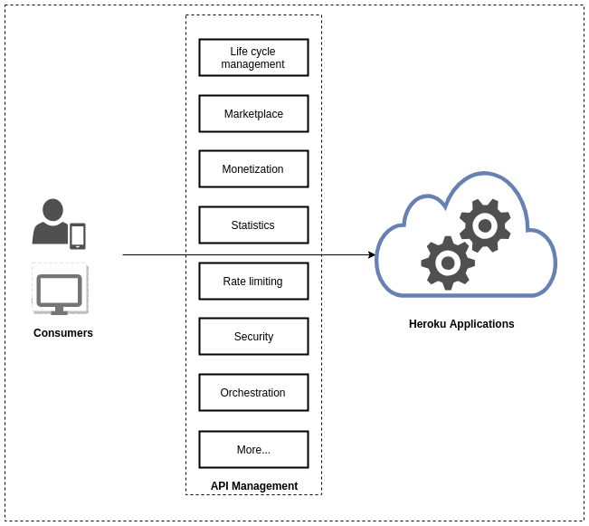
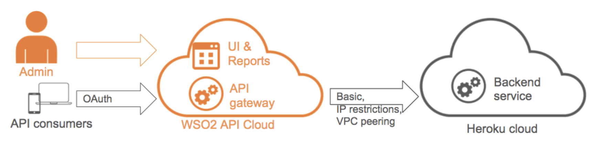
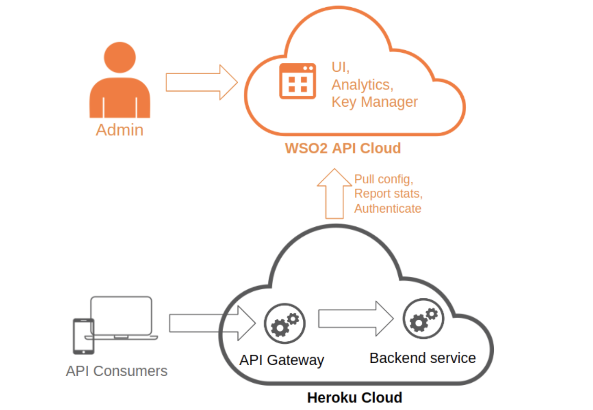

# Overview of Integrating with Heroku

Heroku is a platform as a service (PaaS) that allows you to build, run,
and operate applications entirely in the cloud. When you create
applications or services in Heroku, you will want your applications and
services to interact with external applications and services, serve as
backends for web and mobile applications, integrate with social networks
etc. In today's interconnected digital world, such interaction is
essential to bring business value to your Heroku applications and
services. With the current trend where enterprises are becoming more
data-driven and API-centric, the best approach to facilitate interaction
is to expose your Heroku services as APIs. To do this, Heroku has to
support APIs management capabilities.

You can integrate WSO2 API Cloud with Heroku to provide API management
capabilities for your Heroku applications and services. WSO2 API Cloud
supports all API management capabilities that you need to gain the best
business benefit out of your Heroku applications and services.

Following are the API management capabilities you get for your Heroku
services when you integrate WSO2 API Cloud with Heroku:

-   API publishing tools to design, prototype, import, and test APIs,
    work on new versions of APIs as well as manage the API lifecycle.
-   A feature-rich developer portal where developers can locate your
    APIs, try out the APIs, read the documentation, subscribe as well as
    manage OAuth keys.
-   A fast and scalable API gateway, which can transform incoming calls
    and data formats into what your backend needs, and vice versa.
-   Built-in security and throttling policies to define who can access
    your APIs, manage their OAuth keys, set roles and scopes as well as
    impose throttling and rate-limiting.
-   Ability to view API statistics, graphs, and also the possibility to
    configure alerts to monitor APIs.
-   Flexibility to scale your service depending on your requirement.
-   Ability to monetize your APIs (i.e., bill subscribers who consume
    APIs on your API store)

Now that you understand the benefits of having API management
capabilities for your Heroku applications and services, let's take a
look at how you can integrate WSO2 API Cloud with Heroku.

The following topics describe two possible deployment options that you
can consider depending on your business requirement. 

### Deploy WSO2 API Cloud as an add-on for Heroku applications

The [WSO2 API Cloud
add-on](https://elements.heroku.com/addons/wso2apicloud) allows Heroku
users to have easy access to an API management solution as a service.

The following diagram illustrates how you can have WSO2 API Cloud as an
add-on for your Heroku applications:

This is the best option when you have a business use case where WSO2 API
Gateway needs to be outside the Heroku deployment to work as an external
layer that secures access and enforces policies.

For instructions on how to expose and manage a Heroku
backend using the WSO2 API Cloud add-on, see [Deploy WSO2 API Cloud as an Add-on for Heroku](../deploy-as-an-add-on).

### Directly deploy WSO2 API Gateway on Heroku

WSO2 API Gateway, which is available in the [Heroku elements
marketplace](https://elements.heroku.com/buttons/wso2/cloud-heroku-api-gateway)
allows Heroku users to quickly deploy WSO2 API Gateway on Heroku without
leaving the web browser.

The following diagram illustrates the direct deployment of WSO2 API
Gateway on Heroku:

If you have a business use case that requires minimum average response
time to serve an API call, and you do not need to connect to other API
management components, the best option is to deploy WSO2 API Gateway as
your own [Heroku dyno](https://www.heroku.com/dynos).

Following are the benefits of deploying WSO2 API Gateway as your
own Heroku dyno:

-   **High performance** : You can have the API Gateway close to your
    backend services and API subscribers. This avoids costly extra hops
    to the cloud and back.
-   **Better security and compliance** : API calls and payload data does
    not leave your network. This results in better security and
    compliance.
-   **Effective connectivity** : Since your API gateway runs on Heroku,
    you do not have to set up a VPN or any other alternative to expose
    your Heroku backend to the internet.
-   **Low total cost of ownership (TCO)** : Most of the infrastructure
    is run and maintained by WSO2 for you.

For instructions on how you can directly deploy WSO2 API
Gateway on Heroku, see [Directly Deploy WSO2 API Gateway on Heroku](../deploy-as-an-add-on).

  
