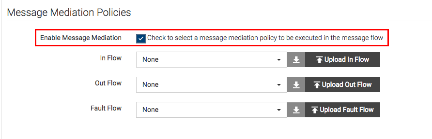
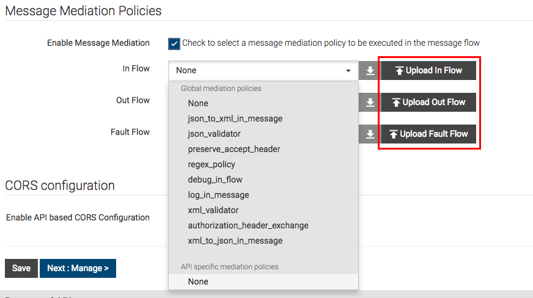

# Add a Custom Sequence to your API

This section shows you how to add a mediation sequence to your API

1.  Sign in to [WSO2 API Cloud](https://api.cloud.wso2.com/publisher/) with your credentials 

2.  Select an existing API and click **Edit**.  

3.  Go to the **Implement** tab.  

4.  Select **Enable Message Mediation**.  
       
    You can add any of the following types of sequences:

    -   In Flow - To change the default request

    -   Out Flow - To change the default response

    -   Fault Flow - To modify the default fault sequence of events.

Click the drop-down menu to see the default sequences available for each
flow. You can also upload custom sequences manually as an xml file depending on your requirement.  

