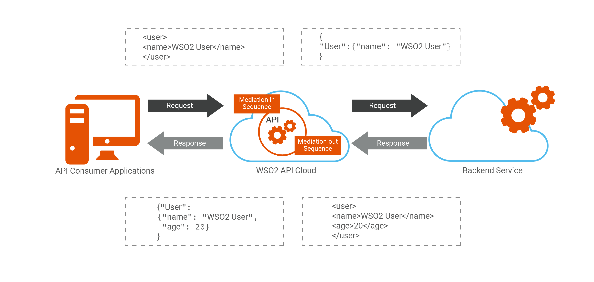
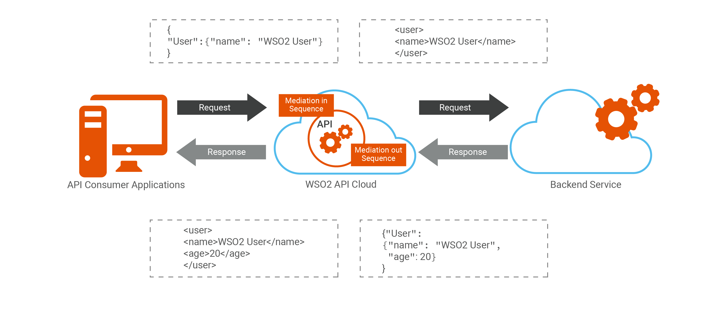
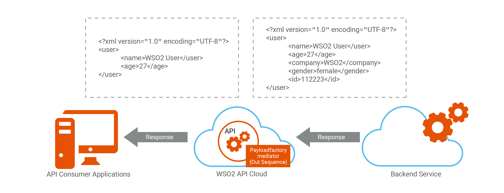
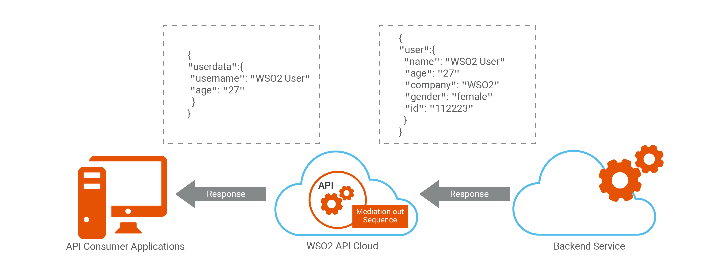
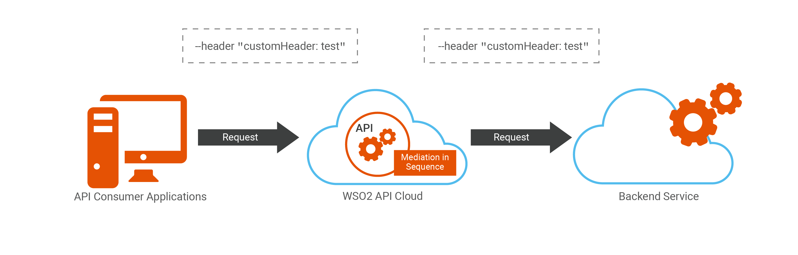
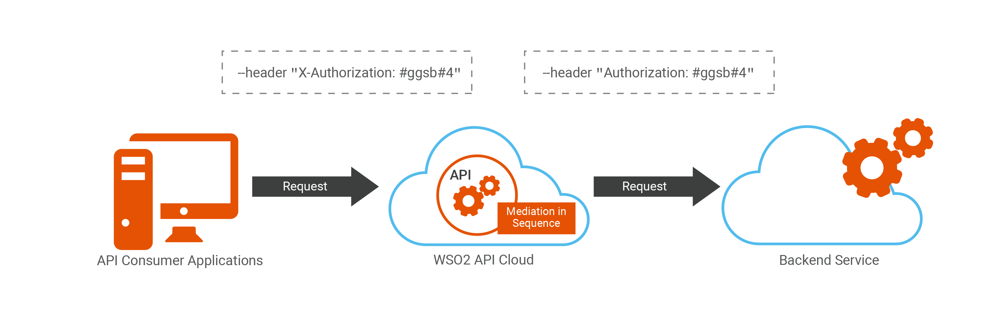
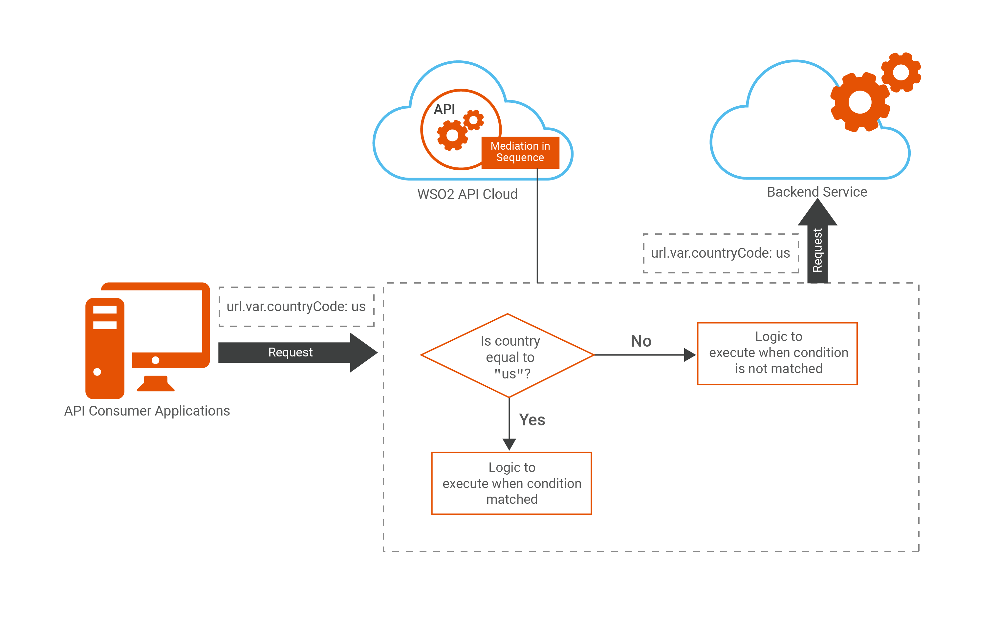
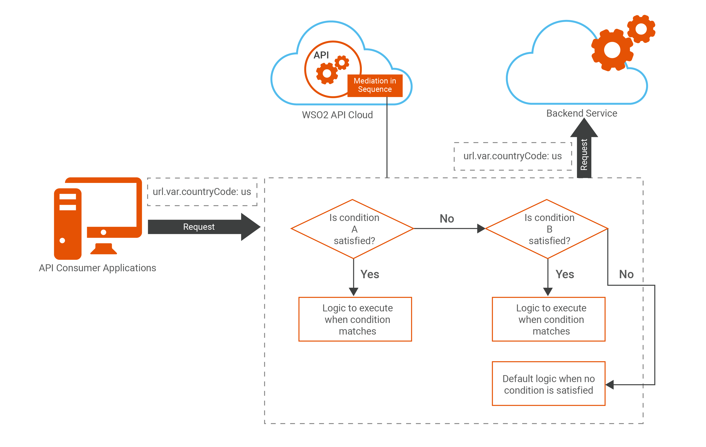
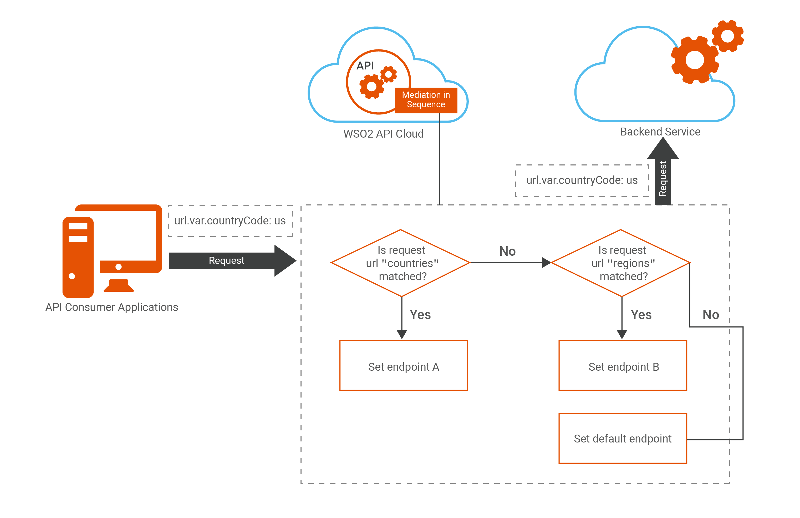
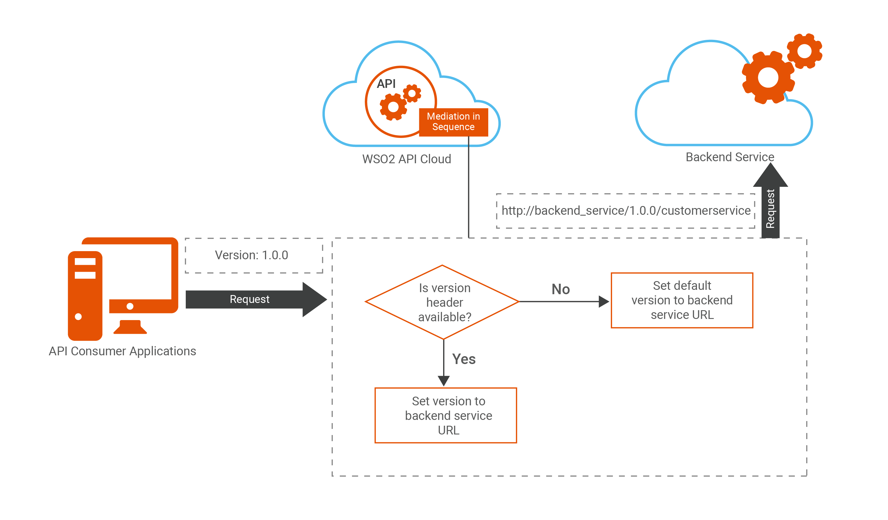

# Sample Mediation Sequences

WSO2 API Cloud allows you to use mediation sequences with your APIs.

The topics in this section describe how you can add various mediation sequences to your API via the Publisher portal depending on your requirement

!!! tip
    
    The custom sequences given below can be added to your API through the
    Publisher UI. See [Add a Custom Sequence to your
    API](../add-a-custom-sequence-to-your-api), for instructions on how to do this.
    

### Change the content type

The following are two examples on how to convert your message.

#### Convert an XML message to JSON

To convert an XML message to JSON, add the
`messageType` property to the custom sequence as shown
in the sample below.

``` java
<sequence xmlns="http://ws.apache.org/ns/synapse"  name="xml_to_json_message">      
    <property name="messageType" value="application/json" scope="axis2"/>
</sequence>
```

This sequence can be added in the In flow and the Out flow.
    
    -   In Flow - xml\_json\_in\_message
    -   Out Flow - xml\_json\_out\_message
    

The diagram below shows how this fits into an API call as a custom
sequence.

  


#### Convert a JSON message to XML

To convert a JSON message to XML, add the messageType property to the
custom sequence as shown in the sample below.

``` java
<sequence xmlns="http://ws.apache.org/ns/synapse"  name="json_to_xml_message">      
    <property name="messageType" value="application/xml" scope="axis2"/>
</sequence>
```

This sequence can be added in the In flow and the Out flow.
    
    -   In Flow - json\_xml\_in\_message
    -   Out Flow - json\_xml\_out\_message
    

The diagram below depicts how this fits into an API call as a custom
sequence.




### Extract, transform, or replace the content of a message

This example shows how to use custom sequences to

-   Change the existing attributes of a message

-   Create a new message

-   Add new attributes to a message.

-   Remove attributes from a message

For more information, see [PayloadFactory
Mediator](https://docs.wso2.com/display/ESB500/PayloadFactory+Mediator)
.

#### Manipulate an XML message

This sequence can be added to your In flow as well as your Out flow. A
sample custom sequence is given below.

``` java
<sequence xmlns="http://ws.apache.org/ns/synapse"  name="message_transform_xml">        
  <!-- Here you specify the format of the json message you need to output -->
     <payloadFactory media-type="xml">
            <format>
          <userdata>
        <username>$1</username>
        <age>$2</age>
          </userdata>
            </format>
              <!-- Used to extract the elements from the XML payload and then assigns them to the variables $1 and $2 respectively. First argument is assigned to the variable $1 and the second to $2-->
            <args>
               <arg expression="//user/name" evaluator="xml"/>
               <arg expression="//user/age" evaluator="xml"/>
            </args>
</payloadFactory>
  <property name="messageType" value="application/xml" scope="axis2"/>
</sequence>
```

The diagram below depicts how this sequence fits in the Out flow.

  
  


#### Manipulate a JSON message

This sequence can be added to your In flow as well as your Out flow. A
sample custom sequence is given below.

``` java
<sequence xmlns="http://ws.apache.org/ns/synapse"  name="message_transform_json">        
     <payloadFactory media-type="json">
  <!-- Here you specify the format of the json message you need to output -->
            <format>
             {  "userdata":  
                {
                    "username": "$1",
                    "age": "$2"
                }
             }
            </format>
           <!-- Used to extract the elements from the JSON payload and then assigns them to the variables $1 and $2 respectively. First argument is assigned to the variable $1 and the second to $2-->
            <args>
               <arg expression="$.user.name" evaluator="json"/>
               <arg expression="$.user.age" evaluator="json"/>
            </args>
</payloadFactory>
  <property name="messageType" value="application/json" scope="axis2"/>
</sequence>
```

The diagram below depicts how this sequence fits in to the Out flow.

  



### Add headers

You can add custom headers to your sequences.

#### Add a custom header 

 

Headers are added to the sequence using the header mediator. You can set
a `name` for the header and the
`scope` as `transport`, as shown in
the example below.

``` java
 <header name="customHeader" scope="transport" value="test"/>
```

To add this custom header to your sequence, save the following code as
an xml file.

``` java
<sequence xmlns="http://ws.apache.org/ns/synapse" name="header_sequence">
   <header name="customHeader" scope="transport" value="test"/>
</sequence>
```

#### Pass an authorization header to your backend  



You cannot directly create an authorization header with the name
**Authorization** , in the API Cloud as the keyword Authorization is a
reserved header name. The following is an alternative to add a header
with this name.

-   Pass the value you need to be set as the Authorization header in a
    property named `X-Authorization`.
-   Extract the value of `X-Authorization` and set it
    as the Authorization property inside your custom sequence.
-   Drop the additional `X-Authorization` header,

Now the Authorization property will be received by your backend with the
value you initially passed in the `X-Authorization`
header.  The sample is given below.

``` java
<sequence xmlns="http://ws.apache.org/ns/synapse" name="authorization_header_exchange">
    <property name="X-Authorization" expression="get-property('transport', 'X-Authorization')" scope="default" type="STRING"/>
    <property name="Authorization" expression="get-property('X-Authorization')" scope="transport" type="STRING" description=""/>
    <property name="X-Authorization" scope="transport" action="remove"/>
</sequence>
```
    
    -   In Flow - authorization\_header\_exchange
    

### Filter messages

#### Filter messages using a single condition  



The Filter Mediator can be used to filter messages based on an XPath,
JSONPath or a regular expression. If the test succeeds, the Filter
mediator executes other mediators enclosed in the sequence. This acts as
an if-else condition in java.

**Syntax**

``` java
<filter (source="[XPath|json-eval(JSONPath)]" regex="string") | xpath="[XPath|json-eval(JSONPath)]">
   mediator+
</filter>
```

This example shows how to check if the request parameter matches a
certain string and print a message if it matches correctly (the path
parameter `countryCode`, passed in a request)

**Request**

``` java
https:/gateway.api.cloud.wso2.com:443/t/wso2cloud/countries/us
```

Save the following code as an xml file:

``` java
<filter source="get-property('uri.var.countryCode')" regex=".*us">
   <then>
      <log level="custom">
         <property name="country" value="Details of USA are requested"/>
      </log>
   </then>
   <else>
      <log level="custom">
         <property name="service" value="Details of a different country is requested"/>
      </log>
   </else>
</filter>
```

#### Filter messages using a series of conditions

Using custom sequences, you can evaluate a value passed through the API
or check against a series of multiple conditions and then execute the
relevant logic. This custom mediation behaves in the same way as a
switch statement in java. This string is matched against the regular
expression in each switch case mediator, in the specified order. If a
matching case is found, it will be executed, and the remaining switch
case mediators are not processed. If none of the case statements are
matching, and a default case is specified, the default will be executed.

  

**Syntax**

``` java
<switch source="[XPath|json-eval(JSON Path)]">
   <case regex="string">
     mediator+
   </case>+
   <default>
     mediator+
   </default>?
</switch>
```

The following example shows how to switch based on the request URI
invoked through your API. If the particular condition is satisfied it
will print a log message to the live log viewer. Save the following code
as an xml file.

``` java
<sequence name="switch_conditions" trace="disable" xmlns="http://ws.apache.org/ns/synapse">
    <switch source="get-property('To')">
        <case regex=".*/countries/.*">
            <log level = "custom">    
                <property name="value" value="countries operation is executed"/>
            </log>
            <!-- logic if it satisfies this condition ie if the request is for the request uri /countries -->
        </case>
        <case regex=".*/regions/.*">
            <log level = "custom">
                <property name="value" value="regions operation is executed"/>
            </log>
            <!-- logic if it satisfies this condition ie if the request is for the request uri /region -->
        </case>
        <case regex=".*/capital/.*">
            <log level = "custom">
                <property name="value" value="capital operation is executed"/>
            </log>
            <!-- logic if it satisfies this condition ie if the request is for the request uri /capital -->
        </case>

        <!– add endpoints as needed –>
        <default>
            <log level = "custom">
                <property name="value" value="default operation is executed"/>
            </log>
            <!-- logic if it satisfies this condition ie if the request is for the default request uri -->
    </switch>
</sequence>
```

### Route to different backends

#### Resource-based routing

You can route to different backends based on the resource which the APIs
is invoked with. The logic being applied is similar to the [Filtering
based on a series of conditions](#SampleMediationSequences-series) .
  
  

In this example we set backend endpoints based on the resource of the
API invocation. Save the following code as an xml file. For instructions
on adding this custom sequence to your API, see [Add a Custom Sequence
to your API](../) . The steps are
explained within the comments.

``` java
<sequence name="dynamic_ep" trace="disable" xmlns="http://ws.apache.org/ns/synapse">
    <!-- The property which is retrieved as get-property('To')" stores the request URI for the API. Based on this value we will determine the endpoint which the request needs to be routed to.-->
    <switch source="get-property('To')">
        <case regex=".*/countries/.*">
           <!-- We are then assigning the endpoint which we need to route to in a property named service_ep in this step -->
            <property name="service_ep" value="https//first.backend.url"/>
        </case>
        <case regex=".*/regions/.*">
            <property name="service_ep" value="https://something.different.url"/>
        </case>
        <!– add endpoints as needed –>
        <default>
            <property name="service_ep" value="http://some.default.url"/>
            <!–default endpoint if required. However there should be a matching resource–>
        </default>
    </switch>
          <!-- Next we need to store this endpoint in a header named To as shown below -->
    <header name="To" expression="get-property('service_ep')"></header>
    <property expression="get-property('service_ep')" name="ENDPOINT_ADDRESS"></property>
    <!–Please note that "ENDPOINT_ADDRESS" (additional) property is defined here in order to populate
    destination address for statistics (API Usage by Destination). –>
</sequence>
```

!!! note
    
    When using this sequence you need to provide the endpoint type in the
    **Implement** section as the **Dynamic Endpoint**, before uploading
    this sequence into your In Flow under mediation extensions.
    

#### Header-based routing

You can route you API to different endpoints based on an incoming
header.

 

This example shows how to create a single API and call multiple
endpoints based on a version header passed in the request. You do not
need to create an API for each backend endpoint version. You can easily
use a custom sequence for the API to route to the required destination.
The sample sequence is given below. Save the following code as an xml
file. For instructions on adding this custom sequence to your API, see
[Add a Custom Sequence to your API](../add-a-custom-sequence-to-your-api).

``` java
<sequence xmlns="http://ws.apache.org/ns/synapse" name="VersionManagerSequence">
<!-- Property name is the parameter name that we added as a parameter when defining the endpoint url -->
<!-- Property expression is how we will be retrieving the version passed as a header, i defined the header as Version when invoking using curl-->
<property name="uri.var.version" expression="get-property('transport','Version')"/>
<!-- Here we are checking if a header named as Version is available or not.-->
    <filter source="boolean(get-property('uri.var.version'))" regex="false">
        <then>
        <!-- If no header mentioned as version is passed we will assign the version as our default version for the endpoint. So in the value you need to specify     your default version of the endpoint -->
        <property name="uri.var.version" value="customerservice-default-version"/>
        <then>
        <else/>
    </filter>
</sequence>
```

!!! note
    
    When specifying the endpoint for your API you need to provide is as
    mentioned below. So that the version which is passed through the header
    will be read inside the custom sequence and the backend endpoint will be
    populated accordingly.
    
    ``` java
    http://backend_service/1.0.0/customerservice
    ```
    

When you invoke this API then you will be using a format similar to the
cURL command given below. The request will be made to the specific
version of the endpoint you pass as a header in your API call.

``` java
curl -k -v -X GET --header "Accept: application/json" --header "Version: customerservice-1.1.0" --header "Authorization: Bearer access_token" "https://gateway.api.cloud.wso2.com/t/tenant/customer/1.0/customerservice/customers/123"
```

Alternate Method

You can do the same using a dynamic sequence as well. For that you will
need to make the below changes to the sequence explained in
**Resource-based routing** . However all the versions needs to be
defined and handled separately whereas the above sequence will
dynamically populate any version which you pass in the header.

Following is a sample sequence:

``` java
<sequence name="dynamic_ep" trace="disable" xmlns="http://ws.apache.org/ns/synapse">
    <!-- The property which is retrieved as get-property('To')" stores the request URI for the API. Based on this value we will determine the endpoint which the request needs to be routed to.-->
    <switch source="get-property('transport','Version')">
        <case regex="1.0.0.*">
           <!-- We are then assigning the endpoint which we need to route to in a property named service_ep in this step -->
            <property name="service_ep" value="https//first.backend.url/1.0.0/customers/>
        </case>
        <case regex="2.0.0">
            <property name="service_ep" value="https//first.backend.url/2.0.0/customers/"/>
        </case>
        <!– add endpoints as needed –>
        <default>
            <property name="service_ep" value="https//first.backend.url/1.0.0/customers/"/>
            <!–default endpoint if required. However there should be a matching resource–>
        </default>
    </switch>
    <!-- Next we need to store this endpoint in a header named To as shown below -->
    <header name="To" expression="get-property('service_ep')"></header>
    <property expression="get-property('service_ep')" name="ENDPOINT_ADDRESS"></property>
    <!–Please note that "ENDPOINT_ADDRESS" (additional) property is defined here in order to populate
    destination address for statistics (API Usage by Destination). –>
</sequence>


```
