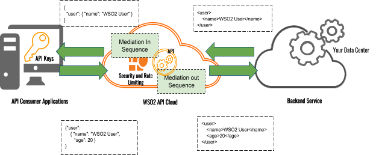

# Overview of Message Mediation for WSO2 API Cloud

An API hosted in WSO2 API Cloud receives requests sent from your
consumer applications to your backend, and then sends the responses from
the backend to you. The default flow of events of an API hosted in
WSO2 API Cloud is depicted in the diagram below.

  
If you need to modify or transform the requests and responses of your
API, you need to engage a message mediation that intercepts the default
flow. The API Gateway has a default mediation flow, which you can extend
using mediation policies. You can create a custom mediation policy
manually, or using a tool, and then engage it with the API. This will
enable you to modify the default mediation flow for different use cases
according to your requirement.

Let's look at a scenario, where custom mediation policies can be
applied.

In this example, your consumer application sends and receives messages
in JSON format and the backend service uses XML. Therefore, your
consumer application sends the request payload using JSON . However,
your backend service expects the request payload to be in XML format.
Similarly, your consumer application expects a JSON response from your
API, but the backend service is only capable of sending the responses in
XML format. You have to convert the JSON messages sent from the
application to the backend service into an XML and also convert the XML
messages sent back from the backend service as the response to the
consumer application into JSON format. WSO2 API Cloud allows you to add
mediation policies that convert the messages to the correct format, as
depicted in the diagram below.

  

You can add a mediation sequence to the In Flow, which converts the JSON
request from the application and sends it in XML format to the backend
service. You will also need to convert the XML responses from the
backend service, to JSON which can be detected by your application. To
convert the responses from XML to JSON, you can add another mediation
sequence to the Out Flow.

WSO2 API Cloud offers a wide variety of custom sequences 
that you can apply depending on your requirement. Some examples for
custom message mediation are listed below.

-   Change the content type.
-   Extract, transform or replace the content of a message.
-   Add headers.
-   Filter messages.
-   Route to different backends.
-   Work with properties.
-   Read path and query parameters inside a sequence.
-   Move query parameters to the REST path.
-   Disable chunking.
-   Debug requests.
-   Service Chaining with API Cloud.
-   Other custom mediation scenarios.
-   View sequences uploaded to APIs.

For more information on using sample mediation sequences, see
[Add a Sample Mediation
Sequence to Your API](../add-a-sample-mediation-sequence). If you have a custom requirement, contact us via support or simply
email your use case to <cloud@wso2.com> so that the WSO2 Cloud team can assist you to implement it.
