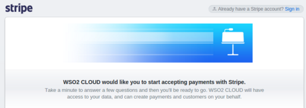

# API Monetization Overview

API monetization allows API publishers to bill subscribers who consume
APIs on their API store (developer portal). This key capability allows
API publishers to gain revenue based on the usage of their APIs.

WSO2 API Cloud supports end-to end API monetization so that you can
build an effective API monetization strategy. WSO2 API Cloud
monetization model is based on API subscription volume. This model
allows API publishers to bill subscribers depending on the total API
usage over a time period. For the purpose of invoicing, WSO2 API Cloud
allows API Publishers to expose each API over one or more preferred
tiers. Subscribers can select a preferred tier when subscribing to an
API and are invoiced appropriately depending on the consumed tiers.

!!! note
    
    WSO2 API Cloud uses [Stripe](https://stripe.com) to accept payments.
    Therefore, if you want to use the monetization capability, you need to
    create an account in Stripe and connect your bank account to it. If your
    bank account is in a country that is not yet supported by Stripe, you
    cannot make use of the monetization capability. Click
    [here](https://stripe.com/global) to see whether Stripe is supported in
    your country.
    

To get started with WSO2 API Cloud monetization capabilities, you need
to enable monetization.

Follow the instructions below to set up and enable monetization:

1.  Sign in to [WSO2 API Cloud](https://api.cloud.wso2.com) . This takes
    you to the API Publisher.
2.  On the API Publisher, click **Monetization** under **Manage**.

    !!! tip
    
        To perform API monetization using WSO2 API Cloud, you need to
        subscribe to a pricing plan. For detailed information on each
        pricing plan, see [WSO2 API Cloud
        pricing](https://wso2.com/api-management/cloud/#pricing) .
      
      
    If you have already subscribed to a pricing plan, go to step
    3. If you have a trial account and you are
    prompted to subscribe to a pricing plan, follow the instructions
    below:

    1.  Click **OK** on the message that prompts you to upgrade your
        account. This prompts you to select a pricing plan to subscribe.
    2.  Click **Select** on a pricing plan that you prefer.

    3.  Provide your billing information, contact information, and then
        click **Proceed** to upgrade your account to the selected
        pricing plan.  
    4.  Once you successfully upgrade, click the settings icon on the
        top right corner of the screen, and then click **Monetization**
        to return to the API Publisher.

3.  Follow the steps below to connect with Stripe, which is an American
    technology company that operates in over 25 countries and allows
    both private individuals and businesses to accept payments over the
    Internet.

    !!! note
    
        Do not perform any manual actions such as updating/removing
        accounts, pricing plans, or subscriptions on your Stripe
        monetization account. Such actions can cause data inconsistencies.
    

    1.  Click **Connect with Stripe** to create a Stripe account. You
        will be redirected to the Stripe application page.
    2.  Depending on your requirement, you can either create a new
        account or use an existing account.

        !!! note
    
            If you already have an existing Stripe account that you want to
            use, click **Sign In** on the top right corner of your screen, then
            enter your credentials and sign in.
                

            -   If you want to create an account, enter your account details
            in the Stripe application form and click **Authorize access
            to this account** to activate your account. You will be
            redirected to the WSO2 Cloud API page.       

            -   Enter your cloud account password and then click **Enable
            Monetization** .  

This enables monetization and displays a message confirming that the
configurations required for monetization have been added to your
organization. 

Now that you have enabled monetization, you can start using WSO2 API
Cloud monetization capabilities.

Following are the key API monetization capabilities of WSO2 API Cloud.
Click on a topic for information on how to use the capability.  

-   [Monetize subscriptions](../monetize-subscriptions)
-   [Set up billing plans](../set-up-billing-plans)
-   [Apply a subscription tier to an API](../apply-a-subscription-tier-to-an-api)
-   [Subscribe to an API that has a monetization plan](../subscribe-to-an-api-that-has-a-monetization-plan)
