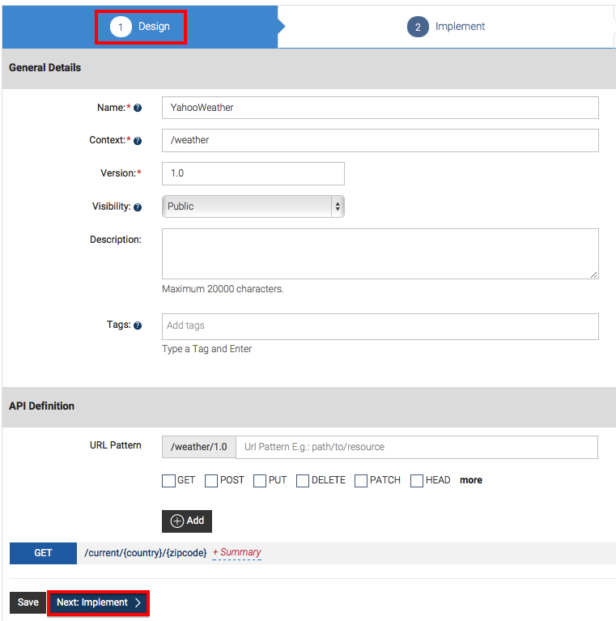
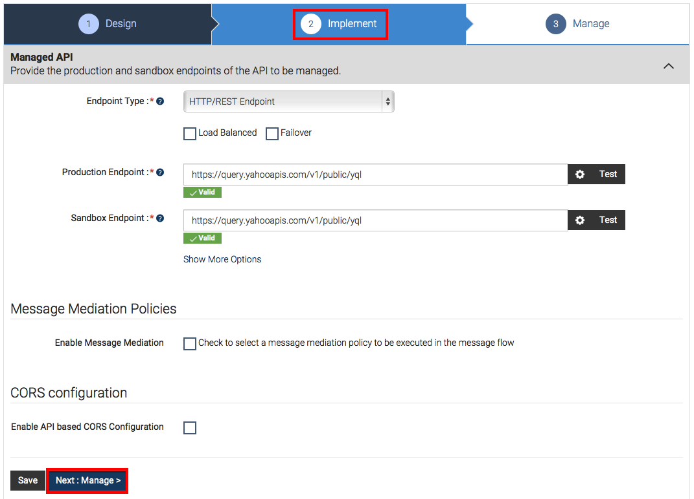
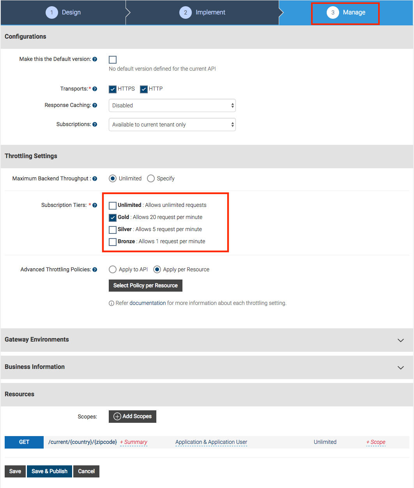
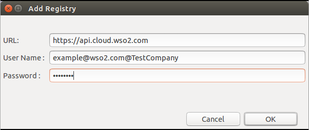
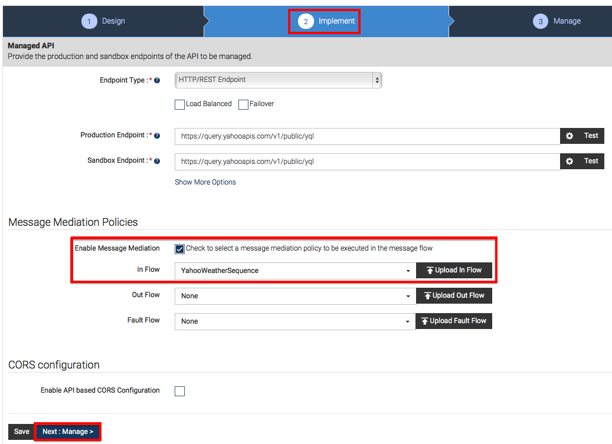

# Change the Default Mediation Flow of API Requests

Sometimes, the backend implementation of a web service might not exactly
match your preferred API design. In that case, you can perform various message
transformations and orchestrate multiple backend services to achieve the
design you want to have.

In this tutorial you create a custom sequence using the WSO2
Tooling Plug-in and use it in your APIs to mediate incoming API
calls.

!!! note
    
    WSO2 API Cloud comes with a powerful mediation engine that can transform
    and orchestrate API calls on the fly. It is built on WSO2 ESB and
    supports a variety of mediators that you can use as building blocks for
    your sequences. See the [list of
    mediators](https://docs.wso2.com/display/APICloud/Key+Concepts#KeyConcepts-Mediators)
    supported in the API Cloud and WSO2 ESB.
    
    You can extend the API Gateway's default mediation flow to do custom
    mediation by providing an extension as a synapse mediation sequence. You
    need to design all sequences using a tool like the WSO2 Tooling Plug-in
    and then store the sequence in the Gateway's registry.
    

Let's get started. 

1.  Sign in to WSO2 API Cloud with your credentials. This opens the API Publisher.  

2.  Click **Add New API**, create an API with the following information, and then click
    **Implement**.

    <table>
    <colgroup>
    <col style="width: 33%" />
    <col style="width: 33%" />
    <col style="width: 33%" />
    </colgroup>
    <thead>
    <tr class="header">
    <th>Field</th>
    <th></th>
    <th>Sample value</th>
    </tr>
    </thead>
    <tbody>
    <tr class="odd">
    <td>Name</td>
    <td></td>
    <td>YahooWeather</td>
    </tr>
    <tr class="even">
    <td>Context</td>
    <td></td>
    <td>/weather</td>
    </tr>
    <tr class="odd">
    <td>Version</td>
    <td></td>
    <td>1.0</td>
    </tr>
    <tr class="even">
    <td>Resources</td>
    <td>URL pattern</td>
    <td>current/{country}/{zipcode}</td>
    </tr>
    <tr class="odd">
    <td></td>
    <td>Request types</td>
    <td><p>GET method to return the current weather conditions of a ZIP code that belongs to a particular country</p></td>
    </tr>
    </tbody>
    </table>

    

    

3.  On the **Implement** tab, select **Managed API**, provide the information given in the table below, and then click **Next:** **Manage \>** .

    <table>
    <colgroup>
    <col style="width: 50%" />
    <col style="width: 50%" />
    </colgroup>
    <thead>
    <tr class="header">
    <th>Field</th>
    <th>Sample value</th>
    </tr>
    </thead>
    <tbody>
    <tr class="odd">
    <td>Endpoint type</td>
    <td>HTTP/REST endpoint</td>
    </tr>
    <tr class="even">
    <td>Production endpoint</td>
    <td><p>You can find the Yahoo weather API's endpoint from <a href="https://developer.yahoo.com/weather/">https://developer.yahoo.com/weather/</a> . Copy the part before the '?' sign to get this URL: <a href="https://query.yahooapis.com/v1/public/yql?q=select%20*%20from%20weather.forecast%20where%20woeid%20in%20(select%20woeid%20from%20geo.places(1)%20where%20text%3D%22nome%2C%20ak%22)&amp;format=json&amp;env=store%3A%2F%2Fdatatables.org%2Falltableswithkeys">https://query.yahooapis.com/v1/public/yql</a></p>
    <p>To verify the URL, click the <strong>Test</strong> button next to it.</p></td>
    </tr>
    <tr class="odd">
    <td>Sandbox endpoint</td>
    <td><p><a href="https://query.yahooapis.com/v1/public/yql?q=select%20*%20from%20weather.forecast%20where%20woeid%20in%20(select%20woeid%20from%20geo.places(1)%20where%20text%3D%22nome%2C%20ak%22)&amp;format=json&amp;env=store%3A%2F%2Fdatatables.org%2Falltableswithkeys">https://query.yahooapis.com/v1/public/yql</a> . To verify the URL, click the <strong>Test</strong> button next to it.</p></td>
    </tr>
    </tbody>
    </table>

    

4.  Provide the following information in the **Manage** tab and click
    **Save & Publish** once you are done.

    | Field                                            | Sample value |
    |--------------------------------------------------|--------------|
    | Tier Availability                                | Gold         |
    | Keep the default values for the other attributes |              |

    

5.  Download and install the [WSO2 API Manager Tooling
    Plug-in](https://docs.wso2.com/display/AM260/Installing+the+API+Manager+Tooling+Plug-In)
    if you have not done so already. Start Eclipse by double clicking on
    the Eclipse application, which is inside the downloaded folder.

6.  Click **Window \> Open Perspective \> Other** to open the Eclipse
    perspective selection window. Alternatively, click **Open
    Perspective** on the top, right-hand corner.  
    

7.  On the dialog box that appears, select **WSO2 APIManager** and click
    **OK** .  
    )

8.  On the APIM perspective, click **Sign in** as shown below.
    

9.  On the **Add Registry** dialog box that opens, specify your cloud user name (in the
    format `<email@company_name>`) and password,
    and click **OK**.

    

10. On the tree view that is displayed, expand the folder structure of the
    existing API.

11. Right click on the `in` sequence folder and click
    **Create** to create a new `in` sequence.  
    
 
    This steps required because you want the custom sequence to be invoked in the
    `In` direction or the request path.  
    If you want it to be involved in the `Out` or
    `Fault` paths, select the respective folder
    under `customsequences`.


12. Name the sequence as `YahooWeatherSequence`.
    Your sequence will now be visible on the Developer Studio console.

13. Under the **Mediators** section, drag and drop a **Property**
    mediator to your sequence and give the following values to the
    property mediator.

    <table>
    <colgroup>
    <col style="width: 50%" />
    <col style="width: 50%" />
    </colgroup>
    <tbody>
    <tr class="odd">
    <td>Property Name</td>
    <td>New Property</td>
    </tr>
    <tr class="even">
    <td>New Property Name</td>
    <td>YQL</td>
    </tr>
    <tr class="odd">
    <td>Value Type</td>
    <td>Expression</td>
    </tr>
    <tr class="even">
    <td>Value Expression</td>
    <td><p>For the XPath expression, we take a part of the query in the Yahoo API's endpoint ( <a href="https://developer.yahoo.com/weather/">https://developer.yahoo.com/weather/</a> ) and concatenate the zip code and country to it using the synapse get-property XPath expression:</p>
    <div class="code panel pdl" style="border-width: 1px;">
    <div class="codeContent panelContent pdl">
    <div class="sourceCode" id="cb1" data-syntaxhighlighter-params="brush: java; gutter: false; theme: Confluence" data-theme="Confluence" style="brush: java; gutter: false; theme: Confluence"><pre class="sourceCode java"><code class="sourceCode java"><a class="sourceLine" id="cb1-1" title="1"><span class="fu">concat</span>(&#39;?q=select%<span class="dv">20</span>*%20from%20weather.<span class="fu">forecast</span>%20where%20woeid%20in%<span class="dv">20</span>(select%20woeid%20from%20geo.<span class="fu">places</span>(<span class="dv">1</span>)%20where%20text%<span class="fl">3D</span>%<span class="dv">22</span>&#39;,syn:get-<span class="fu">property</span>(&#39;uri.<span class="fu">var</span>.<span class="fu">zipcode</span>&#39;),<span class="ch">&#39;,&#39;</span>,syn:get-<span class="fu">property</span>(&#39;uri.<span class="fu">var</span>.<span class="fu">country</span>&#39;),&#39;%<span class="dv">22</span>)&amp;format=json&#39;)</a></code></pre></div>
    </div>
    </div></td>
    </tr>
    </tbody>
    </table>

    

14. Similarly, add another property mediator with the following
    values.  
    This is an HTTP transport property that appends its value to the
    address endpoint URL. Once you are done, save the sequence.

    |                   |                     |
    |-------------------|---------------------|
    | Property Name     | New Property        |
    | New Property Name | REST\_URL\_POSTFIX  |
    | Value Type        | Expression          |
    | Value Expression  | get-property('YQL') |
    | Property Scope    | Axis2               |

    

15. Navigate to the **File** menu, and click **Save** to save the
    sequence.

16. Right-click on the sequence and click **Commit File,** and
    thereafter click **Yes** to push the changes to the Publisher
    server.

17. Sign in to WSO2 API Publisher again, search for the API that you
    created earlier, and click the **Edit** link to go to the edit
    wizard.

18. On the **Implement** section, select
    **Enable Message Mediation**, and select the sequence that
    you created for the In flow. Next, **Save** the API.

    !!! tip
    
        It might take a few minutes for the sequence to be
        uploaded into the API Publisher. If it isn't there, please check
        again later.
    

    

    !!! note
    
        When selecting a mediator, make sure that it is a non-blocking
        mediator as blocking mediators are not supported in API Gateway
        custom mediations.     

19. Sign in to the API Store, subscribe to the API that you just
    published and generate the access tokens in order to invoke the
    API.  
    

20. Click the **API Console** tab of the API. It opens the integrated
    API Console via which you can invoke the API.  
    

21. Specify the following values for the parameters and invoke the API. You
    can also give any other value of your choice.

    <table>
    <colgroup>
    <col style="width: 50%" />
    <col style="width: 50%" />
    </colgroup>
    <tbody>
    <tr class="odd">
    <td>country</td>
    <td><p>usa</p></td>
    </tr>
    <tr class="even">
    <td>zipcode</td>
    <td>95004</td>
    </tr>
    </tbody>
    </table>

    

22. Note the response that you get as a JSON object from Yahoo.

    ``` java
    {
      "query": {
        "count": 1,
        "created": "2017-05-04T12:49:03Z",
        "lang": "en-US",
        "results": {
          "channel": {
            "units": {
              "distance": "mi",
              "pressure": "in",
              "speed": "mph",
              "temperature": "F"
            },
            "title": "Yahoo! Weather - Aromas, CA, US",
            "link": "http://us.rd.yahoo.com/dailynews/rss/weather/Country__Country/*https://weather.yahoo.com/country/state/city-12797499/",
            "description": "Yahoo! Weather for Aromas, CA, US",
            "language": "en-us",
            "lastBuildDate": "Thu, 04 May 2017 05:49 AM PDT",
            "ttl": "60",
            "location": {
              "city": "Aromas",
              "country": "United States",
              "region": " CA"
            },
            "wind": {
              "chill": "50",
              "direction": "245",
              "speed": "4"
            },
            "atmosphere": {
              "humidity": "98",
              "pressure": "999.0",
              "rising": "0",
              "visibility": "7.5"
            },
            "astronomy": {
              "sunrise": "6:9 am",
              "sunset": "7:58 pm"
            },
            "image": {
              "title": "Yahoo! Weather",
              "width": "142",
              "height": "18",
              "link": "http://weather.yahoo.com",
              "url": "http://l.yimg.com/a/i/brand/purplelogo//uh/us/news-wea.gif"
            },
            "item": {
              "title": "Conditions for Aromas, CA, US at 05:00 AM PDT",
              "lat": "36.878021",
              "long": "-121.618973",
              "link": "http://us.rd.yahoo.com/dailynews/rss/weather/Country__Country/*https://weather.yahoo.com/country/state/city-12797499/",
              "pubDate": "Thu, 04 May 2017 05:00 AM PDT",
              "condition": {
                "code": "33",
                "date": "Thu, 04 May 2017 05:00 AM PDT",
                "temp": "51",
                "text": "Mostly Clear"
              },
              "forecast": [
                {
                  "code": "30",
                  "date": "04 May 2017",
                  "day": "Thu",
                  "high": "74",
                  "low": "55",
                  "text": "Partly Cloudy"
                },
                {
                  "code": "28",
                  "date": "05 May 2017",
                  "day": "Fri",
                  "high": "71",
                  "low": "53",
                  "text": "Mostly Cloudy"
                },
                {
                  "code": "30",
                  "date": "06 May 2017",
                  "day": "Sat",
                  "high": "65",
                  "low": "47",
                  "text": "Partly Cloudy"
                },
                {
                  "code": "12",
                  "date": "07 May 2017",
                  "day": "Sun",
                  "high": "62",
                  "low": "48",
                  "text": "Rain"
                },
                {
                  "code": "30",
                  "date": "08 May 2017",
                  "day": "Mon",
                  "high": "69",
                  "low": "46",
                  "text": "Partly Cloudy"
                },
                {
                  "code": "30",
                  "date": "09 May 2017",
                  "day": "Tue",
                  "high": "69",
                  "low": "48",
                  "text": "Partly Cloudy"
                },
                {
                  "code": "28",
                  "date": "10 May 2017",
                  "day": "Wed",
                  "high": "70",
                  "low": "52",
                  "text": "Mostly Cloudy"
                },
                {
                  "code": "30",
                  "date": "11 May 2017",
                  "day": "Thu",
                  "high": "72",
                  "low": "52",
                  "text": "Partly Cloudy"
                },
                {
                  "code": "30",
                  "date": "12 May 2017",
                  "day": "Fri",
                  "high": "72",
                  "low": "48",
                  "text": "Partly Cloudy"
                },
                {
                  "code": "34",
                  "date": "13 May 2017",
                  "day": "Sat",
                  "high": "71",
                  "low": "46",
                  "text": "Mostly Sunny"
                }
              ],
              "description": "<![CDATA[\n<BR />\n<b>Current Conditions:</b>\n<BR />Mostly Clear\n<BR />\n<BR />\n<b>Forecast:</b>\n<BR /> Thu - Partly Cloudy. High: 74Low: 55\n<BR /> Fri - Mostly Cloudy. High: 71Low: 53\n<BR /> Sat - Partly Cloudy. High: 65Low: 47\n<BR /> Sun - Rain. High: 62Low: 48\n<BR /> Mon - Partly Cloudy. High: 69Low: 46\n<BR />\n<BR />\n<a href=\"http://us.rd.yahoo.com/dailynews/rss/weather/Country__Country/*https://weather.yahoo.com/country/state/city-12797499/\">Full Forecast at Yahoo! Weather</a>\n<BR />\n<BR />\n(provided by <a href=\"http://www.weather.com\" >The Weather Channel</a>)\n<BR />\n]]>",
              "guid": {
                "isPermaLink": "false"
              }
            }
          }
        }
      }
    }
    ```

Now you have tried out creating a sequence to change the default mediation
flow of API requests, deployed it in the API Gateway and invoked an API
using the custom mediation flow.
