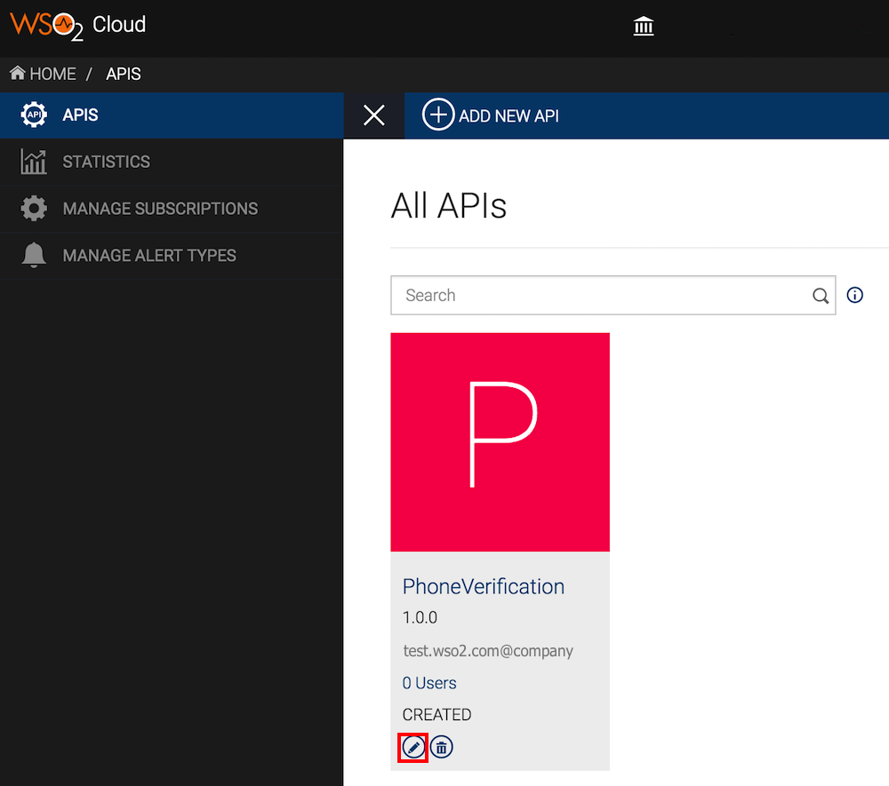
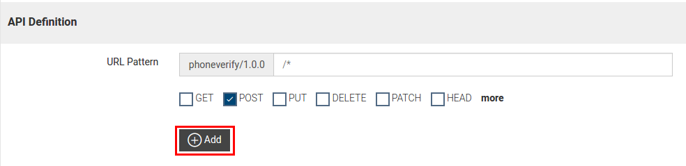
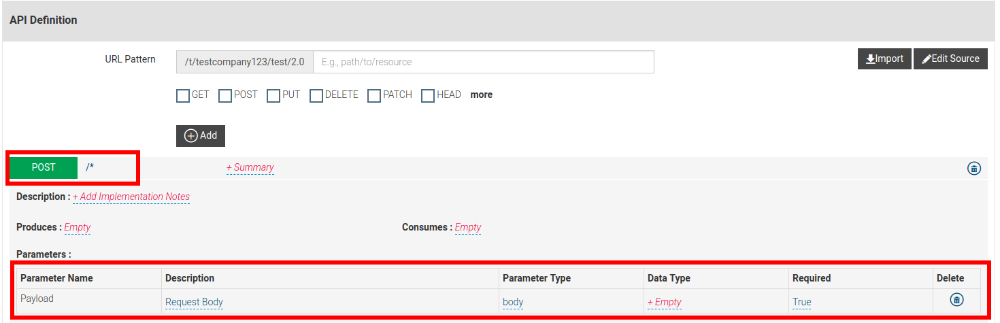
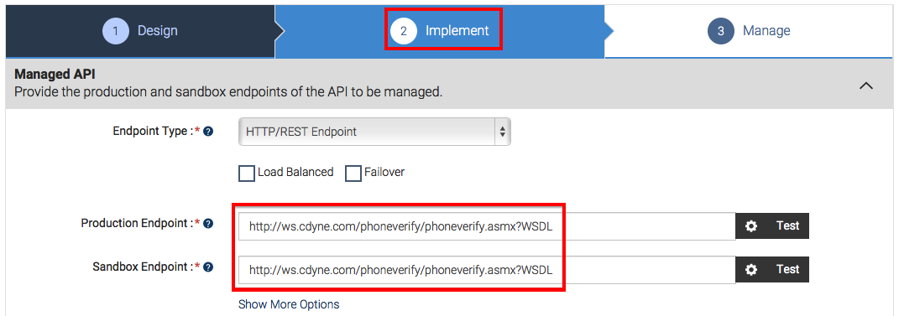
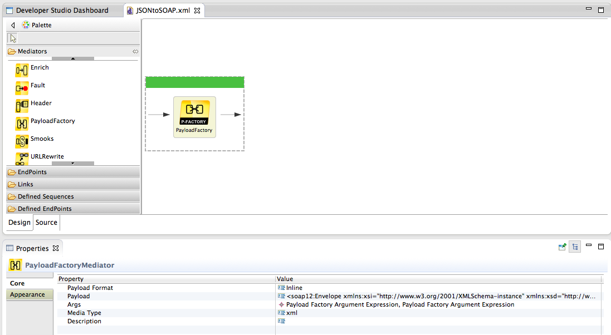
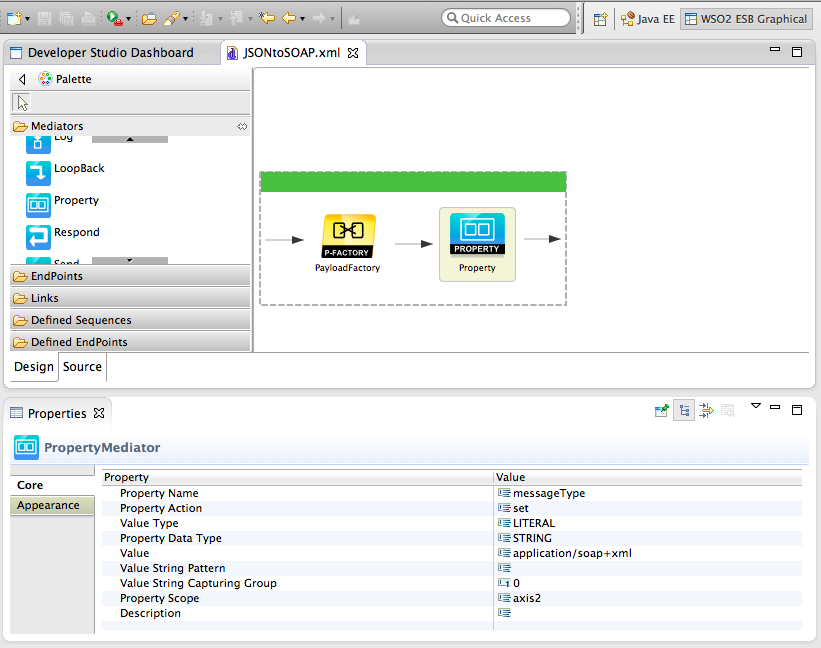
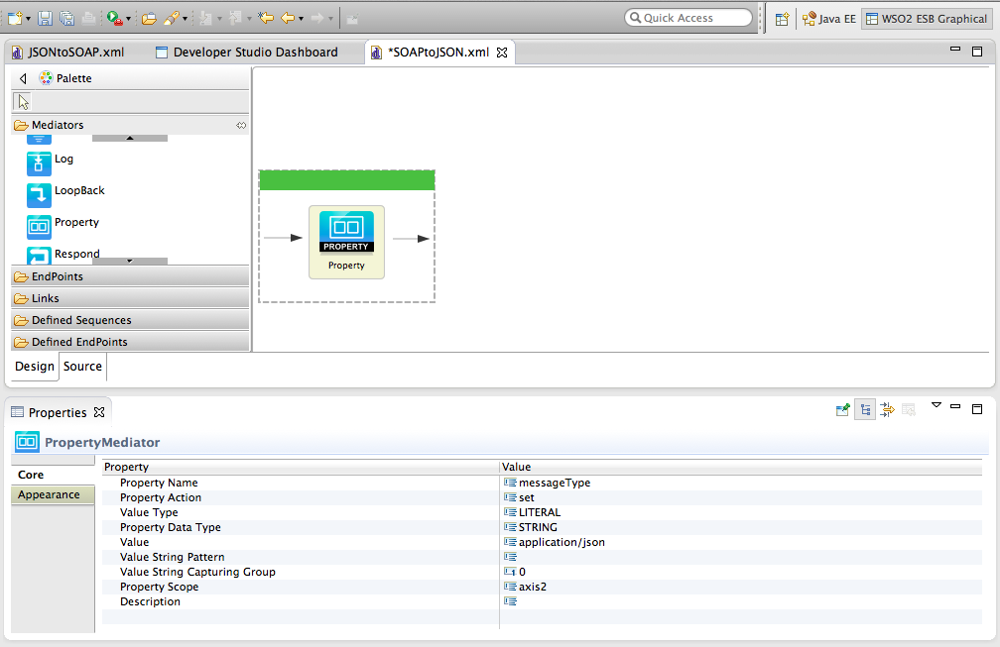
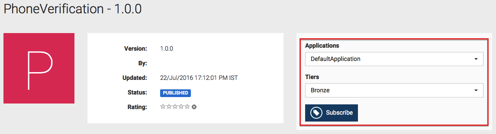
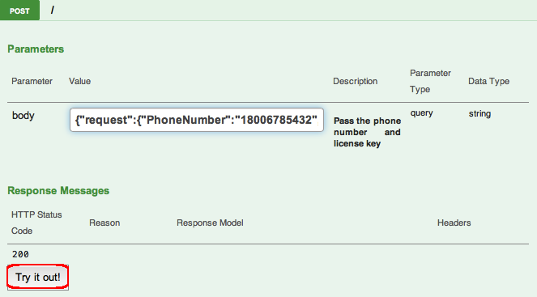

# Convert a JSON Message to SOAP and SOAP to JSON

<html>
         

         
Note

         
This tutorial uses the [WSO2 API Manager Tooling
    Plug-in](https://docs.wso2.com/display/AM260/Installing+the+API+Manager+Tooling+Plug-In).
 
         

</html> 

WSO2 API Cloud comes with a powerful mediation engine that can transform
and orchestrate API calls on the fly. It is built on the WSO2 ESB and
supports a variety of mediators that you can use as building blocks for
your sequences.

You can provide an extension as a synapse mediation sequence to the API
Gateway's default mediation flow to transform message formats.

In this tutorial you convert a request message with a JSON payload
and a REST URL to a SOAP message, send it to the backend and then
convert the request from the backend to JSON.

The examples here use the `PhoneVerification` API,
which is created by following the tutorial [Create and Publish an
API](../create-and-publish-an-api). If you do not have this API or the
existing one is deprecated, simply create a new API with the backend as
<http://ws.cdyne.com/phoneverify/phoneverify.asmx>. It accepts both
SOAP and REST requests as shown
[here](http://ws.cdyne.com/phoneverify/phoneverify.asmx?op=CheckPhoneNumber).

Let's get started.

1.  Sign in to WSO2 API Cloud with your credentials. This opens the API Publisher.

2.  Click to edit the
    `PhoneVerification` API.  
    

3.  Add the following resource to the API.

    !!! tip
    
        The resource you create here invokes the [SOAP 1.2 Web
        service of the
        backend](http://ws.cdyne.com/phoneverify/phoneverify.asmx?op=CheckPhoneNumber).
        Therefore, the recommended method is HTTP POST. As you do not
        include the payload in a query string, avoid giving any specific
        name in the URL pattern, which will be amended to the actual backend
        URL.
    

    <table>
    <thead>
    <tr class="header">
    <th>Field</th>
    <th>Sample value</th>
    </tr>
    </thead>
    <tbody>
    <tr class="odd">
    <td>Resources</td>
    <td>URL pattern: /*</td>
    </tr>
    <tr class="even">
    <td> 
    </td>
    <td>Request types: POST</td>
    </tr>
    </tbody>
    </table>

    
   

4.  After the resource is added, expand it and note a parameter by the
    name **payload** already available. You can use this parameter to
    pass the payload to the backend. Edit its values as follows:

    | Parameter name | Description                           | Parameter Type | Data Type | Required |
    |----------------|---------------------------------------|----------------|-----------|----------|
    | payload        | Pass the phone number and license key | body           | Empty     | True     |

    

    Next, let's write a sequence to convert the JSON payload to a SOAP
    request. We do this because the backend accepts SOAP requests.

5.  Navigate to the **Implement** page and change the endpoint of the
    API to <http://ws.cdyne.com/phoneverify/phoneverify.asmx?WSDL> .
    Once the edits are done, click **Save** .  
     

6.  Download and install the [WSO2 API Manager Tooling
    Plug-in](https://docs.wso2.com/display/AM260/Installing+the+API+Manager+Tooling+Plug-In)
    if you have not done so already. Open Eclipse by double clicking the
    `Eclipse.app` file inside the downloaded
    folder.

7.  Click **Window \> Open Perspective \> Other** to open the Eclipse
    perspective selection window. Alternatively, click **Open
    Perspective** on the top, right-hand corner.  
    

8.  On the dialog box that appears, select **WSO2 APIManager** and click
    **OK** .  
    

9.  On the APIM perspective, click **Sign in** as shown below.
    

10. On the **Add Registry** dialog box that opens, specify your cloud user name (in the
    format `<email@company_name>`) and password,
    and click **OK**.

    

11. On the tree view that is displayed, expand the folder structure of the
    existing API.

12. Right click on the `in` sequence folder and click
    **Create** to create a new `in` sequence.  
    
 
13. Name the sequence as `JSONtoSOAP`. 
    Your sequence will now be visible on the APIM perspective.  

14. Under the
    **Mediators** section, drag and drop a **PayloadFactory**
    mediator to your sequence and specify the following values.

    !!! tip
    
        The **PayloadFactory** mediator transforms the content of
        your message. The `<args>` elements define
        arguments that retrieve values at runtime by evaluating the provided
        expression against the SOAP body. You can configure the format of
        the request/response and map it to the arguments.
    
        For example, in the following configuration, the values for the
        format parameters `PhoneNumber` and
        `LicenseKey` will be assigned with values that
        are taken from the `<args>` elements
        (arguments,) in that particular order.
    
        For details on how you got this configuration, see [PayloadFactory
        Mediator](https://docs.wso2.com/enterprise-service-bus/PayloadFactory+Mediator)
        in the WSO2 ESB documentation.
    
      
    

    <table>
    <tbody>
    <tr class="odd">
    <td>Payload</td>
    <td>

    

    

    
<pre class="sourceCode xml"><code class="sourceCode xml"><a class="sourceLine" id="cb1-1" title="1">&lt;soap12:Envelope xmlns:xsi=&quot;http://www.w3.org/2001/XMLSchema-instance&quot; xmlns:xsd=&quot;http://www.w3.org/2001/XMLSchema&quot; xmlns:soap12=&quot;http://www.w3.org/2003/05/soap-envelope&quot;&gt;</a>
    <a class="sourceLine" id="cb1-2" title="2">    &lt;soap12:Body&gt;</a>
    <a class="sourceLine" id="cb1-3" title="3">        &lt;CheckPhoneNumber xmlns=&quot;http://ws.cdyne.com/PhoneVerify/query&quot;&gt;</a>
    <a class="sourceLine" id="cb1-4" title="4">             &lt;PhoneNumber&gt;$1&lt;/PhoneNumber&gt;</a>
    <a class="sourceLine" id="cb1-5" title="5">             &lt;LicenseKey&gt;$2&lt;/LicenseKey&gt;</a>
    <a class="sourceLine" id="cb1-6" title="6">        &lt;/CheckPhoneNumber&gt;</a>
    <a class="sourceLine" id="cb1-7" title="7">     &lt;/soap12:Body&gt;</a>
    <a class="sourceLine" id="cb1-8" title="8">&lt;/soap12:Envelope&gt;</a></code></pre>

    

    

    
</td>
    </tr>
    <tr class="even">
    <td>Args</td>
    <td>
Give the following arguments:

    

    <table>
    <colgroup>
    <col style="width: 33%" />
    <col style="width: 33%" />
    <col style="width: 33%" />
    </colgroup>
    <thead>
    <tr class="header">
    <th>Type</th>
    <th>Value</th>
    <th>Evaluator</th>
    </tr>
    </thead>
    <tbody>
    <tr class="odd">
    <td>expression</td>
    <td>

    <code class="sourceCode java">                     //request/PhoneNumber                    </code>
    
</td>
    <td>xml</td>
    </tr>
    <tr class="even">
    <td>expression</td>
    <td><code class="sourceCode java">                    //request/LicenseKey                   </code></td>
    <td>xml</td>
    </tr>
    </tbody>
    </table>
    
</td>
    </tr>
    </tbody>
    </table>

15. Similarly, add a **Property** mediator to the same sequence and give
    the following values to the property mediator.  
    

    |                |                      |
    |----------------|----------------------|
    | Property Name  | messageType          |
    | Value Type     | Literal              |
    | Value          | application/soap+xml |
    | Property Scope | axis2                |

16. Save the sequence, which is in XML format (e.g.,
    `JSONtoSOAP.xml` ). This will be the
    `In` sequence for your API. Next, create an
    `out` sequence.

17. Right-click on the `out` sequence folder and
    click **Create** to create a new `out`
    sequence.  
    

18. Name the sequence `SOAPtoJSON`. Add a
    **Property** mediator to the sequence and give the following values
    to the property mediator.

    |                |                  |
    |----------------|------------------|
    | Property Name  | messageType      |
    | Value Type     | Literal          |
    | Value          | application/json |
    | Property Scope | axis2            |

    

19. Save the sequence, which is in XML format (e.g.,
    `SOAPtoJSON.xml`). This will be the
    `Out` sequence for your API.

20. Click the **Push all changes to the server** icon shown below to
    commit your changes to the Publisher server.  
    

21. Sign back in to the API Publisher, click to **Edit** the API, navigate to the **Implement** tab, select **Enable
    Message Mediation** and engage the `In`
    and `out` sequences that you created earlier.  
    

22. **Save** the API.  
    You have created an API, a resource to access the SOAP backend and
    engaged sequences to the request and response paths to convert the
    message format from JSON to SOAP and back to JSON. Let's subscribe
    to the API and invoke it.

23. Sign in to the API Store and subscribe to the API and create an
    access token if you have not done so already.  
    

24. Go to the **API Console** tab and expand the POST method.

25. Provide the payload in the `body` parameter in
    JSON format and click **Try it out**. Here's a sample JSON
    payload: {"request":{"PhoneNumber":"18006785432","LicenseKey":"0"}}  
    

26. Note that you get a JSON response to the JSON request whereas the
    backend accepts SOAP messages. The request and response are
    converted by the sequences that you engaged at the API Gateway.  
    

In this tutorial, you converted a message from JSON to SOAP and back to
JSON using `In` and `Out` sequences.
