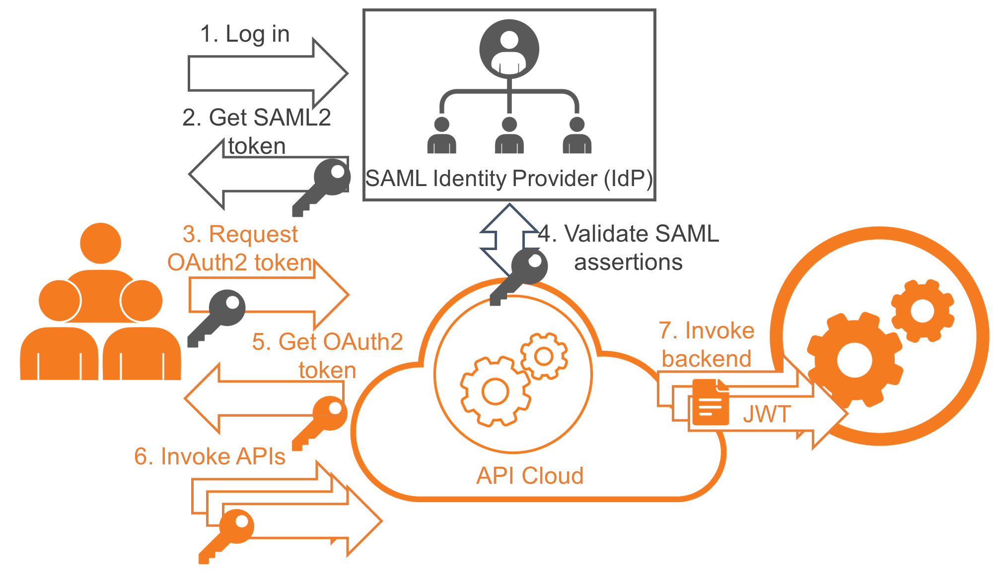

# SAML Extension Grant

SAML 2.0 is an XML-based
[protocol.](http://en.wikipedia.org/wiki/Communications_protocol) It
uses [security tokens](http://en.wikipedia.org/wiki/Software_token)
containing
[assertions](http://en.wikipedia.org/wiki/Security_Assertion_Markup_Language)
to pass information about an end-user between a SAML authority and a
SAML consumer. A SAML authority is an [identity
provider](http://en.wikipedia.org/wiki/Identity_provider) (IdP) and a
SAML consumer is a [service
provider](http://en.wikipedia.org/wiki/Service_provider) (SP).

Enterprise applications that have SAML2 based SSO
infrastructures sometimes need to consume OAuth-protected resources
through APIs. However, these apps prefer to use the existing trust
relationship with the IdP, even if the OAuth authorization server is
entirely different from the IdP. The API Cloud leverages this trust
relationship by exchanging the SAML2.0 token to an OAuth token with the
authorization server. It acts as the OAuth authorization server.

The following diagram depicts this scenario:

 

The steps depicted in the diagram are described below:

**Step \[1\]** : User initiates a login call to an enterprise
application.

**Step \[2\]** :

-   As the application is a SAML SP, it redirects the user to the
    SAML2.0 IdP to log in.  
-   The user provides credentials at the IdP and is redirected back to
    the SP with a SAML2.0 token signed by the IdP.  
-   The SP verifies the token and logs the user to the application.  
-   The SAML 2.0 token is stored in the user's session by the SP. ****

**Step \[3\]** :

-   The enterprise application (SP) wants to access an OAuth2 protected
    API resource through WSO2 API Cloud.
-   The application makes a request to the API Cloud to exchange the
    SAML2 bearer token for an OAuth2.0 access token.

**Step \[4\]** : The API Cloud validates the assertion and returns
the access token.

**Step \[5\]** : The API Cloud returns OAuth2 access token to the
application.

**Step \[6\]** : The user does API invocations through the API Cloud
by setting it as an Authorization header with the returned OAuth2 access
token.

**Step \[7\]** : The backend receives the API call together with the JWT
token and user information.

Let's configure the token exchange.

### Configure the token exchange

!!! note
    
    Before you begin, make sure you have the following:
    
    -   A valid user account in the API Store.
    -   An identity provider capable of issuing SAML tokens.
    -   A valid consumer key and consumer secret. Initially, these keys must
        be generated through the API Store by clicking the **Generate** link
        on the **My Subscriptions** page.
    

To configure the identity provider:

1.  On the **Configure** menu, click **External Users**.  
2.  On the **API Consumer Authentication** tab, click **Connect Your IdP
    (SAML Grant)**.  
3.  Provide the following values:

    -   **Public Certificate:** The certificate used to sign the SAML
        assertion. Export the public certificate of WSO2 IS and import
        it here.

    -   **SSO URL:** Enter the IdP's SAML2 Web SSO URL value. E.g.,
        <https://localhost:9444/samlsso/> if you have offset the default
        port, which is 9443.
    -   **IdP Entity ID:** The SAML2 issuer name specified when
        generating the assertion token, which contains the unique
        identifier of the IdP.

4.  Click **Submit Request** .

### Invoking the Token API to generate tokens

Follow the steps below to invoke the token API to generate access tokens
from SAML2 assertions.

1.  Combine the consumer key and consumer secret keys as
    `consumer-key:consumer-secret`. Encode the
    combined string using base64 ( http://base64encode.org ). Here's an
    example consumer key and secret combination:
    `wU62DjlyDBnq87GlBwplfqvmAbAa:ksdSdoefDDP7wpaElfqvmjDue`.
2.  Access the token API using a REST client such as the WSO2 REST
    Client or Curl. The parameters are explained below:  

    -   Assuming that both the client and the API Gateway run on the
        same server, the Token API URL is
        `https://gateway.api.cloud.wso2.com:8243`

    -   payload -
        `grant_type=urn:ietf:params:oauth:grant-type:saml2-bearer&assertion=                            <SAML2_Encoded_Assertion_Token> &scope=PRODUCTION`. Replace the
        `<SAML2_Encoded_Assertion_Token>` value
        as appropriate.

    -   headers -
        `Authorization: `Basic <base64 encoded consumer-key:consumer-secret>`, `Content-Type: application/x-www-form-urlencoded`. Replace the
        `<base64 encoded consumer-key:consumer-secret>`
        as appropriate.

    For example, the following Curl command is used to access the Token
    API. It generates an access token and a refresh token. You can use
    the refresh token at the time the token is renewed.

    ``` java
    curl -k -d "grant_type=urn:ietf:params:oauth:grant-type:saml2-bearer&assertion=<Assertion_provided_by_client>&scope=PRODUCTION" -H "Authorization: Basic <Base64 encoded consumer key:consumer secret>, Content-Type: application/x-www-form-urlencoded" https://gateway.api.cloud.wso2.com:8243/token
    ```
